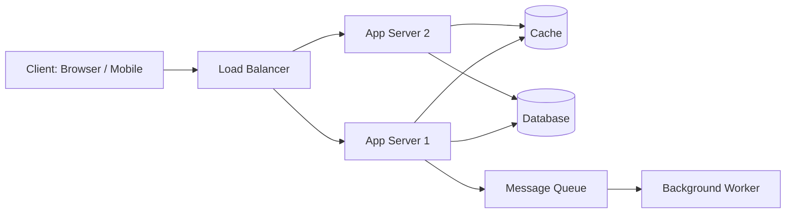

# What Is System Design

## 🧭 Overview
System design is the process of defining the architecture, components, data, and interactions of a software system to satisfy a set of functional and non-functional requirements. It matters because real-world applications must serve millions of users reliably, cheaply, and fast — and the choices you make early (which database, how to cache, how to scale) determine whether the system survives growth or collapses under it. You'll encounter system design when building production software and, very visibly, in technical interviews at top companies.

---

## 🧠 Technical Explanation

System design sits one level above writing code: it answers *what* pieces exist and *how* they fit together, before you worry about line-by-line implementation.

### Functional vs Non-Functional Requirements
- **Functional requirements** describe *what the system does* — "users can upload a photo," "users can search posts."
- **Non-functional requirements (NFRs)** describe *how well* it does it — latency, availability, scalability, durability, security, cost.

In interviews and in practice, NFRs drive most architecture decisions.

### The Building Blocks
Most large systems are assembled from a recurring vocabulary of components:
- **Clients** (browser, mobile app) and **servers** (application logic).
- **Load balancers** that distribute traffic.
- **Databases** (SQL/NoSQL) for persistence.
- **Caches** (Redis, Memcached) for speed.
- **Message queues** (Kafka, SQS) for asynchronous work.
- **CDNs** for static content close to users.
- **Object storage** (S3) for large blobs.

### How the Process Works
1. **Clarify requirements** — functional + non-functional.
2. **Estimate scale** — users, requests/sec, storage, bandwidth.
3. **Define the API** and data model.
4. **Sketch a high-level architecture.**
5. **Deep-dive** on the hard components.
6. **Identify bottlenecks and trade-offs.**

### HLD vs LLD
- **High-Level Design (HLD):** components, data flow, scaling — the "boxes and arrows" view.
- **Low-Level Design (LLD):** classes, objects, methods, patterns — the "code structure" view.

---

## 🍎 Simple Explanation (ELI5 / Analogy)
Designing a system is like planning a city. Before laying a single brick, the city planner decides where roads, water pipes, power lines, hospitals, and schools go, and how they connect. If they plan badly, traffic jams and blackouts follow when the population grows. System design is city planning for software: you decide the "roads and utilities" (servers, databases, caches) so the "city" keeps running smoothly as more "residents" (users) arrive.

---

## 📊 Diagram / Flowchart

---

## ⚖️ Trade-offs

| Pros (of investing in design) | Cons / Costs |
|------|------|
| Systems scale gracefully under load | Up-front time and analysis effort |
| Bottlenecks anticipated before they hurt | Risk of over-engineering for scale you don't have |
| Easier to onboard engineers with clear architecture | Designs can become outdated as requirements change |
| Better cost control (right-sized infrastructure) | Premature optimization can waste effort |

---

## 🌍 Real-World Examples
- **Netflix** designs for availability and global reach: it serves video from CDNs near users and runs stateless microservices so any instance can fail without downtime.
- **Amazon** designs its checkout for consistency and durability — an order must never be silently lost — while product browsing is optimized for speed and can tolerate slightly stale data.
- **Twitter/X** designs its timeline around read-heavy access: it pre-computes ("fans out") tweets into followers' feeds so reads are cheap.

---

## 🎯 Interview Questions

### 🔵 Conceptual (Theory)
1. What is the difference between functional and non-functional requirements? → **Answer:** Functional = what the system does (features); non-functional = qualities like latency, availability, scalability, and security that constrain *how* it does them.
2. What is the difference between HLD and LLD? → **Answer:** HLD describes components and data flow (architecture); LLD describes classes, methods, and patterns (code structure).
3. Why do non-functional requirements drive most architecture decisions? → **Answer:** Because two systems with the same features but different scale/latency/availability targets need radically different architectures.

### 🟠 Design (Practical)
1. How would you start designing a photo-sharing app? → **Answer:** Clarify requirements (upload, view, feed), estimate scale (DAU, photos/day, storage), define APIs, then sketch clients → LB → app servers → object storage for photos + DB for metadata + CDN for delivery.
2. What components would almost any large web system include? → **Answer:** Load balancer, stateless app servers, database (often with replicas), cache, object storage/CDN for static assets, and a queue for async work.

### 🔴 Company-Specific
1. [Google] How would you decide whether a feature needs strong consistency or can tolerate eventual consistency? *(Hint: think about user expectations — money vs likes.)*
2. [Amazon] Walk through how you'd gather requirements for a new service before designing it. *(Hint: separate functional from non-functional, ask about scale and SLAs.)*
3. [Meta] When is it acceptable to over-engineer, and when is it harmful? *(Hint: match design to actual and near-future scale, not imagined scale.)*

---

## 📚 Further Reading
- *Designing Data-Intensive Applications* by Martin Kleppmann
- *System Design Interview* by Alex Xu (Vol. 1 & 2)

---

## 🔗 Related Topics
- [Client-Server Model](02-client-server-model.md)
- [Latency vs Throughput](04-latency-vs-throughput.md)
- [HLD Interview Framework](../13-hld-deep-dive/02-hld-interview-framework.md)
- [What is LLD](../14-lld/01-what-is-lld.md)
