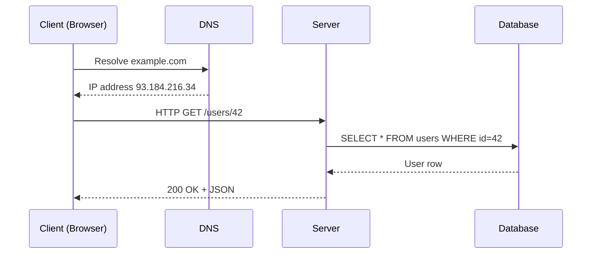

# The Client-Server Model

## 🧭 Overview
The client-server model is the foundational architecture of the modern internet: a **client** (browser, mobile app, IoT device) requests resources or actions, and a **server** processes those requests and returns responses. It matters because almost every web and mobile system is built on this request-response pattern, and understanding it is the prerequisite for everything else in system design. You encounter it every time you load a webpage, send a chat message, or refresh a feed.

---

## 🧠 Technical Explanation

### How It Works
1. The client opens a connection to the server (typically over **TCP**, often secured with **TLS**).
2. The client sends a **request** (e.g., an HTTP `GET /users/42`).
3. The server processes it — querying a database, applying logic — and returns a **response** (status code + body).
4. The connection is reused (HTTP keep-alive) or closed.

### Key Properties
- **Stateless vs stateful servers:** A *stateless* server keeps no client-specific memory between requests (session data lives in a database/cache). This is essential for horizontal scaling because any server can handle any request. A *stateful* server remembers client context, which complicates scaling and failover.
- **Synchronous vs asynchronous:** Requests can block waiting for a response, or be queued for background processing.
- **Request-response vs streaming:** Classic HTTP is request-response; WebSockets and gRPC streaming allow long-lived, bidirectional flows.

### The Layers Involved
- **DNS** resolves a domain name to an IP address.
- **Transport (TCP/UDP)** moves bytes reliably (TCP) or fast-but-lossy (UDP).
- **Application protocols (HTTP/HTTPS, WebSocket, gRPC)** define the message format.

### Three-Tier Architecture
A common extension splits the server side into:
- **Presentation tier** (UI/API layer)
- **Application/logic tier** (business rules)
- **Data tier** (databases, storage)

---

## 🍎 Simple Explanation (ELI5 / Analogy)
Think of a restaurant. You (the **client**) sit at a table and tell the waiter what you want. The waiter carries your order to the kitchen (the **server**), which prepares the food and sends it back. You don't need to know how the kitchen works — you just make requests and get responses. A *stateless* kitchen forgets you the moment your plate is served; if you want a refill, you have to say who you are again (or show your receipt — like a session token).

---

## 📊 Diagram / Flowchart

---

## ⚖️ Trade-offs

| Pros | Cons |
|------|------|
| Centralized logic and data are easy to manage and secure | Server is a potential single point of failure (needs redundancy) |
| Clients stay thin and simple | Network latency added to every interaction |
| Easy to update logic server-side without redeploying clients | Server must scale to handle all client load |
| Clear separation of concerns | Offline functionality is harder |

---

## 🌍 Real-World Examples
- **Gmail** runs as a thin client (browser/app) talking to Google's mail servers; your inbox lives server-side so you see it on any device.
- **Slack** uses a hybrid: REST for actions plus a persistent **WebSocket** so the server can push new messages to the client in real time.
- **Banking apps** keep all sensitive logic and balances server-side; the mobile app is just a presentation layer.

---

## 🎯 Interview Questions

### 🔵 Conceptual (Theory)
1. What does it mean for a server to be stateless, and why is it important? → **Answer:** It keeps no per-client memory between requests, so any server instance can handle any request — enabling easy horizontal scaling and failover.
2. What is the difference between TCP and UDP? → **Answer:** TCP is connection-oriented and reliable (ordered, retransmitted); UDP is connectionless and fast but lossy — good for video/gaming where speed beats perfection.
3. How does a client find a server's address? → **Answer:** Via DNS, which resolves a human-readable domain to an IP address.

### 🟠 Design (Practical)
1. Where would you store session data in a stateless architecture? → **Answer:** In an external shared store like Redis or a database, so any app server can read it.
2. When would you use WebSockets instead of plain HTTP request-response? → **Answer:** For real-time, server-push use cases like chat, live notifications, or collaborative editing.

### 🔴 Company-Specific
1. [Meta] How would you design a server that pushes live updates to millions of connected clients? *(Hint: persistent connections, connection servers, pub/sub fan-out.)*
2. [Amazon] Why are stateless services preferred in large-scale architectures? *(Hint: scaling, failover, deployment simplicity.)*
3. [Google] How does keeping servers stateless interact with load balancing? *(Hint: any node can serve any request; no sticky sessions needed.)*

---

## 📚 Further Reading
- MDN Web Docs: "Overview of HTTP"
- *High Performance Browser Networking* by Ilya Grigorik (free online)

---

## 🔗 Related Topics
- [Network Basics](03-network-basics.md)
- [Load Balancing](../02-scalability/02-load-balancing.md)
- [HTTPS and TLS](../09-security/03-https-and-tls.md)
