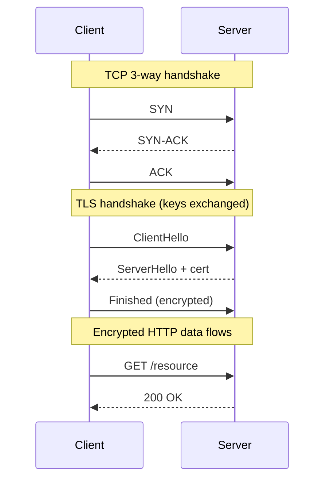

# Network Basics

## 🧭 Overview
Networking is how bytes travel between machines, and a working mental model of it is essential for system design: latency budgets, protocol choices, and failure modes all stem from how networks behave. This file covers the core layers and protocols (IP, TCP/UDP, DNS, HTTP, TLS) at the depth you need to reason about distributed systems and answer interview questions. You encounter these every time data crosses a network boundary — which, in a distributed system, is constantly.

---

## 🧠 Technical Explanation

### The Layered Model (simplified TCP/IP)
| Layer | Job | Examples |
|-------|-----|----------|
| Application | App-level messages | HTTP, gRPC, DNS, SMTP |
| Transport | End-to-end delivery | TCP, UDP, QUIC |
| Network | Routing between hosts | IP (IPv4/IPv6) |
| Link | Local physical transfer | Ethernet, Wi-Fi |

### IP Addresses & DNS
- An **IP address** uniquely identifies a host on a network. **DNS** maps friendly names (`api.example.com`) to IPs and supports load distribution (multiple A records, GeoDNS).
- DNS is hierarchical and heavily cached (TTL), which is why DNS changes take time to propagate.

### TCP vs UDP
- **TCP**: connection-oriented, reliable, ordered, with congestion control. Used by HTTP, databases. Costs a handshake (SYN/SYN-ACK/ACK) before data flows.
- **UDP**: connectionless, no delivery guarantee, minimal overhead. Used for DNS, video, gaming, and VoIP where speed matters more than perfection.

### HTTP Evolution
- **HTTP/1.1**: one request per connection at a time (head-of-line blocking); keep-alive reuses connections.
- **HTTP/2**: multiplexes many streams over one connection, header compression.
- **HTTP/3 (QUIC)**: runs over UDP, eliminates TCP head-of-line blocking, faster connection setup.

### TLS
**TLS** encrypts traffic (HTTPS = HTTP over TLS). A handshake establishes keys; modern TLS 1.3 needs just one round trip.

### Network Realities to Remember
- Networks are **unreliable** (packets drop), **slow relative to memory** (ms vs ns), and have **limited bandwidth**.
- A round trip across the world is ~100–200 ms — this dominates many latency budgets.

---

## 🍎 Simple Explanation (ELI5 / Analogy)
Sending data over a network is like mailing a series of postcards. **IP** is the addressing system that gets each postcard to the right house. **TCP** is like numbering your postcards and asking the recipient to confirm each one, re-sending any that get lost — reliable but slower. **UDP** is dropping postcards in the mail and hoping they arrive — fast, but some may be lost. **DNS** is the phone book that turns "Grandma's house" into an actual street address. **TLS** is sealing each postcard in a tamper-proof, unreadable envelope.

---

## 📊 Diagram / Flowchart

---

## ⚖️ Trade-offs

| Choice | Pros | Cons |
|------|------|------|
| TCP | Reliable, ordered, congestion-aware | Handshake + retransmission latency |
| UDP | Fast, low overhead | No reliability/ordering guarantees |
| HTTP/2 | Multiplexing, fewer connections | Still suffers TCP-level head-of-line blocking |
| HTTP/3 (QUIC) | No TCP HOL blocking, fast setup | Newer, occasional middlebox issues |

---

## 🌍 Real-World Examples
- **Google** pioneered QUIC/HTTP/3 to speed up YouTube and Search on lossy mobile networks.
- **Zoom and online games** use UDP because a slightly dropped video frame is better than a frozen, delayed stream.
- **Cloudflare** terminates TLS at edge locations to reduce handshake latency for users worldwide.

---

## 🎯 Interview Questions

### 🔵 Conceptual (Theory)
1. Why is a single cross-continent round trip a big deal for latency? → **Answer:** It can cost 100–200 ms; if a page needs several sequential round trips, latency adds up fast — which is why we minimize round trips and put data close to users.
2. When would you choose UDP over TCP? → **Answer:** Real-time media, gaming, or DNS, where low latency matters more than guaranteed delivery.
3. What problem does HTTP/2 multiplexing solve? → **Answer:** HTTP/1.1's head-of-line blocking, where one slow request blocks others on the same connection.

### 🟠 Design (Practical)
1. How would you reduce TLS handshake overhead for global users? → **Answer:** Terminate TLS at edge/CDN locations near users and use TLS 1.3 session resumption.
2. Your API feels slow despite fast servers — what network factors do you check? → **Answer:** DNS resolution time, number of round trips, TCP/TLS setup cost, payload size, and geographic distance/CDN usage.

### 🔴 Company-Specific
1. [Google] How does QUIC improve performance over TCP-based HTTP? *(Hint: UDP-based, no TCP HOL blocking, 0-RTT setup.)*
2. [Netflix] How would you minimize startup latency when a user presses play? *(Hint: CDN proximity, connection reuse, prefetching.)*
3. [Amazon] How does DNS help with load distribution and failover? *(Hint: multiple records, health-checked routing, GeoDNS.)*

---

## 📚 Further Reading
- *Computer Networking: A Top-Down Approach* by Kurose & Ross
- Cloudflare Learning Center: "What is DNS?" and "What is TLS?"

---

## 🔗 Related Topics
- [Client-Server Model](02-client-server-model.md)
- [Latency vs Throughput](04-latency-vs-throughput.md)
- [CDN](../04-caching/04-cdn.md)
- [HTTPS and TLS](../09-security/03-https-and-tls.md)
