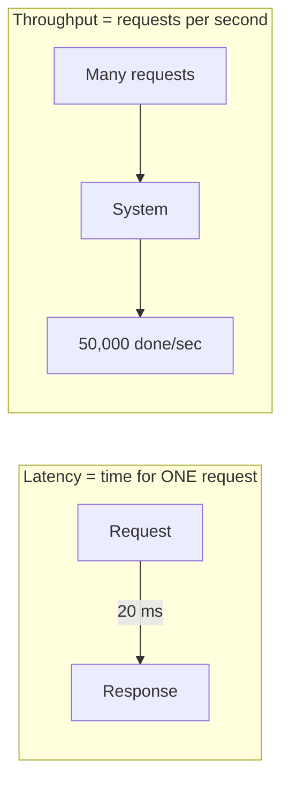

# Latency vs Throughput

## 🧭 Overview
**Latency** is how long a single operation takes; **throughput** is how many operations the system completes per unit of time. These two metrics are the language of performance in system design, and confusing them is a classic interview mistake. You'll reason about them whenever you size a system, choose a database, or debug a slow service — they shape nearly every architectural decision.

---

## 🧠 Technical Explanation

### Definitions
- **Latency** — time from request to response for one operation, e.g., 20 ms. Often reported as percentiles: **p50** (median), **p95**, **p99**, **p99.9** (tail latency).
- **Throughput** — operations per second the system can sustain, e.g., 50,000 requests/sec (RPS) or QPS.

### Why Percentiles Matter More Than Averages
Averages hide pain. If p50 is 10 ms but p99 is 2,000 ms, 1% of users (potentially millions) have a terrible experience. Large companies optimize **tail latency** (p99/p99.9) because a single user request often fans out to many backend calls, and the slowest one dictates the overall response time.

### The Relationship (Little's Law)
`Concurrency = Throughput × Latency`. If each request takes 100 ms (latency) and you want 1,000 RPS (throughput), you need ~100 requests in flight concurrently. Reducing latency or adding concurrency raises achievable throughput.

### Sources of Latency
- Network round trips (biggest, often).
- Disk I/O (SSD ~100 µs, HDD ~10 ms).
- Queueing/contention under load.
- Serialization, computation, lock waits.

### Improving Each
- **Lower latency:** caching, CDNs, indexes, fewer round trips, faster storage, geographic proximity.
- **Higher throughput:** horizontal scaling, batching, async processing, connection pooling, load balancing.

### The Trade-off
Optimizing for one can hurt the other. **Batching** improves throughput (amortizes overhead) but adds latency (requests wait to fill a batch). A system tuned for max throughput may have worse single-request latency, and vice versa.

---

## 🍎 Simple Explanation (ELI5 / Analogy)
Imagine a highway. **Latency** is how long it takes *one car* to drive from start to finish. **Throughput** is how many cars pass through *per hour*. A wider highway (more lanes) lets more cars through per hour (higher throughput) even if each individual trip takes the same time. A faster speed limit reduces each trip's time (lower latency). You can have a high-throughput highway where each car is still slow (a packed but moving freeway), or a fast empty road carrying few cars.

---

## 📊 Diagram / Flowchart

---

## ⚖️ Trade-offs

| Optimize For | Pros | Cons |
|------|------|------|
| Low latency | Snappy UX, good for interactive apps | Often higher cost per request, less batching |
| High throughput | Cost-efficient at scale, handles bursts | Individual requests may wait (batching/queueing) |
| Batching | Big throughput gains | Adds latency per item |
| Caching | Cuts both latency and load | Stale data risk, cache invalidation complexity |

---

## 🌍 Real-World Examples
- **Amazon** found every 100 ms of added latency cost measurable sales — so they obsess over p99 latency on the shopping path.
- **Kafka** is built for massive throughput (millions of messages/sec) by batching writes, accepting slightly higher per-message latency.
- **Google Search** targets sub-200 ms responses by fanning out queries in parallel and capping the slowest shards.

---

## 🎯 Interview Questions

### 🔵 Conceptual (Theory)
1. What is the difference between latency and throughput? → **Answer:** Latency = time per operation; throughput = operations per unit time. They are related but distinct, and you can improve one while hurting the other.
2. Why do engineers care about p99 latency, not just the average? → **Answer:** Averages hide the slow tail; p99 reflects the experience of the unluckiest 1% of requests, which at scale is a huge number of users and often dominates fanned-out requests.
3. State Little's Law and what it tells you. → **Answer:** Concurrency = throughput × latency; it relates how many in-flight requests you need to hit a target throughput given a latency.

### 🟠 Design (Practical)
1. A service has good average latency but bad p99 — how do you investigate? → **Answer:** Look for GC pauses, lock contention, cold caches, slow downstream dependencies, queueing under load, and noisy-neighbor effects.
2. How would you increase throughput without buying faster machines? → **Answer:** Horizontal scaling, batching, async processing, caching, connection pooling, and removing serial bottlenecks.

### 🔴 Company-Specific
1. [Amazon] How would you keep checkout latency low during a traffic spike like Prime Day? *(Hint: caching, autoscaling, async non-critical work, graceful degradation.)*
2. [Google] When a request fans out to 100 servers, how do you control tail latency? *(Hint: hedged requests, timeouts, tied requests, ignore slowest shard.)*
3. [Netflix] How do you balance throughput vs latency in a video-encoding pipeline? *(Hint: batch offline encoding for throughput; keep playback path low-latency.)*

---

## 📚 Further Reading
- "The Tail at Scale" by Dean & Barroso (Google)
- *Designing Data-Intensive Applications*, Chapter 1 (reliability, scalability, maintainability)

---

## 🔗 Related Topics
- [Network Basics](03-network-basics.md)
- [Caching Fundamentals](../04-caching/01-caching-fundamentals.md)
- [Numbers Every Engineer Should Know](../12-cheatsheets/numbers-every-engineer-should-know.md)
- [Estimation and Back-of-Envelope](../11-interview-playbook/02-estimation-and-back-of-envelope.md)
