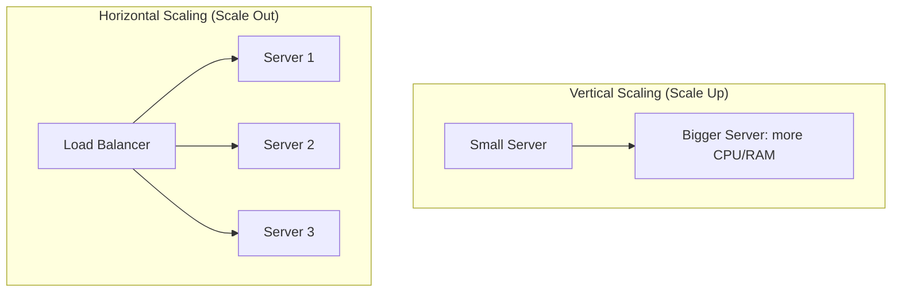

# Horizontal vs Vertical Scaling

## 🧭 Overview
Scaling is how a system handles more load. **Vertical scaling (scale up)** means making one machine more powerful; **horizontal scaling (scale out)** means adding more machines. This is one of the first decisions in any growth story, and the choice ripples through your entire architecture (statelessness, load balancing, data partitioning). You encounter it the moment a single server can no longer keep up.

---

## 🧠 Technical Explanation

### Vertical Scaling (Scale Up)
Add more CPU, RAM, or faster disks to an existing server. Simple — no code changes, no distribution problems. But it has a hard ceiling (the biggest machine you can buy), gets expensive non-linearly, and leaves you with a single point of failure.

### Horizontal Scaling (Scale Out)
Add more machines and spread load across them with a load balancer. Near-limitless scale and built-in redundancy, but it demands **stateless services**, a way to **distribute data** (sharding/replication), and tolerance for **partial failures**.

### Prerequisites for Horizontal Scaling
- **Statelessness:** servers store no client-specific data locally; sessions live in shared stores.
- **Load balancing:** to route requests across instances.
- **Data partitioning/replication:** the database must also scale, often the hardest part.

### When Each Wins
- **Vertical:** early-stage apps, databases that are hard to distribute, when simplicity matters and load is moderate.
- **Horizontal:** large/elastic workloads, high-availability requirements, web/app tiers that are naturally stateless.

Most real systems combine both: scale individual nodes up to a sensible size, then scale out.

---

## 🍎 Simple Explanation (ELI5 / Analogy)
Imagine a pizza shop that's getting too many orders. **Vertical scaling** is buying a bigger, faster oven so your one chef can bake more pizzas. **Horizontal scaling** is hiring more chefs and adding more ovens, with a host (the load balancer) directing orders to whichever chef is free. The bigger oven eventually maxes out, but you can keep hiring chefs almost indefinitely — as long as they don't need to share one cutting board (shared state).

---

## 📊 Diagram / Flowchart

---

## ⚖️ Trade-offs

| | Vertical (Scale Up) | Horizontal (Scale Out) |
|---|------|------|
| Complexity | Low | High (distribution, coordination) |
| Ceiling | Hardware limit | Near-unlimited |
| Cost curve | Expensive at the top end | Linear-ish, commodity hardware |
| Fault tolerance | Single point of failure | Redundant by design |
| Code requirements | None | Stateless, partition-aware |

---

## 🌍 Real-World Examples
- **Early-stage startups** typically scale up a single database (bigger RDS instance) because sharding is complex and premature.
- **Google and Facebook** scale out across tens of thousands of commodity servers; no single machine could ever serve their load.
- **Stack Overflow** famously ran on a relatively small number of powerful, vertically scaled servers for years, showing scale-up can go far with efficient code.

---

## 🎯 Interview Questions

### 🔵 Conceptual (Theory)
1. What must be true of a service before you can scale it horizontally? → **Answer:** It must be (or be made) stateless, with shared state externalized to a database/cache, and traffic routed by a load balancer.
2. Why does vertical scaling have a single point of failure? → **Answer:** All load runs on one machine; if it fails, the whole service goes down — there's no redundancy.
3. Why is the database often the hardest part to scale horizontally? → **Answer:** Distributing data requires sharding and/or replication, which introduce consistency, rebalancing, and cross-shard query challenges.

### 🟠 Design (Practical)
1. Your web tier is overloaded but the DB is fine — how do you scale? → **Answer:** Make app servers stateless and scale out behind a load balancer; the DB stays as-is until it becomes the bottleneck.
2. When would you deliberately choose to scale up instead of out? → **Answer:** When the workload is hard to distribute (e.g., a single relational DB), load is moderate, or you want to avoid distributed-systems complexity early on.

### 🔴 Company-Specific
1. [Amazon] How would you scale a stateless API service to handle 10x traffic during a sale? *(Hint: autoscaling groups + load balancer + stateless design.)*
2. [Google] At what point does scaling up stop making sense and scaling out become necessary? *(Hint: hardware ceiling, cost, single-point-of-failure risk.)*
3. [Meta] How do you scale the database tier when scaling out the app tier isn't enough? *(Hint: read replicas, sharding, caching.)*

---

## 📚 Further Reading
- AWS Well-Architected Framework: Performance Efficiency pillar
- *Designing Data-Intensive Applications*, Chapter 1

---

## 🔗 Related Topics
- [Load Balancing](02-load-balancing.md)
- [Auto Scaling](03-auto-scaling.md)
- [Sharding](../03-databases/03-sharding.md)
- [Client-Server Model](../01-fundamentals/02-client-server-model.md)
