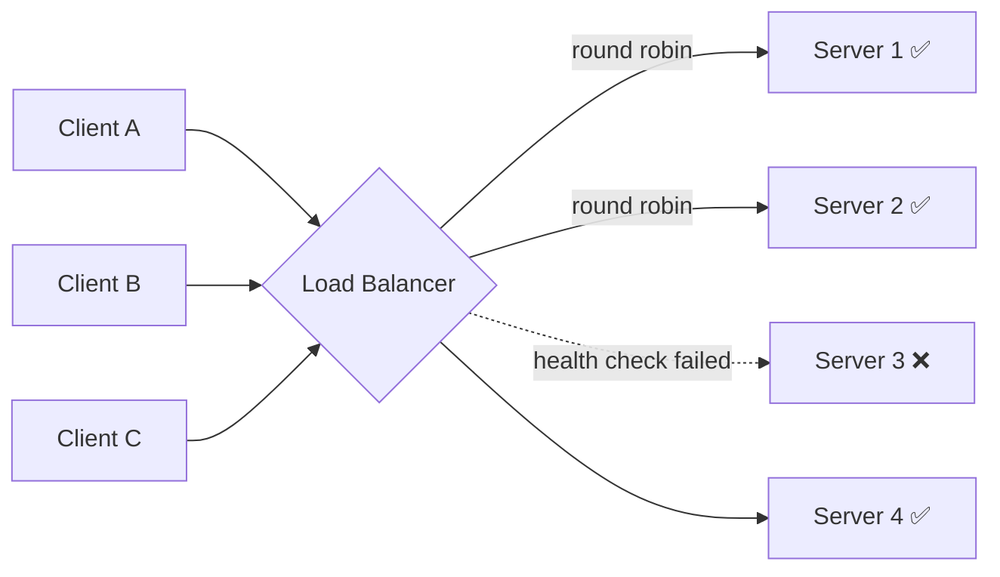

# Load Balancing

## 🧭 Overview
A load balancer (LB) distributes incoming traffic across multiple backend servers so no single server is overwhelmed, while also improving availability by routing around failed instances. It's the linchpin that makes horizontal scaling work, and it appears in essentially every large-scale architecture. You encounter it the moment you run more than one app server.

---

## 🧠 Technical Explanation

### What It Does
- **Distributes load** across healthy servers.
- **Health checks** servers and stops routing to unhealthy ones.
- **Terminates TLS** (often), offloading encryption from app servers.
- Can provide **sticky sessions**, **rate limiting**, and **failover**.

### Layer 4 vs Layer 7
- **L4 (transport)**: routes based on IP/port without inspecting content — fast, protocol-agnostic.
- **L7 (application)**: inspects HTTP — can route by URL path, headers, cookies; enables content-based routing and smarter features. Slightly more overhead.

### Load-Balancing Algorithms
| Algorithm | How it works | Best for |
|-----------|--------------|----------|
| Round Robin | Rotate through servers | Uniform servers/requests |
| Weighted Round Robin | Rotate, but bigger servers get more | Heterogeneous servers |
| Least Connections | Send to server with fewest active conns | Long-lived/variable requests |
| Least Response Time | Fastest-responding server | Latency-sensitive |
| IP Hash / Consistent Hash | Route by hashing client/key | Sticky routing, caches |

### High Availability of the LB Itself
The LB must not become a single point of failure. Solutions: redundant LBs with a floating IP / DNS failover, or managed LBs (AWS ELB/ALB) that are internally redundant. Very large sites use multiple layers (DNS → L4 → L7).

### Sticky Sessions
Route a user consistently to the same server (via cookie or IP hash). Useful for in-memory session state, but it undermines even load distribution and failover — prefer externalizing session state instead.

---

## 🍎 Simple Explanation (ELI5 / Analogy)
A load balancer is like the host at a busy restaurant with many identical dining rooms. As guests arrive, the host seats them in whichever room has space, keeping all rooms evenly full. If one room's kitchen breaks down, the host simply stops seating guests there and sends everyone to the working rooms — guests never notice.

---

## 📊 Diagram / Flowchart

---

## ⚖️ Trade-offs

| Pros | Cons |
|------|------|
| Enables horizontal scaling and high availability | Adds a network hop / potential bottleneck |
| Health checks route around failures | Must itself be made highly available |
| Can offload TLS, do rate limiting, content routing | L7 inspection adds latency/CPU |
| Smooths uneven load | Sticky sessions complicate even distribution |

---

## 🌍 Real-World Examples
- **AWS** offers ALB (L7, content-based routing) and NLB (L4, ultra-high throughput); most web apps use ALB.
- **Google** uses global load balancing with a single anycast IP that directs users to the nearest healthy data center.
- **Netflix** uses Zuul/Eureka-based routing to distribute requests across its microservices fleet.

---

## 🎯 Interview Questions

### 🔵 Conceptual (Theory)
1. What is the difference between L4 and L7 load balancing? → **Answer:** L4 routes on IP/port without reading content (fast); L7 reads HTTP and can route by path/headers/cookies (smarter, slightly slower).
2. Why are sticky sessions discouraged at scale? → **Answer:** They tie users to specific servers, undermining even distribution and complicating failover; externalizing session state is preferred.
3. How does a load balancer detect a dead server? → **Answer:** Periodic health checks (e.g., HTTP `/health` or TCP probes); failing servers are removed from the pool.

### 🟠 Design (Practical)
1. How do you prevent the load balancer from being a single point of failure? → **Answer:** Run redundant LBs with failover (floating IP, DNS, or a managed redundant LB), and/or layer DNS-based global balancing on top.
2. Which algorithm would you pick for requests with highly variable durations? → **Answer:** Least Connections (or least response time), so long requests don't pile up on one server.

### 🔴 Company-Specific
1. [Google] How would you design global load balancing across multiple regions? *(Hint: anycast IP, GeoDNS, health-checked regional pools.)*
2. [Amazon] When would you choose an NLB (L4) over an ALB (L7)? *(Hint: extreme throughput/low latency, non-HTTP protocols, static IP needs.)*
3. [Meta] How do you balance load when backend servers have different capacities? *(Hint: weighted algorithms.)*

---

## 📚 Further Reading
- NGINX docs: "What Is Load Balancing?"
- AWS docs: ALB vs NLB comparison

---

## 🔗 Related Topics
- [Horizontal vs Vertical Scaling](01-horizontal-vs-vertical-scaling.md)
- [Auto Scaling](03-auto-scaling.md)
- [API Gateway](../06-api-design/03-api-gateway.md)
- [Service Discovery](../07-distributed-systems/04-service-discovery.md)
