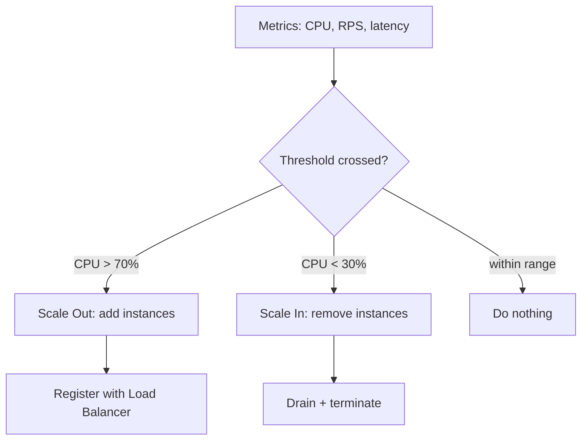

# Auto-Scaling

## 🧭 Overview
Auto-scaling automatically adjusts the number of running servers (or container instances) to match current demand — adding capacity during spikes and removing it when idle. It matters because traffic is rarely constant: provisioning for peak wastes money, while provisioning for average causes outages. You encounter auto-scaling in any cloud-native system that wants to be both reliable and cost-efficient.

---

## 🧠 Technical Explanation

### How It Works
1. Define a **scaling group** of identical instances (or pods) behind a load balancer.
2. Set **metrics and thresholds** (CPU > 70%, requests/sec, queue depth, p95 latency).
3. A controller continuously evaluates metrics and triggers **scale-out** (add) or **scale-in** (remove).
4. New instances must **boot fast** and be **stateless** so they can join/leave freely.

### Types of Auto-Scaling
- **Reactive (metric-based):** scale when a threshold is crossed. Simple, but lags behind sudden spikes.
- **Scheduled:** scale at known times (e.g., scale up every weekday at 9 AM). Good for predictable patterns.
- **Predictive:** use ML/forecasting to scale *ahead* of demand. Reduces lag for recurring patterns.

### Key Concepts
- **Cooldown / stabilization period:** wait after a scaling action before another, to avoid thrashing.
- **Min/max bounds:** floor (always-on capacity) and ceiling (cost cap).
- **Warm-up time:** new instances take time to boot and warm caches; design for this lag.
- **Graceful shutdown:** drain in-flight requests before terminating an instance.

### Horizontal vs Vertical Auto-Scaling
- **Horizontal Pod/Instance Autoscaler:** changes the *count* of instances (most common).
- **Vertical Autoscaler:** changes the *size* (CPU/RAM) of instances — useful but causes restarts.

---

## 🍎 Simple Explanation (ELI5 / Analogy)
Auto-scaling is like a coffee shop that hires extra baristas during the morning rush and sends them home in the slow afternoon. A manager (the auto-scaler) watches the line length (the metric). When the line gets long, they call in more baristas; when it's quiet, they save money by reducing staff. They keep at least one barista always on duty (the minimum) and never exceed the number of espresso machines they own (the maximum).

---

## 📊 Diagram / Flowchart

---

## ⚖️ Trade-offs

| Pros | Cons |
|------|------|
| Matches cost to demand (saves money) | Boot/warm-up lag during sudden spikes |
| Handles unexpected traffic surges | Misconfigured thresholds cause thrashing |
| Improves availability | Requires stateless, fast-booting services |
| Removes manual capacity planning | Cold caches on new instances hurt latency briefly |

---

## 🌍 Real-World Examples
- **Netflix** scales its AWS fleet up each evening for prime-time viewing and down overnight, saving large sums.
- **E-commerce sites** use scheduled + predictive scaling for events like Black Friday.
- **Kubernetes** offers the Horizontal Pod Autoscaler (HPA) driven by CPU/memory or custom metrics.

---

## 🎯 Interview Questions

### 🔵 Conceptual (Theory)
1. Why is statelessness a prerequisite for effective auto-scaling? → **Answer:** Instances are added and removed at will; if they held unique state, scaling in would lose data and scaling out couldn't serve consistent requests.
2. What is scaling "thrashing" and how do you prevent it? → **Answer:** Rapidly adding/removing instances due to oscillating metrics; prevent it with cooldown periods and hysteresis (different scale-out vs scale-in thresholds).
3. What's the difference between reactive and predictive auto-scaling? → **Answer:** Reactive responds after a threshold is crossed; predictive forecasts demand and scales ahead of it.

### 🟠 Design (Practical)
1. A sudden viral spike overwhelms your service before auto-scaling reacts — what do you do? → **Answer:** Keep warm buffer capacity, use predictive/scheduled scaling, add a queue to absorb bursts, and apply graceful degradation/rate limiting.
2. Which metric would you scale a queue-worker fleet on? → **Answer:** Queue depth / backlog age, not CPU — it directly reflects pending work.

### 🔴 Company-Specific
1. [Netflix] How would you scale ahead of a predictable nightly traffic peak? *(Hint: scheduled + predictive scaling, pre-warming.)*
2. [Amazon] How do you avoid cold-start latency when new instances join during a spike? *(Hint: warm pools, pre-baked AMIs/containers, connection/cache warm-up.)*
3. [Google] How would you autoscale a stateful workload? *(Hint: it's hard — partition data, use StatefulSets, scale read replicas, keep writes bounded.)*

---

## 📚 Further Reading
- AWS Auto Scaling documentation
- Kubernetes Horizontal Pod Autoscaler docs

---

## 🔗 Related Topics
- [Horizontal vs Vertical Scaling](01-horizontal-vs-vertical-scaling.md)
- [Load Balancing](02-load-balancing.md)
- [Deployment Strategies](../13-hld-deep-dive/08-deployment-strategies.md)
