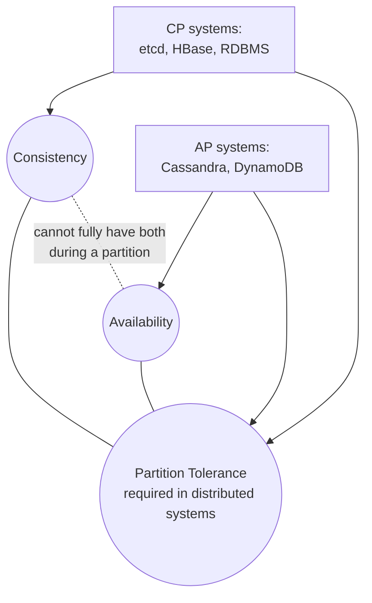

# CAP Theorem

## 🧭 Overview
The CAP theorem states that a distributed data store can provide at most **two** of three guarantees simultaneously: **Consistency**, **Availability**, and **Partition tolerance**. Since network partitions are unavoidable in distributed systems, the real choice is between consistency and availability *during* a partition. CAP is one of the most cited (and most misunderstood) concepts in system design interviews, and it frames every database and replication decision.

---

## 🧠 Technical Explanation

### The Three Properties
- **Consistency (C):** every read sees the most recent write (or an error). All nodes agree on the data — this is *linearizability*, stronger than the "C" in ACID.
- **Availability (A):** every request gets a non-error response, even if it might not be the latest data.
- **Partition tolerance (P):** the system keeps operating despite dropped/delayed messages between nodes (a network split).

### The Real Insight
Networks **will** partition. So **P is non-negotiable** for any distributed system. The genuine trade-off, when a partition happens, is:
- **CP system:** preserve consistency by refusing some requests (sacrifice availability).
- **AP system:** stay available by serving possibly stale data (sacrifice consistency).

When there is **no** partition, a well-designed system can offer both C and A.

### CP vs AP Examples
- **CP:** ZooKeeper, etcd, HBase, traditional RDBMS with synchronous replication, MongoDB (default majority writes).
- **AP:** Cassandra, DynamoDB (tunable), CouchDB, DNS.

### Beyond CAP: PACELC
PACELC extends CAP: **if Partition (P), choose A or C; Else (E), choose Latency (L) or Consistency (C)**. It acknowledges that even without partitions, you trade latency for consistency (e.g., waiting for replicas to acknowledge a write).

### Tunable Consistency
Systems like Cassandra and DynamoDB let you tune per-request: require `W` write acks and `R` read responses out of `N` replicas. If `W + R > N`, you get strong consistency; lower values favor availability/latency.

---

## 🍎 Simple Explanation (ELI5 / Analogy)
Imagine two librarians in two buildings sharing one catalog. Normally they sync constantly. One day the phone line between them breaks (a **partition**). Now, if someone returns a book to librarian A:
- **Consistency choice (CP):** librarian B refuses to answer questions about that book until the line is fixed, so nobody is ever told something wrong — but B is temporarily "unavailable."
- **Availability choice (AP):** librarian B keeps answering, but might wrongly say the book is still checked out, because they haven't heard the update yet — available, but possibly stale.
You can't have B be both always-answering *and* always-correct while the line is down.

---

## 📊 Diagram / Flowchart

---

## ⚖️ Trade-offs

| Choice (during partition) | Pros | Cons |
|------|------|------|
| CP (consistency) | No stale/incorrect reads | Some requests rejected → reduced availability |
| AP (availability) | Always responsive | May serve stale data; conflicts to resolve |
| Tunable (W/R/N) | Per-request flexibility | More complex to reason about |

---

## 🌍 Real-World Examples
- **Banking/ledger systems** lean **CP**: better to reject a transaction than double-spend money.
- **Amazon's shopping cart (Dynamo)** chose **AP**: the cart must always accept adds, even if it occasionally needs to merge conflicting versions later.
- **DNS** is **AP**: it serves cached (possibly stale) records for availability and speed.

---

## 🎯 Interview Questions

### 🔵 Conceptual (Theory)
1. Why is partition tolerance considered mandatory in distributed systems? → **Answer:** Networks inevitably drop or delay messages; a system that can't tolerate partitions would simply fail, so P is a given and the real trade-off is C vs A during a partition.
2. How does PACELC extend CAP? → **Answer:** It adds the *no-partition* case: even without partitions you trade latency (L) vs consistency (C), capturing the everyday cost of strong consistency.
3. Is the "C" in CAP the same as the "C" in ACID? → **Answer:** No. CAP's C is linearizability (reads see latest writes across nodes); ACID's C is preserving database invariants/constraints within a transaction.

### 🟠 Design (Practical)
1. You're designing a "like" counter for posts — CP or AP? → **Answer:** AP; a momentarily stale like count is fine, and availability/latency matter more than exactness.
2. You're designing a seat-booking system — CP or AP? → **Answer:** CP for the booking step; double-booking a seat is unacceptable, so reject rather than risk inconsistency.

### 🔴 Company-Specific
1. [Amazon] Why did DynamoDB's design favor availability, and how does it reconcile conflicts? *(Hint: AP, vector clocks/last-write-wins, application-level merge.)*
2. [Google] When would you choose a CP store like Spanner despite its latency cost? *(Hint: financial data, strong consistency requirements, TrueTime.)*
3. [Meta] How would you choose consistency settings for a social feed vs a payments service? *(Hint: feed = AP/eventual; payments = CP/strong.)*

---

## 📚 Further Reading
- "CAP Twelve Years Later" by Eric Brewer
- "PACELC" by Daniel Abadi

---

## 🔗 Related Topics
- [Consistency Models](../07-distributed-systems/01-consistency-models.md)
- [Replication](../03-databases/04-replication.md)
- [ACID vs BASE](../03-databases/05-acid-vs-base.md)
