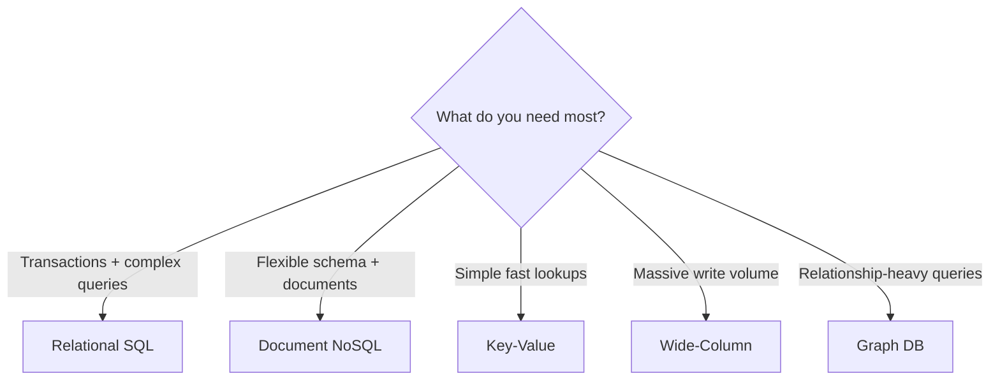

# Relational (SQL) vs NoSQL

## 🧭 Overview
Relational databases (SQL) store data in structured tables with predefined schemas and relationships, enforcing strong consistency via ACID transactions. NoSQL databases trade some of that structure and consistency for flexibility, scale, and performance, and come in several flavors (document, key-value, wide-column, graph). Choosing between them is one of the most consequential decisions in any design, and a near-guaranteed interview topic.

---

## 🧠 Technical Explanation

### Relational (SQL)
- **Model:** tables (rows + columns), fixed schema, foreign keys, joins.
- **Guarantees:** ACID transactions, strong consistency.
- **Query:** SQL — expressive, supports complex joins and aggregations.
- **Scaling:** primarily vertical; horizontal scaling (sharding) is harder.
- **Examples:** PostgreSQL, MySQL, Oracle, SQL Server.

### NoSQL Families
| Type | Model | Good for | Examples |
|------|-------|----------|----------|
| Document | JSON-like documents | Flexible/evolving schemas, content | MongoDB, Couchbase |
| Key-Value | Simple key → value | Caching, sessions, high throughput | Redis, DynamoDB |
| Wide-Column | Rows with dynamic columns | Huge write volume, time-series | Cassandra, HBase, Bigtable |
| Graph | Nodes + edges | Relationships, recommendations | Neo4j, Neptune |

### Key Differences
- **Schema:** SQL = rigid schema-on-write; NoSQL = flexible schema-on-read.
- **Consistency:** SQL = strong/ACID; many NoSQL = eventual/BASE (tunable).
- **Scale:** NoSQL is built to scale out horizontally; SQL traditionally scales up.
- **Joins:** SQL does them natively; NoSQL usually denormalizes data instead.

### When to Use Which
- **SQL** when you need transactions, complex queries, strong consistency, and well-defined relationships (banking, orders, inventory).
- **NoSQL** when you need massive scale, flexible/changing data, high write throughput, or a specific access pattern (caching, feeds, time-series, graph queries).

Modern reality: most large systems are **polyglot** — they use multiple databases, each for what it does best.

---

## 🍎 Simple Explanation (ELI5 / Analogy)
A SQL database is like a meticulously organized spreadsheet with strict rules: every row must have the same columns, and everything links neatly via IDs. A NoSQL database is more like a big box of labeled folders — each folder can hold whatever shape of paper you want, and you can add millions of folders across many rooms, but you give up the spreadsheet's neat cross-references and built-in math.

---

## 📊 Diagram / Flowchart

---

## ⚖️ Trade-offs

| | SQL | NoSQL |
|---|------|------|
| Schema | Rigid, enforced | Flexible |
| Consistency | Strong (ACID) | Often eventual (tunable) |
| Scaling | Vertical (sharding hard) | Horizontal (built-in) |
| Joins/complex queries | Native, powerful | Limited; denormalize instead |
| Best fit | Structured, transactional data | Scale, flexible, specific patterns |

---

## 🌍 Real-World Examples
- **Stripe and banks** use relational databases (Postgres/MySQL) for financial integrity and ACID guarantees.
- **Netflix** uses Cassandra (wide-column) for high-volume viewing history and time-series data.
- **Facebook** uses a graph-oriented store (TAO) over MySQL to serve the social graph efficiently.

---

## 🎯 Interview Questions

### 🔵 Conceptual (Theory)
1. What does "schema-on-read" mean and which family uses it? → **Answer:** The data's structure is interpreted when read, not enforced when written; NoSQL document/key-value stores use it, allowing flexible/evolving data.
2. Why is horizontal scaling harder for relational databases? → **Answer:** Joins, transactions, and foreign keys assume data lives together; sharding splits it across nodes, breaking those assumptions and forcing cross-shard coordination.
3. Name the four main NoSQL families and a use case for each. → **Answer:** Document (flexible content), key-value (caching/sessions), wide-column (high write/time-series), graph (relationship queries).

### 🟠 Design (Practical)
1. You're storing user orders and payments — which database and why? → **Answer:** Relational/SQL, because you need ACID transactions and strong consistency to never lose or duplicate money.
2. You're storing a social feed read by millions — what fits? → **Answer:** A NoSQL store (wide-column/key-value) with denormalized, pre-computed feeds for fast horizontal-scale reads.

### 🔴 Company-Specific
1. [Amazon] When would you choose DynamoDB over Aurora/RDS? *(Hint: predictable key-based access at massive scale, serverless, tunable consistency vs complex relational queries.)*
2. [Meta] Why store a social graph in a graph-optimized layer instead of plain SQL joins? *(Hint: deep relationship traversals are expensive as joins; caching the graph scales reads.)*
3. [Google] How do you decide between Bigtable and Spanner? *(Hint: Bigtable = wide-column, eventual; Spanner = relational + global strong consistency.)*

---

## 📚 Further Reading
- *Designing Data-Intensive Applications*, Chapter 2 (data models)
- MongoDB vs PostgreSQL official comparisons

---

## 🔗 Related Topics
- [Database Selection Guide](06-database-selection-guide.md)
- [ACID vs BASE](05-acid-vs-base.md)
- [Sharding](03-sharding.md)
- [Choosing the Right Database](../13-hld-deep-dive/03-choosing-the-right-database.md)
