# Database Indexing

## 🧭 Overview
An index is an auxiliary data structure that lets a database find rows quickly without scanning the entire table — the difference between flipping to a book's index versus reading every page. Indexing is the single most impactful database performance lever, and understanding it (and its costs) is essential for both real systems and interviews. You encounter it whenever a query is slow.

---

## 🧠 Technical Explanation

### Why Indexes Speed Up Reads
Without an index, finding rows matching `WHERE email = 'x'` requires a **full table scan** — O(n). An index gives a sorted/structured lookup, typically **O(log n)** for B-trees or **O(1)** average for hash indexes.

### Common Index Types
- **B-Tree (B+Tree):** the default. Keeps keys sorted; supports equality *and* range queries (`<`, `>`, `BETWEEN`, `ORDER BY`). Used by most relational DBs.
- **Hash index:** O(1) equality lookups, but no range queries. Good for exact-match keys.
- **LSM-Tree:** write-optimized (used by Cassandra, RocksDB); batches writes in memory then flushes sorted files. Great for high write throughput.
- **Inverted index:** maps terms → documents; powers full-text search (Elasticsearch, Lucene).
- **Geospatial (R-tree / geohash):** for location queries.

### Clustered vs Non-Clustered
- **Clustered index:** the table rows are physically stored in index order (one per table, usually the primary key). Range scans are fast.
- **Non-clustered (secondary) index:** a separate structure pointing to row locations; you can have many.

### Composite & Covering Indexes
- **Composite index** on `(a, b, c)` helps queries filtering by a leftmost prefix (`a`, or `a,b`). Order matters.
- **Covering index** includes all columns a query needs, so the DB answers from the index alone (no table lookup).

### The Cost of Indexes
Indexes **speed up reads but slow down writes** (every insert/update/delete must also update indexes) and **consume storage**. Over-indexing is a real problem.

---

## 🍎 Simple Explanation (ELI5 / Analogy)
An index is like the index at the back of a textbook. To find every mention of "photosynthesis," you don't read all 800 pages — you flip to the index, which lists the exact page numbers, sorted alphabetically. The catch: every time the author adds or edits a page, they must also update the index. So the index makes *looking things up* fast, but makes *editing the book* a bit more work.

---

## 📊 Diagram / Flowchart

```mermaid
flowchart TD
    Q[Query: WHERE email = 'a@x.com']
    Q --> D{Index on email?}
    D -->|No| FS[Full table scan O&#40;n&#41;]
    D -->|Yes| BT[B-Tree lookup O&#40;log n&#41;]
    BT --> Row[Fetch matching rows]
    FS --> Row
```

---

## ⚖️ Trade-offs

| Pros | Cons |
|------|------|
| Dramatically faster reads/lookups | Slower writes (indexes must be maintained) |
| Enables fast sorting & range queries (B-tree) | Extra storage cost |
| Enforces uniqueness (unique index) | Too many indexes hurt write-heavy workloads |
| Covering indexes avoid table lookups | Wrong index = ignored by query planner |

---

## 🌍 Real-World Examples
- **PostgreSQL/MySQL** use B+Trees by default; adding an index on a frequently filtered column can turn a multi-second query into milliseconds.
- **Elasticsearch** uses inverted indexes to power full-text search at companies like GitHub and Wikipedia.
- **Cassandra** uses LSM-trees so it can ingest huge write volumes (e.g., sensor/event data).

---

## 🎯 Interview Questions

### 🔵 Conceptual (Theory)
1. Why does a B-tree index support range queries but a hash index doesn't? → **Answer:** B-trees keep keys sorted, so ranges are contiguous; hash indexes scatter keys by hash, supporting only equality lookups.
2. Why can adding indexes hurt a write-heavy workload? → **Answer:** Every insert/update/delete must also update each index, adding I/O and CPU cost per write.
3. What is a covering index? → **Answer:** An index that contains all columns a query needs, so the query is answered entirely from the index without reading the table.

### 🟠 Design (Practical)
1. A query filters by `user_id` and sorts by `created_at` — what index helps? → **Answer:** A composite index on `(user_id, created_at)` so filtering and ordering are both served by the index.
2. Your write throughput dropped after adding several indexes — what do you do? → **Answer:** Audit and drop unused/redundant indexes, keep only those that serve real query patterns, and consider write-optimized storage (LSM) if writes dominate.

### 🔴 Company-Specific
1. [Google] How would you index data to support full-text search over billions of documents? *(Hint: inverted index, sharded across nodes.)*
2. [Amazon] How do composite index column order choices affect query performance? *(Hint: leftmost-prefix rule.)*
3. [Meta] When would you accept slower writes for faster reads, and vice versa? *(Hint: read-heavy vs write-heavy workload analysis; LSM vs B-tree.)*

---

## 📚 Further Reading
- *Use The Index, Luke!* (use-the-index-luke.com)
- *Designing Data-Intensive Applications*, Chapter 3 (storage & retrieval)

---

## 🔗 Related Topics
- [Relational vs NoSQL](01-relational-vs-nosql.md)
- [Sharding](03-sharding.md)
- [Latency vs Throughput](../01-fundamentals/04-latency-vs-throughput.md)
