# Database Sharding

## 🧭 Overview
Sharding is horizontal partitioning of data across multiple database servers (shards), where each shard holds a subset of the rows. It's how you scale a database beyond what a single machine can store or serve. Sharding unlocks massive scale but introduces real complexity (routing, cross-shard queries, rebalancing), making it a rich and common interview topic.

---

## 🧠 Technical Explanation

### The Problem It Solves
A single database eventually hits limits on storage, write throughput, or memory. Sharding splits the dataset so each server handles only `1/N` of the data and traffic.

### Sharding Strategies
| Strategy | How | Pros | Cons |
|----------|-----|------|------|
| **Range-based** | Partition by key ranges (A–M, N–Z) | Simple, good for range scans | Hotspots if data/access uneven |
| **Hash-based** | shard = hash(key) % N | Even distribution | Range queries hard; resharding moves lots of data |
| **Consistent hashing** | Keys mapped on a ring | Minimal data movement on resize | More complex |
| **Directory-based** | Lookup table maps key → shard | Flexible | Lookup table is a bottleneck/SPOF |
| **Geo-based** | By region | Data locality, compliance | Uneven load by region |

### Choosing a Shard Key
The **shard key** determines distribution. A good key:
- Spreads load **evenly** (high cardinality).
- Matches common **query patterns** (so most queries hit one shard).
- Avoids **hotspots** (e.g., sharding by `country` overloads big countries).

### The Hard Parts
- **Cross-shard queries / joins:** must scatter-gather across shards — slow and complex.
- **Rebalancing:** adding a shard with naive `mod N` reshuffles almost everything; **consistent hashing** minimizes movement.
- **Distributed transactions:** spanning shards is expensive (two-phase commit / sagas).
- **Hotspots:** a "celebrity" key can overload one shard.

### Sharding vs Partitioning vs Replication
- **Partitioning:** splitting data (sharding = partitioning across machines).
- **Replication:** copying the *same* data for redundancy/read scaling.
- Real systems combine both: each shard is also replicated.

---

## 🍎 Simple Explanation (ELI5 / Analogy)
Imagine one librarian managing a library so huge they can't keep up. You split the books across several smaller libraries by the first letter of the author's last name: A–F in one building, G–M in another, and so on. Each librarian now handles fewer books. The shard key (first letter) decides where each book lives. The tricky part: if you want *every* book by authors across all letters, you have to visit every building (a cross-shard query).

---

## 📊 Diagram / Flowchart

```mermaid
flowchart TD
    App[Application] --> Router[Shard Router<br/>shard = hash&#40;user_id&#41; % 3]
    Router -->|users 0,3,6...| S0[(Shard 0)]
    Router -->|users 1,4,7...| S1[(Shard 1)]
    Router -->|users 2,5,8...| S2[(Shard 2)]
    S0 --> R0[(Replica 0)]
    S1 --> R1[(Replica 1)]
    S2 --> R2[(Replica 2)]
```

---

## ⚖️ Trade-offs

| Pros | Cons |
|------|------|
| Scales storage and write throughput horizontally | Cross-shard queries/joins are complex & slow |
| Smaller datasets per node = faster queries | Rebalancing/resharding is operationally painful |
| Fault isolation (one shard down ≠ all down) | Distributed transactions are expensive |
| Can co-locate data with users (geo) | Poor shard key → hotspots |

---

## 🌍 Real-World Examples
- **Instagram** shards its Postgres data by user ID across many logical shards mapped onto fewer physical servers.
- **Discord** moved messages to Cassandra/ScyllaDB, sharding by channel to handle billions of messages.
- **Vitess** (used by YouTube/Slack) adds sharding on top of MySQL transparently.

---

## 🎯 Interview Questions

### 🔵 Conceptual (Theory)
1. Why is consistent hashing preferred over `hash(key) % N` for sharding? → **Answer:** Adding/removing a node with `mod N` remaps almost all keys; consistent hashing only moves keys near the changed node, minimizing data movement.
2. What makes a good shard key? → **Answer:** High cardinality for even distribution, alignment with common query patterns, and no hotspots.
3. Why are cross-shard transactions hard? → **Answer:** They require coordination across nodes (two-phase commit or sagas), adding latency, failure modes, and complexity.

### 🟠 Design (Practical)
1. You shard a social app by `country` and one country dominates traffic — what's wrong and how do you fix it? → **Answer:** Hotspot/uneven load; re-shard on a higher-cardinality key like `hash(user_id)`, or split the hot shard.
2. How would you add a new shard with minimal data movement? → **Answer:** Use consistent hashing (and virtual nodes) so only a fraction of keys relocate to the new shard.

### 🔴 Company-Specific
1. [Instagram/Meta] How would you shard a table of billions of photos by user while keeping a user's photos together? *(Hint: shard by user_id hash; user's data co-located.)*
2. [Google] How do you handle a celebrity/hot-key that overloads a single shard? *(Hint: dedicated shard, caching, request coalescing, key splitting.)*
3. [Amazon] How does DynamoDB partition data and avoid hot partitions? *(Hint: partition key hashing, adaptive capacity, good key design.)*

---

## 📚 Further Reading
- "Consistent Hashing and Random Trees" (Karger et al.)
- Instagram Engineering: "Sharding & IDs at Instagram"

---

## 🔗 Related Topics
- [Replication](04-replication.md)
- [Relational vs NoSQL](01-relational-vs-nosql.md)
- [Consensus Algorithms](../07-distributed-systems/03-consensus-algorithms.md)
- [Horizontal vs Vertical Scaling](../02-scalability/01-horizontal-vs-vertical-scaling.md)
