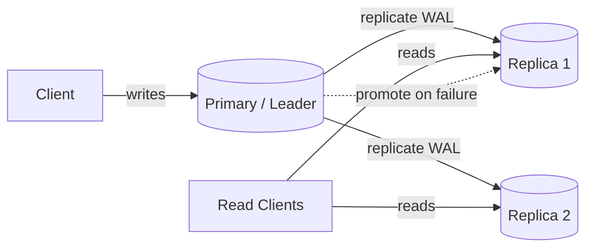

# Database Replication

## 🧭 Overview
Replication keeps copies of the same data on multiple database nodes. It improves **availability** (survive node failures), **read scalability** (serve reads from replicas), and **durability/locality** (data closer to users). It's a foundational technique behind nearly every production database and a frequent interview topic, especially around the consistency trade-offs it introduces.

---

## 🧠 Technical Explanation

### Replication Topologies
- **Single-leader (primary-replica):** one node accepts writes (leader), which streams changes to read-only replicas. Simple, common. Reads scale; writes don't.
- **Multi-leader:** multiple nodes accept writes (e.g., one per region). Better write availability/locality, but introduces **write conflicts** to resolve.
- **Leaderless (Dynamo-style):** any replica accepts writes; clients use quorums (`W + R > N`) for consistency. Used by Cassandra, DynamoDB.

### Synchronous vs Asynchronous
- **Synchronous:** leader waits for replica(s) to acknowledge before confirming the write. Strong consistency, but slower and the leader stalls if a replica is down.
- **Asynchronous:** leader confirms immediately and replicates in the background. Fast, but replicas lag → reads can be stale, and a leader crash can lose unreplicated writes.
- **Semi-synchronous:** wait for at least one replica — a common compromise.

### Replication Lag & Its Problems
Async replicas fall behind ("lag"). This causes:
- **Read-your-own-writes** violations (you post, then don't see your post).
- **Monotonic read** violations (you see newer data, then older).
Mitigations: read from the leader for your own recent writes, sticky routing, or version tokens.

### Failover
If the leader dies, a replica is promoted (automatically or manually). Risks: **split-brain** (two leaders), lost writes (async), and choosing the most up-to-date replica. Consensus protocols (Raft) make failover safe.

---

## 🍎 Simple Explanation (ELI5 / Analogy)
Imagine a head chef (the leader) who writes the master recipe book. Several assistant chefs (replicas) keep photocopies so customers can ask any of them what's in a dish (reads scale). When the head chef updates a recipe, the copies must be refreshed. If copies update instantly (synchronous), everyone's always in sync but the head chef waits. If copies update "whenever" (asynchronous), the head chef moves fast, but an assistant might quote a slightly outdated recipe (replication lag).

---

## 📊 Diagram / Flowchart

---

## ⚖️ Trade-offs

| | Synchronous | Asynchronous |
|---|------|------|
| Consistency | Strong (no lost writes) | Eventual (possible stale reads) |
| Write latency | Higher (wait for replicas) | Low (immediate ack) |
| Availability on replica failure | Leader may stall | Unaffected |
| Risk on leader crash | None (replicated) | Recent writes may be lost |

---

## 🌍 Real-World Examples
- **MySQL/PostgreSQL** commonly run single-leader with async read replicas to scale read-heavy workloads.
- **Cassandra/DynamoDB** use leaderless quorum replication across nodes/regions for high availability.
- **Google Spanner** uses synchronous, Paxos-based replication across regions for strong global consistency.

---

## 🎯 Interview Questions

### 🔵 Conceptual (Theory)
1. What is replication lag and what problems does it cause? → **Answer:** The delay before async replicas reflect the leader's writes; it causes stale reads and violations like not seeing your own recent write.
2. How do you guarantee read-your-own-writes with async replicas? → **Answer:** Route a user's reads to the leader for a short window after their write, or use version tokens / sticky sessions to a sufficiently up-to-date replica.
3. What is split-brain and how is it prevented? → **Answer:** Two nodes both believing they're leader, causing divergent writes; prevented via consensus (Raft/Paxos) and quorum-based leader election with fencing.

### 🟠 Design (Practical)
1. Your read load is 10x your write load — how does replication help? → **Answer:** Add read replicas and route reads to them, scaling reads horizontally while the single leader handles writes.
2. You must not lose any confirmed write even if the leader crashes — what do you choose? → **Answer:** Synchronous (or semi-sync) replication to at least one replica before acknowledging writes.

### 🔴 Company-Specific
1. [Google] How does Spanner achieve strong consistency across regions despite replication latency? *(Hint: Paxos + TrueTime clock bounds.)*
2. [Amazon] How does multi-region replication in DynamoDB Global Tables handle conflicts? *(Hint: last-writer-wins by timestamp, eventual consistency.)*
3. [Meta] How would you serve a global read-heavy workload with low latency? *(Hint: regional read replicas + route to nearest + accept eventual consistency.)*

---

## 📚 Further Reading
- *Designing Data-Intensive Applications*, Chapter 5 (replication)
- "In Search of an Understandable Consensus Algorithm" (Raft paper)

---

## 🔗 Related Topics
- [Sharding](03-sharding.md)
- [CAP Theorem](../02-scalability/04-cap-theorem.md)
- [Consistency Models](../07-distributed-systems/01-consistency-models.md)
- [Consensus Algorithms](../07-distributed-systems/03-consensus-algorithms.md)
