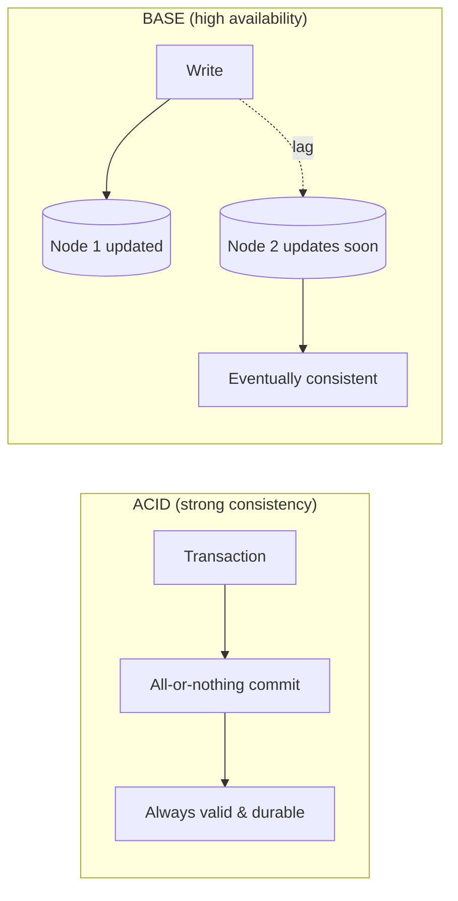

# ACID vs BASE

## 🧭 Overview
**ACID** and **BASE** are two contrasting philosophies for database guarantees. ACID (Atomicity, Consistency, Isolation, Durability) prioritizes correctness and strong consistency — the traditional relational model. BASE (Basically Available, Soft state, Eventually consistent) prioritizes availability and scale — the NoSQL/distributed model. Knowing when each applies is central to choosing databases and answering consistency questions in interviews.

---

## 🧠 Technical Explanation

### ACID
- **Atomicity:** a transaction is all-or-nothing; partial failures roll back.
- **Consistency:** transactions move the database from one valid state to another, preserving invariants/constraints.
- **Isolation:** concurrent transactions don't corrupt each other; behaves as if serialized (controlled by isolation levels).
- **Durability:** once committed, data survives crashes (written to durable storage / WAL).

**Isolation levels** (weakest → strongest): Read Uncommitted → Read Committed → Repeatable Read → Serializable. Stronger isolation prevents anomalies (dirty reads, non-repeatable reads, phantoms) but costs performance.

### BASE
- **Basically Available:** the system always responds (maybe with stale or approximate data).
- **Soft state:** state may change over time even without input (due to eventual propagation).
- **Eventually consistent:** given no new writes, all replicas converge to the same value eventually.

### Why the Split Exists
ACID is natural on a single node but expensive across a distributed cluster (coordination, locking, latency). BASE relaxes consistency to gain the availability and horizontal scalability that large distributed systems need — directly reflecting the CAP trade-off.

### It's a Spectrum, Not Binary
Many modern systems are tunable: DynamoDB offers eventual *or* strong reads; some NoSQL stores support ACID transactions (MongoDB multi-document, Cassandra lightweight transactions). Choose guarantees per use case, not per database dogmatically.

---

## 🍎 Simple Explanation (ELI5 / Analogy)
**ACID** is like a bank teller who refuses to finish a transfer until both accounts are perfectly updated and locked safe — slow, but never wrong about your money. **BASE** is like a group chat announcement: you post it and it's "out there," but it takes a moment to reach everyone's phone. For a while, some friends have seen it and others haven't, yet eventually everyone sees the same message. For money you want ACID; for a casual announcement, BASE is fine.

---

## 📊 Diagram / Flowchart

---

## ⚖️ Trade-offs

| | ACID | BASE |
|---|------|------|
| Consistency | Strong, immediate | Eventual |
| Availability | Lower under partition | High |
| Scalability | Harder (coordination) | Scales out easily |
| Complexity for app | DB handles correctness | App must handle stale data/conflicts |
| Best for | Money, inventory, bookings | Feeds, analytics, caching, IoT |

---

## 🌍 Real-World Examples
- **Stripe/PayPal** use ACID relational databases — financial correctness is non-negotiable.
- **Amazon's cart and DynamoDB** use BASE/eventual consistency to stay available at massive scale.
- **Social media like/view counters** are BASE — approximate, eventually consistent counts are acceptable.

---

## 🎯 Interview Questions

### 🔵 Conceptual (Theory)
1. What does the "I" in ACID guarantee, and how is it tuned? → **Answer:** Isolation ensures concurrent transactions don't interfere; it's tuned via isolation levels (Read Committed → Serializable), trading performance for fewer anomalies.
2. What does "eventually consistent" actually promise? → **Answer:** If writes stop, all replicas will converge to the same value eventually — but reads in the meantime may be stale.
3. How do ACID/BASE relate to the CAP theorem? → **Answer:** ACID leans CP (consistency over availability during partitions); BASE leans AP (availability over consistency).

### 🟠 Design (Practical)
1. Design a seat-booking flow — ACID or BASE? → **Answer:** ACID; the booking transaction must be atomic and isolated to prevent double-booking.
2. Design a view-count feature for videos — ACID or BASE? → **Answer:** BASE; approximate, eventually consistent counts are fine and scale far better.

### 🔴 Company-Specific
1. [Stripe] Why are ACID guarantees essential for a payments ledger? *(Hint: atomic debits/credits, no lost or duplicated money, auditability.)*
2. [Amazon] How does relaxing to BASE help the shopping cart stay available? *(Hint: always accept writes, reconcile conflicts later.)*
3. [Google] When would you pay the cost of Serializable isolation? *(Hint: when subtle concurrency anomalies would corrupt critical invariants.)*

---

## 📚 Further Reading
- "BASE: An Acid Alternative" by Dan Pritchett (ACM Queue)
- *Designing Data-Intensive Applications*, Chapter 7 (transactions)

---

## 🔗 Related Topics
- [CAP Theorem](../02-scalability/04-cap-theorem.md)
- [Consistency Models](../07-distributed-systems/01-consistency-models.md)
- [Distributed Transactions](../07-distributed-systems/02-distributed-transactions.md)
- [Relational vs NoSQL](01-relational-vs-nosql.md)
