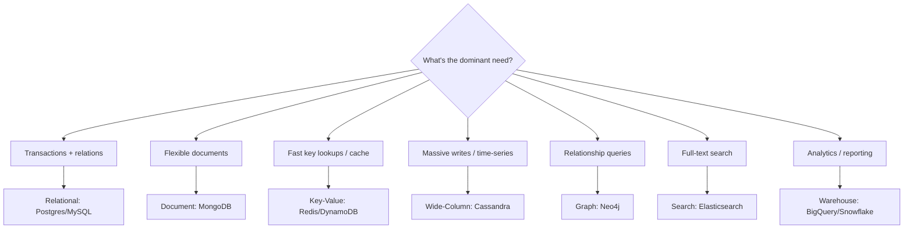

# Database Selection Guide

## 🧭 Overview
With dozens of database options, picking the right one is a matter of matching your **access patterns, consistency needs, scale, and data shape** to a database's strengths. This guide is a practical decision framework you can apply in design interviews and real projects. The key mindset: there is no "best" database — only the best fit for a specific workload, and most large systems use several (polyglot persistence).

---

## 🧠 Technical Explanation

### Step 1 — Characterize the Workload
Ask:
- **Read vs write ratio?** Read-heavy → caching + replicas. Write-heavy → LSM-based stores.
- **Access pattern?** Key lookups, range scans, full-text, relationship traversals, analytics?
- **Consistency needs?** Strong (money) vs eventual (feeds)?
- **Scale?** GBs or PBs? Thousands or millions of QPS?
- **Data shape?** Structured/relational, semi-structured documents, blobs, time-series, graph?

### Step 2 — Map to a Database Type
| Need | Pick | Examples |
|------|------|----------|
| Transactions, joins, strong consistency | Relational | PostgreSQL, MySQL, Spanner |
| Flexible documents, evolving schema | Document | MongoDB, DynamoDB (doc) |
| Ultra-fast key lookups, caching, sessions | Key-Value | Redis, Memcached, DynamoDB |
| Huge write volume, time-series, wide rows | Wide-Column | Cassandra, Bigtable, HBase |
| Relationship-heavy queries | Graph | Neo4j, Neptune |
| Full-text search | Search engine | Elasticsearch, OpenSearch |
| Analytics / OLAP over big data | Columnar warehouse | Snowflake, BigQuery, Redshift |
| Large files / media | Object storage | S3, GCS |
| Time-series metrics | TSDB | InfluxDB, TimescaleDB, Prometheus |

### Step 3 — Apply Constraints
- **Team expertise & operational cost** (managed vs self-hosted).
- **Ecosystem & tooling.**
- **Compliance / data residency.**

### Step 4 — Consider Polyglot Persistence
Use multiple databases together: e.g., Postgres for orders (ACID), Redis for sessions, Elasticsearch for search, S3 for media, Kafka for the event log. Each does one job well.

### OLTP vs OLAP
- **OLTP** (transactional): many small reads/writes, low latency → relational/NoSQL operational DBs.
- **OLAP** (analytical): large scans/aggregations → columnar warehouses. Don't run heavy analytics on your OLTP database.

---

## 🍎 Simple Explanation (ELI5 / Analogy)
Choosing a database is like choosing a vehicle. You don't ask "what's the best vehicle?" — you ask "best for *what*?" A sports car (relational DB) is precise and fast for a careful driver but doesn't haul cargo. A cargo truck (wide-column) moves huge volumes. A motorcycle (key-value cache) is lightning-fast for one rider. A delivery van fleet (polyglot) uses different vehicles for different jobs. Match the vehicle to the trip.

---

## 📊 Diagram / Flowchart

---

## ⚖️ Trade-offs

| Decision | Pros | Cons |
|------|------|------|
| Single database for everything | Simple ops, easy joins | Won't fit all access patterns at scale |
| Polyglot persistence | Best tool per job | More operational complexity, data sync |
| Managed cloud DB | Less ops burden | Higher cost, vendor lock-in |
| Self-hosted | Control, cost at scale | You own ops, backups, scaling |

---

## 🌍 Real-World Examples
- **Uber** uses a polyglot stack: MySQL/Postgres (via Schemaless), Cassandra, Redis, and more — each for specific access patterns.
- **Airbnb** uses MySQL for core booking data and Elasticsearch for search/discovery.
- **Netflix** uses Cassandra for high-volume operational data and S3 + a data warehouse for analytics.

---

## 🎯 Interview Questions

### 🔵 Conceptual (Theory)
1. Why shouldn't you run heavy analytics on your primary OLTP database? → **Answer:** Large scans/aggregations contend for resources and degrade latency-sensitive transactional queries; use a separate OLAP warehouse fed by ETL/CDC.
2. What is polyglot persistence? → **Answer:** Using multiple specialized databases in one system, each chosen for the workload it serves best.
3. What questions most influence database choice? → **Answer:** Access patterns, consistency needs, read/write ratio, scale, and data shape.

### 🟠 Design (Practical)
1. Choose databases for an e-commerce platform (orders, catalog, search, sessions, media). → **Answer:** Relational for orders (ACID), document/relational for catalog, Elasticsearch for search, Redis for sessions, S3 + CDN for media.
2. Your relational DB struggles with full-text search — what do you add? → **Answer:** A dedicated search engine (Elasticsearch/OpenSearch) kept in sync via CDC or events.

### 🔴 Company-Specific
1. [Uber] How would you choose storage for trip data vs driver-location updates? *(Hint: relational/Schemaless for trips; fast geo/key-value for high-frequency location.)*
2. [Amazon] When is DynamoDB the right default and when is Aurora better? *(Hint: key-based scale & serverless vs relational queries/transactions.)*
3. [Google] How would you separate operational and analytical workloads? *(Hint: OLTP DB + warehouse like BigQuery, connected by streaming/ETL.)*

---

## 📚 Further Reading
- *Designing Data-Intensive Applications* (whole book)
- AWS/GCP database decision guides

---

## 🔗 Related Topics
- [Relational vs NoSQL](01-relational-vs-nosql.md)
- [ACID vs BASE](05-acid-vs-base.md)
- [Choosing the Right Database](../13-hld-deep-dive/03-choosing-the-right-database.md)
- [Data Lakes and Warehouses](../08-storage/03-data-lakes-and-warehouses.md)
- [Database Comparison Cheatsheet](../12-cheatsheets/database-comparison.md)
