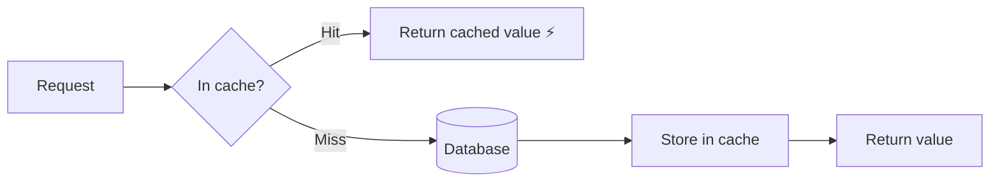

# Caching Fundamentals

## 🧭 Overview
A cache is a high-speed storage layer that holds copies of frequently accessed data so future requests are served faster, avoiding slower backends (databases, disk, network, computation). Caching is one of the highest-leverage performance techniques in system design — often turning 100 ms queries into sub-millisecond reads. You'll add caching to nearly every read-heavy system, and it's a guaranteed interview topic.

---

## 🧠 Technical Explanation

### Why It Works
Caching exploits **locality**: a small fraction of data is accessed far more often than the rest (the 80/20 rule). Serving the "hot" set from fast memory dramatically cuts latency and backend load.

### Where Caches Live (layers)
- **Client-side / browser cache** — static assets, API responses.
- **CDN** — content cached at edge locations near users.
- **Application/in-memory cache** — local process memory (fast, not shared).
- **Distributed cache** — Redis/Memcached shared across servers.
- **Database cache** — query/result/buffer caches inside the DB.

### Key Metrics
- **Hit ratio** = hits / (hits + misses). Higher is better; a low hit ratio means the cache isn't helping.
- **TTL (time to live)** — how long an entry stays valid before expiring.

### Cache Misses
- **Cold miss:** first-ever access (cache empty).
- **Capacity miss:** evicted due to size limits.
- **Invalidation miss:** removed because data changed.

### Hard Problems
- **Cache invalidation:** keeping cache consistent with the source of truth ("there are only two hard things... cache invalidation and naming things").
- **Cache stampede / thundering herd:** when a popular key expires, many requests simultaneously hit the backend. Mitigations: request coalescing/locks, staggered TTLs, "stale-while-revalidate," pre-warming.
- **Hot keys:** a single very popular key overloads one cache node; mitigate with replication or local caching.

---

## 🍎 Simple Explanation (ELI5 / Analogy)
A cache is like keeping your most-used kitchen items on the counter instead of in the basement pantry. The pantry (database) holds everything, but walking down there every time is slow. So you keep salt, pepper, and your favorite mug on the counter (cache) for instant access. The counter is small, so you only keep what you use most, and occasionally you must refresh items that have gone stale.

---

## 📊 Diagram / Flowchart

---

## ⚖️ Trade-offs

| Pros | Cons |
|------|------|
| Massive latency reduction | Risk of serving stale data |
| Reduces load on databases/backends | Invalidation is hard to get right |
| Improves throughput and cost efficiency | Extra infrastructure to operate |
| Smooths read spikes | Cache stampede / hot-key risks |

---

## 🌍 Real-World Examples
- **Facebook** runs a huge Memcached tier in front of MySQL to serve the social graph with high hit ratios.
- **Reddit** caches rendered pages and hot listings in Redis/Memcached to survive traffic spikes.
- **Twitter** caches timelines so feed reads rarely touch the database.

---

## 🎯 Interview Questions

### 🔵 Conceptual (Theory)
1. What is cache hit ratio and why does it matter? → **Answer:** The fraction of requests served from cache; a high ratio means the cache is effectively reducing backend load and latency, while a low ratio signals poor cache design.
2. What is a cache stampede and how do you prevent it? → **Answer:** Many requests hit the backend at once when a hot key expires; prevent with request coalescing/locks, staggered TTLs, and stale-while-revalidate.
3. Why is cache invalidation considered hard? → **Answer:** Keeping cached copies consistent with a changing source of truth across many nodes — without serving stale data or thrashing — is subtle and error-prone.

### 🟠 Design (Practical)
1. Where would you place caches for a global news website? → **Answer:** Browser cache + CDN for articles/assets, a distributed cache (Redis) for rendered content/hot data, and DB-level caching — layered.
2. A single celebrity's profile is a hot key overloading one cache node — what do you do? → **Answer:** Replicate the key across nodes, add a local in-process cache, or use request coalescing to reduce load.

### 🔴 Company-Specific
1. [Meta] How would you design a caching tier in front of a sharded MySQL fleet? *(Hint: Memcached pools, consistent hashing, lease/coalescing for stampede.)*
2. [Amazon] How do you keep a product-price cache consistent when prices change? *(Hint: write-through or event-based invalidation, short TTL.)*
3. [Google] How would you measure whether a cache is worth its complexity? *(Hint: hit ratio, latency improvement, backend load reduction.)*

---

## 📚 Further Reading
- "Scaling Memcache at Facebook" (NSDI paper)
- Redis documentation: caching patterns

---

## 🔗 Related Topics
- [Cache Strategies](02-cache-strategies.md)
- [Eviction Policies](03-eviction-policies.md)
- [CDN](04-cdn.md)
- [Latency vs Throughput](../01-fundamentals/04-latency-vs-throughput.md)
