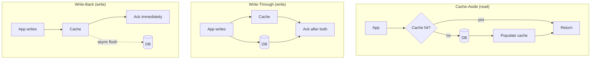

# Cache Strategies (Patterns)

## 🧭 Overview
Caching strategies define *how* your application reads from and writes to the cache relative to the database. The main patterns — **cache-aside, read-through, write-through, write-back, and write-around** — differ in who populates the cache, when, and how consistency is maintained. Choosing the right one is a core design decision and a common interview discussion, because each balances performance against staleness and complexity differently.

---

## 🧠 Technical Explanation

### Cache-Aside (Lazy Loading) — most common
The application manages the cache:
1. Read: check cache → on miss, read DB, then populate cache.
2. Write: write to DB, then **invalidate** (or update) the cache entry.

Pros: only requested data is cached; resilient to cache failures. Cons: first read is a miss; possible brief staleness between DB write and invalidation.

### Read-Through
The cache itself loads from the DB on a miss (the app talks only to the cache). Similar to cache-aside but the loading logic lives in the cache layer/library.

### Write-Through
Every write goes to the cache **and** the DB synchronously before acknowledging. Cache is always fresh; reads are fast. Cost: higher write latency (two writes), and you cache data that may never be read.

### Write-Back (Write-Behind)
Write to cache immediately and acknowledge; the cache asynchronously flushes to the DB later (often batched). Very fast writes, great for write-heavy workloads, but **risk of data loss** if the cache fails before flushing, and more complexity.

### Write-Around
Writes go straight to the DB, **bypassing** the cache; the cache is populated only on read (cache-aside read path). Good when written data is rarely read soon (avoids cache churn), but recently written data causes a read miss.

### Choosing
- **Read-heavy, tolerate slight staleness:** cache-aside (default).
- **Read-heavy, need freshness:** write-through.
- **Write-heavy, can tolerate risk:** write-back.
- **Write-once-read-rarely:** write-around.

---

## 🍎 Simple Explanation (ELI5 / Analogy)
Think of a chef and a recipe whiteboard (cache) vs the recipe binder (database):
- **Cache-aside:** the chef checks the whiteboard; if it's blank, they fetch from the binder and jot it on the whiteboard.
- **Write-through:** whenever a recipe changes, the chef updates both the whiteboard and the binder at the same time — always in sync but a bit slower.
- **Write-back:** the chef scribbles changes on the whiteboard fast and copies them into the binder later — speedy, but if the whiteboard is wiped before copying, changes are lost.

---

## 📊 Diagram / Flowchart

---

## ⚖️ Trade-offs

| Strategy | Read speed | Write speed | Freshness | Risk |
|----------|-----------|-------------|-----------|------|
| Cache-aside | Fast (after warm) | Normal | Slight staleness | Stale on race |
| Write-through | Fast | Slower (dual write) | Always fresh | Caches unused data |
| Write-back | Fast | Very fast | Eventually | Data loss if cache fails |
| Write-around | Fast (later) | Normal | Fresh in DB | Read miss on new data |

---

## 🌍 Real-World Examples
- **Most web apps** use cache-aside with Redis as the default pattern.
- **Write-through** is used where reads must reflect writes immediately, e.g., user profile settings.
- **Write-back** patterns appear in high-write systems like metrics aggregation and some database internal buffers.

---

## 🎯 Interview Questions

### 🔵 Conceptual (Theory)
1. What is the main risk of write-back caching? → **Answer:** Data loss — if the cache fails before flushing buffered writes to the database, those writes are gone.
2. Why is cache-aside resilient to cache outages? → **Answer:** The app falls back to the database on a miss/failure, so the system still works (just slower) without the cache.
3. When does write-around make sense? → **Answer:** When written data is unlikely to be read soon, so caching it would just waste space and churn the cache.

### 🟠 Design (Practical)
1. Design caching for a shopping cart that updates frequently and must reflect changes instantly. → **Answer:** Write-through (or cache-aside with immediate update) to keep cache and DB consistent on every change.
2. How do you handle the brief staleness window in cache-aside on writes? → **Answer:** Invalidate the key on write (delete rather than update), use short TTLs, and consider versioning to avoid races.

### 🔴 Company-Specific
1. [Amazon] Which strategy fits a product catalog read millions of times but updated rarely? *(Hint: cache-aside / write-through with long TTL.)*
2. [Meta] How would you cache write-heavy counters (likes) efficiently? *(Hint: write-back/batched increments, periodic flush.)*
3. [Netflix] How do you keep a cache fresh for frequently changing recommendations? *(Hint: short TTL, async refresh, stale-while-revalidate.)*

---

## 📚 Further Reading
- AWS caching strategies whitepaper
- Redis docs: caching patterns and best practices

---

## 🔗 Related Topics
- [Caching Fundamentals](01-caching-fundamentals.md)
- [Eviction Policies](03-eviction-policies.md)
- [Choosing the Right Cache](../13-hld-deep-dive/04-choosing-the-right-cache.md)
