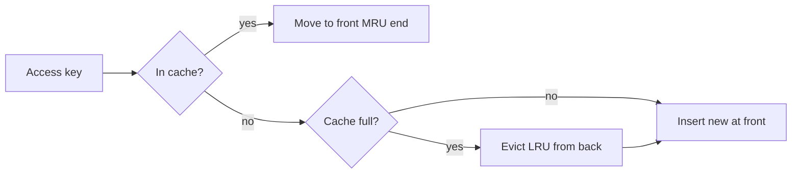

# Cache Eviction Policies

## 🧭 Overview
A cache has limited memory, so when it fills up it must decide which entries to remove to make room for new ones — that decision is the **eviction policy**. The right policy maximizes hit ratio for your access pattern. Eviction policies (LRU, LFU, FIFO, TTL-based, and more) are a frequent interview topic, and LRU in particular is a classic LLD coding question.

---

## 🧠 Technical Explanation

### Common Policies
| Policy | Evicts | Best for | Weakness |
|--------|--------|----------|----------|
| **LRU** (Least Recently Used) | Item unused longest | Temporal locality (recent = likely reused) | A burst of one-time scans pollutes it |
| **LFU** (Least Frequently Used) | Item accessed least often | Stable popularity over time | Slow to adapt; old popular items linger |
| **FIFO** (First In First Out) | Oldest inserted | Simple, fair | Ignores actual usage |
| **MRU** (Most Recently Used) | Most recently used | Some scan patterns | Counterintuitive, rare |
| **Random** | A random entry | Simplicity, avoids worst cases | Not usage-aware |
| **TTL-based** | Expired entries | Time-sensitive data | Doesn't bound memory alone |

### LRU in Detail (the interview favorite)
Implemented with a **hash map + doubly linked list**: the map gives O(1) lookup; the list maintains recency order. On access, move the node to the front; on eviction, remove from the back. All operations are O(1).

### LFU in Detail
Tracks an access count per key; evicts the lowest count. Often implemented with frequency buckets to keep operations O(1). Variants add aging/decay so once-popular items don't stay forever.

### Hybrid & Modern Policies
Real caches use smarter algorithms: **LRU-K**, **2Q**, **ARC** (Adaptive Replacement Cache), and Redis's **allkeys-lru / volatile-lru / allkeys-lfu** approximations (sampling-based for efficiency). These balance recency and frequency and resist scan pollution.

### TTL vs Eviction
TTL expires entries by *time* (correctness/freshness); eviction removes entries due to *space*. Most caches use both: TTL bounds staleness, eviction bounds memory.

---

## 🍎 Simple Explanation (ELI5 / Analogy)
Your fridge (cache) is full and you bought groceries. You must toss something:
- **LRU:** throw out whatever you haven't touched in the longest time — you probably won't miss it.
- **LFU:** throw out whatever you rarely eat, even if you grabbed it yesterday.
- **FIFO:** throw out whatever has been in there the longest, regardless of whether you love it.
- **TTL:** throw out anything past its expiry date, no matter what.

---

## 📊 Diagram / Flowchart

---

## ⚖️ Trade-offs

| Policy | Pros | Cons |
|------|------|------|
| LRU | Great for recency, O(1) | Scan-sensitive, ignores frequency |
| LFU | Captures long-term popularity | Adapts slowly, needs aging |
| FIFO | Trivial to implement | Not usage-aware |
| ARC/2Q | Balances recency + frequency | More complex |
| TTL | Bounds staleness | Doesn't bound memory by itself |

---

## 🌍 Real-World Examples
- **Redis** offers configurable policies (`allkeys-lru`, `volatile-lru`, `allkeys-lfu`, `volatile-ttl`) using approximate sampling for speed.
- **CPU caches** use LRU-like replacement in hardware.
- **CDNs** combine LRU with TTLs to keep popular assets at the edge while expiring stale ones.

---

## 🎯 Interview Questions

### 🔵 Conceptual (Theory)
1. How do you implement an O(1) LRU cache? → **Answer:** A hash map for O(1) key lookup plus a doubly linked list ordered by recency; move-to-front on access, remove-from-tail on eviction.
2. When does LFU outperform LRU? → **Answer:** When popularity is stable over time — LFU keeps consistently popular items even if not accessed very recently; it also resists one-time scan pollution better.
3. What's the difference between TTL expiry and eviction? → **Answer:** TTL removes entries by age for freshness; eviction removes entries to free space when memory is full.

### 🟠 Design (Practical)
1. A nightly batch job scans the whole dataset and ruins your cache hit ratio — which policy or fix helps? → **Answer:** LFU, ARC/2Q, or a scan-resistant policy; or bypass the cache for the batch job (write-around) to avoid pollution.
2. How would you bound both memory and staleness in one cache? → **Answer:** Combine an eviction policy (e.g., LRU) for memory with TTLs for freshness.

### 🔴 Company-Specific
1. [Amazon] Design an LRU cache class — what data structures and complexity? *(Hint: hashmap + doubly linked list, O(1) get/put — also an LLD question.)*
2. [Meta] How would you choose between LRU and LFU for a news-feed cache? *(Hint: recency vs sustained popularity of content.)*
3. [Google] How does Redis approximate LRU/LFU efficiently? *(Hint: random sampling instead of exact global ordering.)*

---

## 📚 Further Reading
- "ARC: A Self-Tuning, Low Overhead Replacement Cache" (Megiddo & Modha)
- Redis docs: eviction policies

---

## 🔗 Related Topics
- [Caching Fundamentals](01-caching-fundamentals.md)
- [Cache Strategies](02-cache-strategies.md)
- [Choosing the Right Cache](../13-hld-deep-dive/04-choosing-the-right-cache.md)
