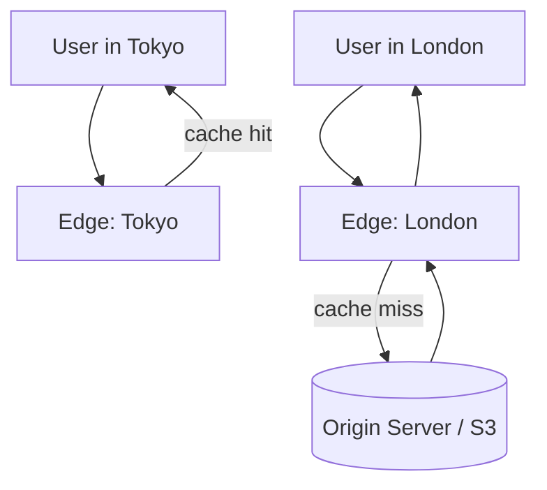

# Content Delivery Networks (CDN)

## 🧭 Overview
A CDN is a geographically distributed network of edge servers that cache and serve content close to users, reducing latency, offloading origin servers, and improving availability. CDNs are how global products deliver images, video, scripts, and even API responses fast worldwide. You'll reach for a CDN in almost any system that serves static content or has a global audience, and it's a standard part of HLD case-study answers.

---

## 🧠 Technical Explanation

### How It Works
1. User requests `cdn.example.com/logo.png`.
2. DNS/anycast routes them to the **nearest edge (PoP — Point of Presence)**.
3. If the edge has the asset cached (**cache hit**), it serves it immediately.
4. On a **cache miss**, the edge fetches from the **origin** (your server / object storage), caches it per its TTL/headers, and serves it.

### What CDNs Cache
- **Static assets:** images, CSS, JS, fonts, video segments.
- **Dynamic content (edge caching):** cacheable API responses, with short TTLs.
- **Streaming media:** chunked video (HLS/DASH) cached at the edge.

### Push vs Pull CDNs
- **Pull:** CDN fetches from origin on first request (lazy). Easy to set up; origin hit on cold content.
- **Push:** you upload content to the CDN proactively. Good for large, predictable files.

### Cache Control
HTTP headers drive CDN behavior: `Cache-Control` (max-age, s-maxage), `ETag`/`Last-Modified` (validation), and `Vary`. **Cache invalidation/purge** APIs remove stale content; **versioned URLs** (`app.v123.js`) are a common way to "invalidate" by changing the path.

### Extra Benefits
- **DDoS protection & WAF** at the edge.
- **TLS termination** near users (faster handshakes).
- **Edge compute** (Cloudflare Workers, Lambda@Edge) runs logic close to users.
- **Origin shielding** — a mid-tier cache reduces origin load further.

---

## 🍎 Simple Explanation (ELI5 / Analogy)
A CDN is like a popular bakery opening branches in every neighborhood instead of one central shop. Instead of everyone driving across town to the original bakery (the origin server) for bread, each neighborhood branch (edge server) keeps the popular loaves stocked. You get fresh bread quickly from nearby, and the central bakery isn't mobbed. If a branch runs out of a special item, it calls the central bakery to restock.

---

## 📊 Diagram / Flowchart

---

## ⚖️ Trade-offs

| Pros | Cons |
|------|------|
| Much lower latency for global users | Cache invalidation/purge complexity |
| Offloads traffic from origin | Cost for high bandwidth |
| Improves availability & DDoS resilience | Stale content risk if misconfigured |
| TLS termination & edge compute | Not ideal for highly dynamic/personalized data |

---

## 🌍 Real-World Examples
- **Netflix Open Connect** places CDN appliances inside ISPs so video streams from as close as possible.
- **Cloudflare/Akamai/Fastly** front a huge share of the web for caching, security, and edge compute.
- **YouTube** serves video chunks from edge caches worldwide to minimize buffering.

---

## 🎯 Interview Questions

### 🔵 Conceptual (Theory)
1. How does a CDN reduce latency? → **Answer:** It serves content from edge servers geographically near users, cutting network round-trip distance and offloading the origin.
2. What's the difference between a push and a pull CDN? → **Answer:** Pull fetches from origin on first request (lazy); push proactively uploads content to the CDN ahead of demand.
3. How do you invalidate content on a CDN? → **Answer:** Use purge APIs, short TTLs, or versioned/hashed URLs so a new path bypasses the old cached entry.

### 🟠 Design (Practical)
1. How would you deliver software downloads (large, static, global) efficiently? → **Answer:** A CDN (push for large predictable files), long TTLs, versioned URLs, and origin in object storage like S3.
2. Should you cache personalized API responses on a CDN? → **Answer:** Generally no (or only with `Vary`/short TTL); personalized data is poorly cacheable — cache static/shared parts instead and consider edge compute.

### 🔴 Company-Specific
1. [Netflix] Why build your own CDN (Open Connect) instead of only using third parties? *(Hint: control, cost at massive video scale, ISP placement.)*
2. [Amazon] How do CloudFront and S3 work together for static sites? *(Hint: S3 origin + CDN edge caching + cache headers.)*
3. [Google] How would you serve dynamic-but-cacheable content at the edge? *(Hint: short TTLs, edge compute, stale-while-revalidate.)*

---

## 📚 Further Reading
- Cloudflare Learning Center: "What is a CDN?"
- Netflix Tech Blog: Open Connect

---

## 🔗 Related Topics
- [Caching Fundamentals](01-caching-fundamentals.md)
- [Object Storage](../08-storage/01-object-storage.md)
- [Network Basics](../01-fundamentals/03-network-basics.md)
- [Design YouTube](../10-real-world-case-studies/03-design-youtube.md)
