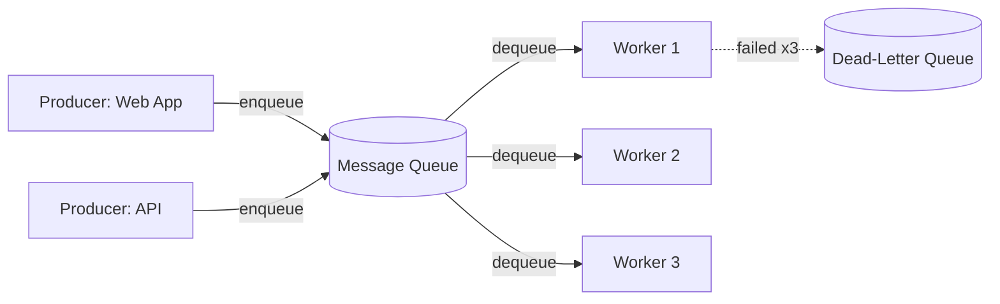

# Message Queues

## 🧭 Overview
A message queue is a component that lets services communicate **asynchronously** by sending messages that are stored until a consumer processes them. Queues decouple producers from consumers, smooth out traffic spikes, and enable reliable background processing. They're a staple of scalable architectures and appear in nearly every non-trivial HLD design (order processing, notifications, video encoding, etc.).

---

## 🧠 Technical Explanation

### The Core Idea
A **producer** puts a message on the queue; a **consumer** pulls it off and processes it later. The two never talk directly and don't need to be online at the same time. This is **point-to-point** messaging: each message is typically processed by exactly one consumer.

### Why Use a Queue
- **Decoupling:** producer and consumer evolve and fail independently.
- **Load leveling / buffering:** absorb spikes; consumers process at their own pace.
- **Asynchronous work:** return to the user fast, do slow work in the background (send email, generate thumbnails).
- **Reliability:** messages persist until processed, surviving consumer crashes.
- **Scalability:** add more consumer workers to drain the queue faster.

### Delivery Guarantees
- **At-most-once:** may lose messages, never duplicates.
- **At-least-once:** never loses, but may duplicate → consumers must be **idempotent**.
- **Exactly-once:** ideal but hard/expensive; often approximated with idempotency + dedup.

### Key Concepts
- **Acknowledgment (ack):** consumer confirms processing; unacked messages are redelivered.
- **Visibility timeout:** a claimed message is hidden from others until acked or timeout.
- **Dead-letter queue (DLQ):** messages that repeatedly fail go here for inspection.
- **Ordering:** some queues guarantee FIFO order (often at a throughput cost).
- **Backpressure:** when consumers can't keep up, the queue grows — monitor depth/age.

### Popular Systems
RabbitMQ, AWS SQS, ActiveMQ, Redis (lists/streams). For high-throughput streaming/log use cases, Kafka (covered separately).

---

## 🍎 Simple Explanation (ELI5 / Analogy)
A message queue is like the order ticket rail in a diner. Waiters (producers) clip order tickets onto the rail and immediately go serve other tables — they don't wait by the kitchen. Cooks (consumers) grab tickets one at a time and cook at their own pace. If a rush hits, tickets pile up but nothing is lost; if a cook takes a break, another cook handles the backlog. The rail decouples taking orders from cooking them.

---

## 📊 Diagram / Flowchart

---

## ⚖️ Trade-offs

| Pros | Cons |
|------|------|
| Decouples services; independent scaling/failure | Added infrastructure & operational complexity |
| Absorbs spikes (load leveling) | Eventual processing → not for sync needs |
| Reliable, retryable background work | Duplicates possible (need idempotency) |
| Improves user-facing latency | Harder to debug/trace async flows |

---

## 🌍 Real-World Examples
- **Amazon** uses SQS extensively to decouple order, fulfillment, and notification services.
- **Image/video apps** queue uploads for async thumbnail/transcode generation.
- **Stripe** processes webhooks and async tasks via durable queues with retries and DLQs.

---

## 🎯 Interview Questions

### 🔵 Conceptual (Theory)
1. Why must consumers be idempotent with at-least-once delivery? → **Answer:** Because the same message can be delivered more than once; idempotent processing ensures duplicates don't cause double charges, duplicate emails, etc.
2. What is a dead-letter queue? → **Answer:** A separate queue where messages that repeatedly fail processing are sent, so they don't block the main queue and can be inspected/retried later.
3. What is a visibility timeout? → **Answer:** A period during which a message claimed by one consumer is hidden from others; if not acked in time, it becomes visible again for redelivery.

### 🟠 Design (Practical)
1. A signup must send a welcome email without slowing the response — how? → **Answer:** Enqueue an "email" message and return immediately; a worker consumes the queue and sends the email asynchronously.
2. Your queue depth keeps growing — what does it mean and what do you do? → **Answer:** Consumers can't keep up (backpressure); scale out workers, optimize processing, or shed/prioritize load.

### 🔴 Company-Specific
1. [Amazon] How would you guarantee an order is processed exactly once with SQS? *(Hint: at-least-once + idempotency keys/dedup, or FIFO queues with dedup IDs.)*
2. [Uber] How would you use a queue to handle surge bursts of ride requests? *(Hint: buffer/load-level, scale consumers, prioritize.)*
3. [Stripe] How do you handle a message that keeps failing? *(Hint: retries with backoff, then DLQ + alerting.)*

---

## 📚 Further Reading
- AWS SQS developer guide
- *Enterprise Integration Patterns* by Hohpe & Woolf

---

## 🔗 Related Topics
- [Pub/Sub](02-pub-sub.md)
- [Kafka Deep Dive](03-kafka-deep-dive.md)
- [Event-Driven Architecture](04-event-driven-architecture.md)
- [Design Notification System](../10-real-world-case-studies/07-design-notification-system.md)
