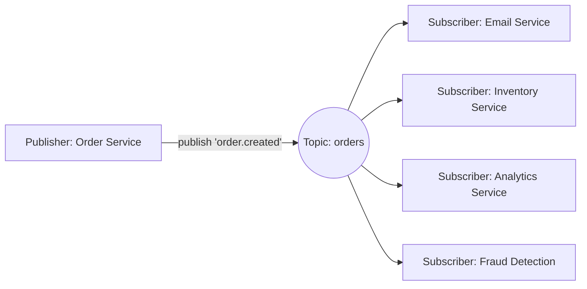

# Publish-Subscribe (Pub/Sub)

## 🧭 Overview
Publish-subscribe is a messaging pattern where **publishers** send messages to a **topic** without knowing who will receive them, and any number of **subscribers** receive every message on topics they care about. Unlike a point-to-point queue (one message → one consumer), pub/sub **broadcasts** (one message → many consumers). It's the backbone of event-driven systems, real-time notifications, and fan-out architectures.

---

## 🧠 Technical Explanation

### Queue vs Pub/Sub
- **Queue (point-to-point):** each message is consumed by exactly one worker. Good for distributing *work*.
- **Pub/Sub (fan-out):** each message is delivered to *all* interested subscribers. Good for distributing *events/notifications*.

### Core Components
- **Publisher:** emits messages to a topic.
- **Topic:** named channel messages are published to.
- **Subscriber:** registers interest in a topic and receives matching messages.
- **Broker:** routes messages from publishers to subscribers, handling delivery and (optionally) durability.

### Delivery Models
- **Push:** broker pushes messages to subscribers (e.g., webhooks).
- **Pull:** subscribers poll for new messages.

### Subscription Types
- **Fan-out:** every subscriber gets every message.
- **Topic/filtered:** subscribers receive only messages matching a topic or attribute filter.
- **Consumer groups (hybrid):** combine pub/sub topics with queue-like load balancing within a group — each group gets all messages, but members of a group share the work (Kafka model).

### Guarantees & Challenges
- Ordering, at-least-once delivery, and durability vary by system.
- Subscribers must handle duplicates (idempotency) and may lag.
- **Decoupling** is the superpower: add new subscribers without touching publishers.

### Popular Systems
Google Cloud Pub/Sub, AWS SNS (+SQS for fan-out-to-queues), Redis Pub/Sub, NATS, and Kafka (topic + consumer groups).

---

## 🍎 Simple Explanation (ELI5 / Analogy)
Pub/Sub is like a magazine subscription. The publisher prints an issue (a message) and sends it to a distribution topic ("Tech Monthly"). Every subscriber to that magazine gets their own copy delivered — the publisher doesn't know or care who the subscribers are, and subscribers don't talk to the publisher. New readers can subscribe anytime and start getting issues, and anyone can unsubscribe without affecting others.

---

## 📊 Diagram / Flowchart

---

## ⚖️ Trade-offs

| Pros | Cons |
|------|------|
| Strong decoupling; add subscribers freely | Harder to trace/debug (who consumed what?) |
| One event reaches many consumers (fan-out) | Duplicate/ordering handling needed |
| Great for real-time event distribution | Slow subscriber can lag or drop messages |
| Scales event-driven architectures | Delivery guarantees vary by broker |

---

## 🌍 Real-World Examples
- **AWS SNS → SQS fan-out:** one event published to SNS lands in multiple SQS queues for different services.
- **Slack/Discord** use pub/sub-style fan-out to deliver a posted message to all clients in a channel.
- **Uber** publishes trip events consumed independently by pricing, ETA, analytics, and notification services.

---

## 🎯 Interview Questions

### 🔵 Conceptual (Theory)
1. What's the difference between a message queue and pub/sub? → **Answer:** A queue delivers each message to one consumer (work distribution); pub/sub broadcasts each message to all subscribers (event distribution).
2. How do consumer groups combine queue and pub/sub semantics? → **Answer:** Each group receives all messages (pub/sub across groups), but within a group, members share/partition the messages (queue-like load balancing).
3. Why is pub/sub good for decoupling? → **Answer:** Publishers don't know subscribers; you can add or remove subscribers without changing the publisher, enabling independent evolution.

### 🟠 Design (Practical)
1. An order event must trigger email, inventory update, and analytics — pattern? → **Answer:** Pub/sub: publish `order.created` to a topic; each service subscribes and reacts independently.
2. How do you add a new "fraud detection" feature without touching existing services? → **Answer:** Add a new subscriber to the existing topic — no changes to publisher or other subscribers.

### 🔴 Company-Specific
1. [Amazon] How do SNS and SQS combine for reliable fan-out? *(Hint: SNS topic → multiple SQS queues, each service drains its own queue with retries/DLQ.)*
2. [Google] How would you design a system to broadcast events to thousands of subscribers reliably? *(Hint: durable topics, consumer offsets, backpressure, scaling.)*
3. [Meta] How would you deliver a chat message to all members of a large group in real time? *(Hint: pub/sub fan-out + connection servers + presence.)*

---

## 📚 Further Reading
- Google Cloud Pub/Sub architecture docs
- *Designing Data-Intensive Applications*, Chapter 11 (stream processing)

---

## 🔗 Related Topics
- [Message Queues](01-message-queues.md)
- [Kafka Deep Dive](03-kafka-deep-dive.md)
- [Event-Driven Architecture](04-event-driven-architecture.md)
