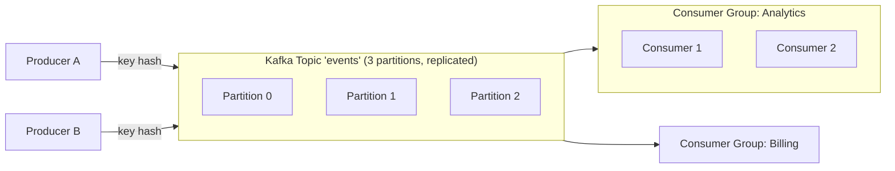

# Apache Kafka Deep Dive

## 🧭 Overview
Apache Kafka is a distributed, durable, high-throughput **event-streaming platform** built around an append-only commit log. Unlike a traditional queue that deletes messages after consumption, Kafka **retains** messages and lets many consumers read them independently at their own pace. It's the de facto backbone for event-driven architectures, log aggregation, stream processing, and data pipelines at massive scale, making it a frequent deep-dive topic in senior interviews.

---

## 🧠 Technical Explanation

### Core Concepts
- **Topic:** a named stream of records, split into **partitions**.
- **Partition:** an ordered, immutable, append-only log. Ordering is guaranteed **within** a partition, not across partitions. Partitions are the unit of parallelism.
- **Offset:** each record's position in a partition; consumers track their own offset.
- **Producer:** appends records to topic partitions (by key hash or round-robin).
- **Consumer / Consumer Group:** consumers in a group split partitions among themselves; each partition is read by exactly one consumer in the group.
- **Broker:** a Kafka server holding partitions; a cluster has many brokers.
- **Replication:** each partition has a leader + follower replicas across brokers for fault tolerance.

### Why It's Fast & Durable
- **Sequential disk I/O** + the OS page cache make append/read extremely fast.
- **Zero-copy** transfers data from disk to network efficiently.
- **Batching & compression** boost throughput.
- Records are **persisted** and **replicated**, so consumers can replay history.

### Retention & Replay
Kafka keeps records for a configured time/size (e.g., 7 days) regardless of consumption. Consumers can **rewind offsets** to reprocess data — invaluable for new consumers, bug recovery, and analytics.

### Delivery Semantics
At-least-once by default; exactly-once is supported via idempotent producers + transactions. Consumers commit offsets to mark progress.

### Coordination
Modern Kafka uses **KRaft** (Raft-based) for metadata/coordination, replacing the older ZooKeeper dependency.

### When to Use Kafka
High-volume event streams, log/metrics pipelines, decoupling microservices, stream processing (Kafka Streams/Flink), event sourcing. **Not** ideal for low-volume task queues with complex routing (RabbitMQ fits better) or request/response RPC.

---

## 🍎 Simple Explanation (ELI5 / Analogy)
Kafka is like a never-erased group journal. Writers (producers) keep appending entries to the end of notebooks (partitions). Readers (consumers) each keep their own bookmark (offset) and read at their own speed — one reader can be on page 5 while another is on page 500. Because nothing is erased, a brand-new reader can start from page 1 and catch up on the whole history. Multiple notebooks (partitions) let many writers and readers work in parallel.

---

## 📊 Diagram / Flowchart

---

## ⚖️ Trade-offs

| Pros | Cons |
|------|------|
| Very high throughput, horizontally scalable | Operationally complex to run/tune |
| Durable, replayable log (retention) | Overkill for simple/low-volume queues |
| Ordering within partition; parallel via partitions | No global ordering across partitions |
| Decouples producers/consumers; many independent readers | Latency higher than in-memory brokers for tiny loads |

---

## 🌍 Real-World Examples
- **LinkedIn** created Kafka to handle its activity stream and now processes trillions of messages/day.
- **Uber** uses Kafka for trip events, pricing, and its real-time data pipeline.
- **Netflix** uses Kafka (Keystone pipeline) for event ingestion and stream processing.

---

## 🎯 Interview Questions

### 🔵 Conceptual (Theory)
1. How does Kafka guarantee ordering, and what's the limitation? → **Answer:** Ordering is guaranteed within a single partition; there is no global ordering across partitions, so related events that must be ordered should share a partition key.
2. How does Kafka differ from a traditional message queue? → **Answer:** Kafka retains messages in a durable log (consumers can replay) and supports many independent consumer groups, whereas a classic queue deletes a message once consumed by one worker.
3. What role do consumer groups play? → **Answer:** Within a group, partitions are divided among consumers for parallelism (each partition to one consumer); different groups each get the full stream independently.

### 🟠 Design (Practical)
1. You need events for the same user processed in order — how do you partition? → **Answer:** Use the user ID as the partition key so all that user's events land in the same partition, preserving order.
2. A new analytics service must process the last 7 days of events — how? → **Answer:** Add a new consumer group and start reading from the earliest offset; Kafka's retention lets it replay history.

### 🔴 Company-Specific
1. [LinkedIn] How would you scale Kafka to handle a 10x increase in event volume? *(Hint: add partitions/brokers, tune batching, scale consumer groups.)*
2. [Uber] How do you achieve exactly-once processing in a Kafka pipeline? *(Hint: idempotent producers, transactions, idempotent consumers.)*
3. [Netflix] When would you choose Kafka over SQS/RabbitMQ? *(Hint: high-throughput streaming, replay, many consumers vs simple task routing.)*

---

## 📚 Further Reading
- "Kafka: a Distributed Messaging System for Log Processing" (LinkedIn)
- Confluent Kafka documentation & design docs

---

## 🔗 Related Topics
- [Message Queues](01-message-queues.md)
- [Pub/Sub](02-pub-sub.md)
- [Event-Driven Architecture](04-event-driven-architecture.md)
- [Consensus Algorithms](../07-distributed-systems/03-consensus-algorithms.md)
