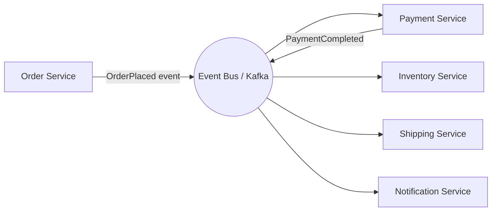

# Event-Driven Architecture (EDA)

## 🧭 Overview
Event-driven architecture is a design style where services communicate by producing and reacting to **events** (immutable facts about something that happened) rather than calling each other directly. Components are loosely coupled and react asynchronously, enabling scalability, resilience, and extensibility. EDA underpins modern microservices, real-time systems, and data pipelines, and it's a common framing for HLD discussions.

---

## 🧠 Technical Explanation

### Events vs Commands
- An **event** states a fact: `OrderPlaced`, `PaymentFailed`. It's named in past tense and has no single intended recipient.
- A **command** is a request to do something: `PlaceOrder`. It targets a specific handler.
EDA centers on events; consumers decide how to react.

### Patterns within EDA
- **Event notification:** a thin event signals "something happened"; consumers fetch details if needed.
- **Event-carried state transfer:** the event carries enough data that consumers don't need to call back.
- **Event sourcing:** store the *sequence of events* as the source of truth; rebuild current state by replaying them. Enables full audit/history and time-travel.
- **CQRS (Command Query Responsibility Segregation):** separate the write model (commands/events) from optimized read models, often paired with event sourcing.

### How It's Built
Producers emit events to a broker (Kafka, SNS/SQS, Pub/Sub); consumers subscribe and react. The broker provides durability, fan-out, and buffering.

### Benefits
- **Loose coupling & extensibility:** add new consumers without touching producers.
- **Scalability & resilience:** async processing absorbs spikes; a down consumer doesn't block producers.
- **Auditability:** the event log is a natural history.

### Challenges
- **Eventual consistency:** reactions happen asynchronously.
- **Debugging/tracing:** flows are distributed (need correlation IDs, distributed tracing).
- **Duplicate/out-of-order events:** require idempotency and sometimes ordering keys.
- **Schema evolution:** events are contracts; changing them needs care (schema registry, versioning).

---

## 🍎 Simple Explanation (ELI5 / Analogy)
Think of a wedding. When the couple says "I do" (an **event**), lots of people react independently: the photographer snaps a photo, the caterer starts plating, the band cues music, guests cheer. The couple didn't individually instruct each person — everyone just reacts to the announced event. You could add a drone operator (a new consumer) next time without changing what the couple does. That's event-driven architecture: announce facts, let everyone react.

---

## 📊 Diagram / Flowchart

---

## ⚖️ Trade-offs

| Pros | Cons |
|------|------|
| Loose coupling, easy to extend | Eventual consistency complicates UX/logic |
| Scales and absorbs spikes (async) | Harder to debug/trace distributed flows |
| Resilient (failures isolated) | Requires idempotency & schema governance |
| Natural audit log (esp. event sourcing) | More moving parts / operational overhead |

---

## 🌍 Real-World Examples
- **Uber** is heavily event-driven: a trip generates events consumed by pricing, ETA, analytics, fraud, and notifications.
- **E-commerce checkouts** emit `OrderPlaced` events that fan out to payment, inventory, shipping, and email services.
- **Banks** use event sourcing for ledgers, where the immutable event history is the source of truth.

---

## 🎯 Interview Questions

### 🔵 Conceptual (Theory)
1. What is the difference between an event and a command? → **Answer:** An event is a past-tense fact with no specific recipient (`OrderPlaced`); a command is a directed request to perform an action (`PlaceOrder`).
2. What is event sourcing and one benefit/drawback? → **Answer:** Storing state as a sequence of events and replaying them to derive current state; benefit = full audit/history and replay, drawback = complexity and rebuild cost.
3. Why does EDA usually imply eventual consistency? → **Answer:** Consumers react asynchronously after events propagate, so the overall system state converges over time rather than updating instantly everywhere.

### 🟠 Design (Practical)
1. How do you trace a single user action across many event-driven services? → **Answer:** Propagate a correlation/trace ID through every event and use distributed tracing (OpenTelemetry) to stitch the flow together.
2. How do you handle duplicate or out-of-order events? → **Answer:** Make consumers idempotent (dedup by event ID), use ordering keys/partitions where order matters, and design for at-least-once delivery.

### 🔴 Company-Specific
1. [Uber] How would you design a trip lifecycle using events? *(Hint: TripRequested → DriverAssigned → TripStarted → TripCompleted, each consumed by multiple services.)*
2. [Amazon] How does EDA help an order pipeline stay resilient when one service is down? *(Hint: events buffered in broker, consumer catches up later.)*
3. [Stripe] Why is event sourcing attractive for a payments ledger? *(Hint: immutable audit trail, replayability, reconstructable balances.)*

---

## 📚 Further Reading
- Martin Fowler: "What do you mean by 'Event-Driven'?"
- *Designing Event-Driven Systems* by Ben Stopford (free, Confluent)

---

## 🔗 Related Topics
- [Pub/Sub](02-pub-sub.md)
- [Kafka Deep Dive](03-kafka-deep-dive.md)
- [Distributed Transactions](../07-distributed-systems/02-distributed-transactions.md)
- [Monolith vs Microservices](../13-hld-deep-dive/05-monolith-vs-microservices.md)
