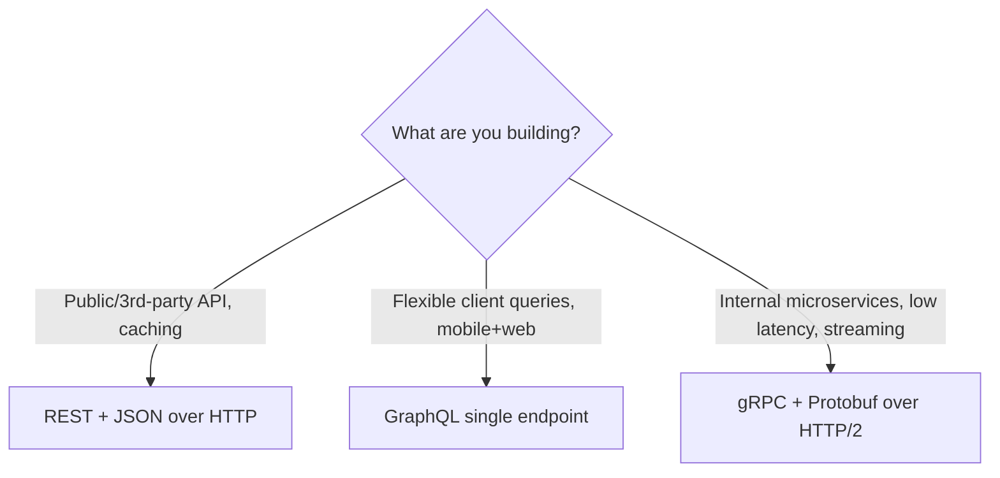

# REST vs GraphQL vs gRPC

## 🧭 Overview
REST, GraphQL, and gRPC are the three dominant API paradigms for client-server and service-to-service communication. They differ in data format, flexibility, performance, and tooling. Choosing the right one shapes developer experience, latency, and how clients fetch data — and explaining the trade-offs is a common API-design interview question.

---

## 🧠 Technical Explanation

### REST (Representational State Transfer)
Resource-oriented HTTP API. Uses URLs for resources (`/users/42`) and HTTP verbs (GET/POST/PUT/DELETE). Typically JSON over HTTP/1.1.
- **Pros:** simple, ubiquitous, cacheable (HTTP caching), human-readable, great tooling.
- **Cons:** **over-fetching** (get more than you need) and **under-fetching** (need multiple round trips to assemble a view); no strict contract by default.

### GraphQL
A query language where the **client specifies exactly what data it wants** in a single request, served by one endpoint. Strongly typed schema.
- **Pros:** no over/under-fetching, one round trip for complex views, strong typing, great for diverse clients (mobile vs web).
- **Cons:** caching is harder (single endpoint, POST), risk of expensive/nested queries (need depth/cost limits), server complexity, N+1 query problem (mitigated with dataloaders).

### gRPC
A high-performance RPC framework using **Protocol Buffers** (binary) over **HTTP/2**. Strong contracts via `.proto` files; supports streaming (client, server, bidirectional).
- **Pros:** very fast/compact (binary), strongly typed contracts, code generation, streaming, ideal for **internal microservice-to-service** calls.
- **Cons:** not human-readable, limited native browser support (needs gRPC-Web proxy), steeper learning curve, less convenient for public/3rd-party APIs.

### Quick Decision Guide
- **Public API / broad compatibility / caching:** REST.
- **Rich, varied client data needs (mobile + web):** GraphQL.
- **Low-latency internal microservices / streaming:** gRPC.

---

## 🍎 Simple Explanation (ELI5 / Analogy)
Imagine ordering food:
- **REST** is a fixed menu: you order dish #42 and get exactly what the kitchen defined — sometimes more sides than you wanted (over-fetching) or you need several orders to get a full meal (under-fetching).
- **GraphQL** is a build-your-own-plate buffet line: you tell the server precisely "just the chicken and rice, no sauce," and get exactly that in one trip.
- **gRPC** is a private kitchen hotline between two chefs: ultra-fast, coded shorthand they both understand, not meant for walk-in customers.

---

## 📊 Diagram / Flowchart

---

## ⚖️ Trade-offs

| | REST | GraphQL | gRPC |
|---|------|---------|------|
| Format | JSON/text | JSON | Binary (Protobuf) |
| Transport | HTTP/1.1 | HTTP | HTTP/2 |
| Fetching | Over/under-fetch | Exact fields | Defined methods |
| Caching | Easy (HTTP) | Harder | Custom |
| Browser support | Native | Native | Needs proxy |
| Best for | Public APIs | Varied clients | Internal services/streaming |

---

## 🌍 Real-World Examples
- **GitHub** offers both a REST API and a GraphQL API (the latter to reduce client round trips).
- **Facebook** created GraphQL to serve its mobile apps efficiently over slow networks.
- **Google** uses gRPC internally for fast, typed microservice communication.

---

## 🎯 Interview Questions

### 🔵 Conceptual (Theory)
1. What problems does GraphQL solve compared to REST? → **Answer:** Over-fetching and under-fetching — clients request exactly the fields they need in a single round trip instead of multiple fixed endpoints.
2. Why is gRPC well-suited for internal microservices? → **Answer:** Binary Protobuf over HTTP/2 is compact and fast, with strong typed contracts, code generation, and streaming — ideal for high-volume service-to-service calls.
3. Why is HTTP caching harder with GraphQL? → **Answer:** Requests usually go to one endpoint via POST with varying query bodies, so standard URL-based HTTP caching doesn't apply cleanly.

### 🟠 Design (Practical)
1. A mobile app makes 5 calls to render one screen — how do you fix it? → **Answer:** Use GraphQL (or a REST aggregation/BFF endpoint) to fetch exactly the needed data in one request.
2. You're designing communication between 50 internal microservices — what do you pick? → **Answer:** gRPC for low latency, strong contracts, and efficient binary serialization.

### 🔴 Company-Specific
1. [Meta] When would you NOT use GraphQL despite its flexibility? *(Hint: simple CRUD, heavy caching needs, query-cost/abuse risk.)*
2. [Google] Why standardize on gRPC internally but expose REST externally? *(Hint: internal perf/typing vs external compatibility/tooling.)*
3. [Amazon] How would you protect a GraphQL endpoint from expensive nested queries? *(Hint: query depth/complexity limits, cost analysis, persisted queries, timeouts.)*

---

## 📚 Further Reading
- graphql.org docs; grpc.io docs
- "Roy Fielding's REST dissertation" (foundational)

---

## 🔗 Related Topics
- [API Gateway](03-api-gateway.md)
- [Rate Limiting](02-rate-limiting.md)
- [Pagination](04-pagination.md)
- [Network Basics](../01-fundamentals/03-network-basics.md)
