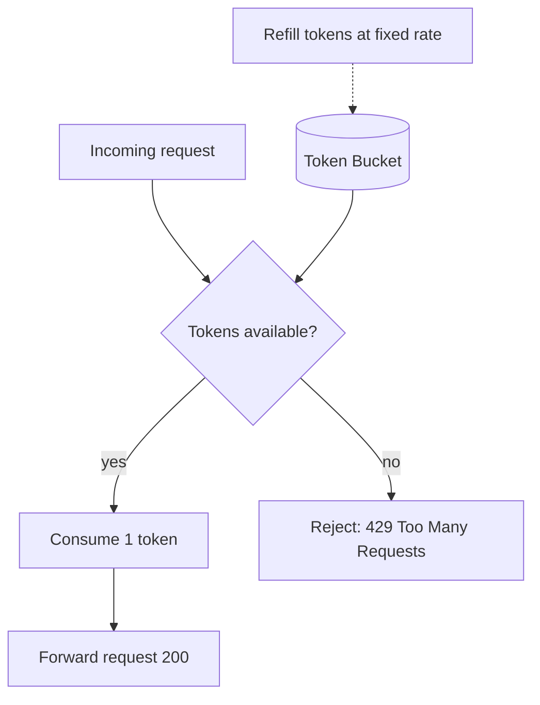

# Rate Limiting

## 🧭 Overview
Rate limiting restricts how many requests a client can make in a given time window, protecting services from abuse, accidental overload, and runaway costs while ensuring fair usage. It's essential for any public API and a classic system-design question (often asked as "design a rate limiter"). You encounter it whenever you see a "429 Too Many Requests" response.

---

## 🧠 Technical Explanation

### Why Rate Limit
- Prevent **abuse/DoS** and brute-force attacks.
- Ensure **fairness** among clients (no single user hogs capacity).
- Control **cost** and protect downstream systems.
- Enforce **API plans/tiers** (free vs paid quotas).

### Core Algorithms
| Algorithm | How it works | Notes |
|-----------|--------------|-------|
| **Token Bucket** | Tokens refill at a rate; each request consumes one; empty = reject | Allows bursts up to bucket size; most popular |
| **Leaky Bucket** | Requests queue and drain at a fixed rate | Smooths bursts into steady output |
| **Fixed Window** | Count per fixed interval (e.g., 100/min) | Simple, but boundary spikes (2x at window edges) |
| **Sliding Window Log** | Timestamp log of requests in the window | Accurate, but memory-heavy |
| **Sliding Window Counter** | Weighted blend of current + previous window | Good accuracy/efficiency balance |

### Where It Runs
- **API gateway / load balancer / reverse proxy** (most common — central choke point).
- **Application middleware.**
- **Distributed rate limiter** using a shared store (Redis) so limits are enforced across many servers consistently.

### Distributed Challenges
With many servers, counters must be shared (e.g., Redis with atomic `INCR`/Lua scripts) to avoid each node allowing the full limit. Trade accuracy vs latency vs coordination cost.

### Key Design Choices
- **Key dimension:** per-user, per-IP, per-API-key, per-endpoint.
- **Response:** HTTP **429** + `Retry-After` and `X-RateLimit-*` headers.
- **Graceful behavior:** throttle vs hard-reject; queueing vs dropping.

---

## 🍎 Simple Explanation (ELI5 / Analogy)
A token bucket is like an arcade with a coin bucket that refills slowly. Each game (request) costs one coin. You can play several games quickly if you've saved up coins (a burst), but once the bucket is empty you must wait for it to refill. The arcade thus limits how often you can play overall, while still letting you enjoy a quick burst now and then.

---

## 📊 Diagram / Flowchart

---

## ⚖️ Trade-offs

| Algorithm | Pros | Cons |
|------|------|------|
| Token bucket | Allows controlled bursts, simple | Needs tuning of rate/size |
| Leaky bucket | Smooth, steady output | No bursts; adds queueing latency |
| Fixed window | Trivial | Burst at window boundaries |
| Sliding window | Accurate | More memory/compute |

---

## 🌍 Real-World Examples
- **Stripe and GitHub** publish per-key rate limits and return `429` with `Retry-After` and rate-limit headers.
- **Cloudflare** enforces edge rate limiting to block abusive traffic before it reaches origins.
- **Twitter/X API** uses windowed limits per endpoint and per user.

---

## 🎯 Interview Questions

### 🔵 Conceptual (Theory)
1. Why does token bucket allow bursts while leaky bucket doesn't? → **Answer:** Token bucket lets accumulated tokens be spent at once (a burst up to bucket size); leaky bucket drains at a fixed rate, smoothing output regardless of arrival bursts.
2. What's the weakness of the fixed-window counter? → **Answer:** Bursts at the boundary — a client can send the full limit at the end of one window and again at the start of the next, effectively doubling the rate briefly.
3. Why is distributed rate limiting harder than single-node? → **Answer:** Counters must be shared/synchronized across nodes (e.g., via Redis) so the combined traffic doesn't exceed the limit; this adds latency and coordination.

### 🟠 Design (Practical)
1. Design a rate limiter for a public API at 1000 req/min per API key across many servers. → **Answer:** Token/sliding-window counter in Redis keyed by API key, atomic increments via Lua, enforced at the API gateway, returning 429 + headers.
2. How do you communicate limits to clients? → **Answer:** Return `429`, `Retry-After`, and `X-RateLimit-Limit/Remaining/Reset` headers so clients can back off intelligently.

### 🔴 Company-Specific
1. [Stripe] How would you implement tiered rate limits (free vs paid)? *(Hint: key by API key + plan, different bucket sizes/rates.)*
2. [Google] How do you rate limit fairly across a globally distributed gateway? *(Hint: shared/regional counters, approximate limits, sync via central store.)*
3. [Amazon] How would you protect a downstream service from a thundering herd after a limit resets? *(Hint: jittered Retry-After, sliding window, request smoothing.)*

---

## 📚 Further Reading
- Stripe Engineering: "Scaling your API with rate limiters"
- System Design Interview (Alex Xu): rate limiter chapter

---

## 🔗 Related Topics
- [API Gateway](03-api-gateway.md)
- [Design Rate Limiter](../10-real-world-case-studies/08-design-rate-limiter.md)
- [Circuit Breaker Pattern](../07-distributed-systems/05-circuit-breaker-pattern.md)
