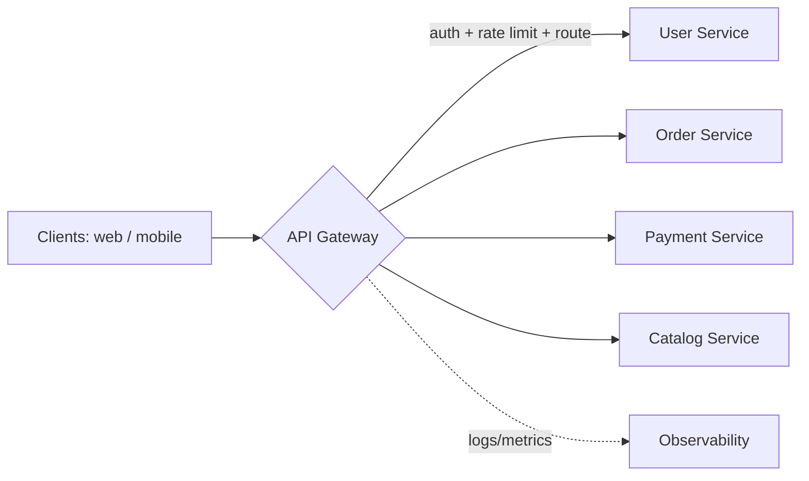

# API Gateway

## 🧭 Overview
An API gateway is a single entry point that sits in front of backend services and handles cross-cutting concerns — routing, authentication, rate limiting, TLS termination, request/response transformation, and aggregation. It simplifies clients and centralizes policy enforcement, making it a near-universal component in microservice architectures. Expect it in most HLD diagrams.

---

## 🧠 Technical Explanation

### What It Does
- **Routing:** maps incoming requests to the right backend service.
- **Authentication & authorization:** validates tokens/API keys before requests reach services.
- **Rate limiting & throttling:** central enforcement.
- **TLS termination:** decrypts HTTPS at the edge.
- **Request/response transformation:** protocol translation (e.g., REST↔gRPC), header rewriting.
- **Aggregation:** combine multiple backend calls into one client response.
- **Observability:** central logging, metrics, tracing.
- **Caching:** cache common responses.

### Gateway vs Load Balancer
A **load balancer** distributes traffic across identical instances (L4/L7). An **API gateway** is application-aware: it knows about APIs/routes and applies policies (auth, rate limits, transformation). They're complementary — often a load balancer fronts the gateway, which fronts services.

### Backend for Frontend (BFF)
A variant where each client type (web, mobile, IoT) gets its own tailored gateway, so each can aggregate/shape data optimally for that client.

### Risks
- **Single point of failure / bottleneck:** must be highly available and scaled.
- **Added latency:** one extra hop.
- **Complexity creep:** avoid putting business logic in the gateway (keep it in services).

### Popular Implementations
AWS API Gateway, Kong, NGINX, Apigee, Envoy, Spring Cloud Gateway, Zuul.

---

## 🍎 Simple Explanation (ELI5 / Analogy)
An API gateway is like the front desk and security checkpoint of a large office building. Visitors (requests) don't wander to individual offices (services) directly. Instead, they check in at the front desk, which verifies their ID (authentication), enforces visitor limits (rate limiting), and directs them to the right floor (routing). It can even gather documents from several offices and hand the visitor one neat packet (aggregation), so the visitor never deals with the building's internal complexity.

---

## 📊 Diagram / Flowchart

---

## ⚖️ Trade-offs

| Pros | Cons |
|------|------|
| Centralizes auth, rate limiting, TLS, logging | Potential single point of failure / bottleneck |
| Simplifies clients (one entry point) | Extra network hop adds latency |
| Enables aggregation & protocol translation | Risk of becoming a "god component" |
| Decouples clients from internal service layout | Operational overhead to scale/secure |

---

## 🌍 Real-World Examples
- **Netflix Zuul** routed and filtered traffic to hundreds of backend microservices.
- **AWS API Gateway** provides managed auth, throttling, and routing for serverless/Lambda backends.
- **Kong/Apigee** are widely used to manage public API programs (keys, quotas, analytics).

---

## 🎯 Interview Questions

### 🔵 Conceptual (Theory)
1. How is an API gateway different from a load balancer? → **Answer:** A load balancer distributes traffic across identical instances; a gateway is API-aware and applies cross-cutting policies (auth, rate limiting, transformation, aggregation) per route.
2. What is a Backend for Frontend (BFF)? → **Answer:** A dedicated gateway per client type that shapes and aggregates backend data optimally for that specific client (e.g., separate mobile vs web BFFs).
3. Why avoid putting business logic in the gateway? → **Answer:** It couples concerns, makes the gateway a bottleneck/god-object, and hurts maintainability; business logic belongs in services.

### 🟠 Design (Practical)
1. Where would you enforce authentication in a microservice system? → **Answer:** At the API gateway, validating tokens once at the edge so downstream services trust the authenticated context.
2. A mobile screen needs data from 4 services — how does a gateway help? → **Answer:** Aggregation: the gateway (or a BFF) fans out to the 4 services and returns a single combined response, reducing client round trips.

### 🔴 Company-Specific
1. [Netflix] How did Zuul help manage a large microservice fleet? *(Hint: dynamic routing, filters for auth/metrics, resilience.)*
2. [Amazon] How do you keep the gateway from becoming a single point of failure? *(Hint: run it redundantly behind a load balancer, autoscale, multi-AZ.)*
3. [Google] How would you handle protocol translation between external REST and internal gRPC? *(Hint: gateway transcoding REST↔gRPC.)*

---

## 📚 Further Reading
- Microsoft Azure Architecture Center: "API Gateway pattern"
- Sam Newman, *Building Microservices* (gateway/BFF chapters)

---

## 🔗 Related Topics
- [Load Balancing](../02-scalability/02-load-balancing.md)
- [Rate Limiting](02-rate-limiting.md)
- [Monolith vs Microservices](../13-hld-deep-dive/05-monolith-vs-microservices.md)
- [Service Mesh](../13-hld-deep-dive/06-service-mesh.md)
