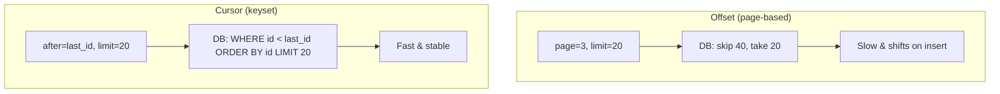

# API Pagination

## 🧭 Overview
Pagination splits large result sets into smaller "pages" so APIs return data in manageable chunks instead of dumping millions of rows at once. It protects servers and clients from huge payloads, reduces latency, and enables smooth infinite-scroll experiences. Choosing the right pagination style (offset vs cursor) is a subtle but important API-design decision and a common interview probe.

---

## 🧠 Technical Explanation

### Why Paginate
Returning an entire large dataset is slow, memory-heavy, and wasteful. Pagination returns a bounded slice plus a way to fetch the next slice.

### Offset / Page-Based Pagination
`GET /items?limit=20&offset=40` (or `?page=3`). The DB skips `offset` rows and returns the next `limit`.
- **Pros:** simple, supports jumping to arbitrary pages, shows total count/pages.
- **Cons:** **slow for deep pages** (`OFFSET 1000000` still scans/skips a million rows), and **inconsistent** if items are inserted/deleted between requests (items shift, causing duplicates or skips).

### Cursor / Keyset Pagination
`GET /items?limit=20&after=<cursor>` where the cursor encodes the last seen sorted key (e.g., `created_at` + `id`). The query is `WHERE (created_at, id) < (...) ORDER BY ... LIMIT 20`.
- **Pros:** **fast and stable at any depth** (uses an index, no skipping), consistent under inserts/deletes — ideal for infinite scroll and real-time feeds.
- **Cons:** can't jump to an arbitrary page, harder to show total pages, cursor must be opaque/encoded.

### Other Styles
- **Time-based:** paginate by timestamp ranges (common for logs/feeds).
- **Token-based:** server returns an opaque `next_page_token` (e.g., Google APIs).

### Best Practices
- Return metadata: `next_cursor`/`next_page_token`, `has_more`.
- Cap `limit` to a max (prevent abuse).
- Keep a **stable sort order** (tie-break by a unique key like `id`).
- Make cursors opaque so internals can change.

---

## 🍎 Simple Explanation (ELI5 / Analogy)
Imagine reading a giant phone book. **Offset pagination** is like saying "skip the first 500 names, then read 20" — but if someone inserts new names while you read, you might re-read or miss some, and skipping 500,000 names takes forever. **Cursor pagination** is like using a bookmark: "continue right after 'Smith, John'." No matter how many names exist or get added, you instantly continue from your bookmark without recounting from the start.

---

## 📊 Diagram / Flowchart

---

## ⚖️ Trade-offs

| | Offset / Page | Cursor / Keyset |
|---|------|------|
| Speed at deep pages | Slow (scans+skips) | Fast (index seek) |
| Stability under writes | Can duplicate/skip | Stable |
| Jump to arbitrary page | Yes | No |
| Show total pages | Easy | Hard |
| Best for | Small/admin tables, page numbers | Feeds, infinite scroll, large data |

---

## 🌍 Real-World Examples
- **Twitter/X and Instagram** feeds use cursor pagination for stable infinite scroll.
- **Slack and Stripe** APIs use cursor/`starting_after` pagination for large lists.
- **Google APIs** return opaque `nextPageToken` values.

---

## 🎯 Interview Questions

### 🔵 Conceptual (Theory)
1. Why is offset pagination slow for deep pages? → **Answer:** The database must scan and skip all rows up to the offset before returning results, so `OFFSET 1,000,000` does a lot of wasted work.
2. Why is cursor pagination more stable than offset under concurrent inserts? → **Answer:** It anchors on a sort key (the cursor), so newly inserted rows don't shift positions and cause skips/duplicates the way an offset does.
3. What's a limitation of cursor pagination? → **Answer:** You can't jump directly to an arbitrary page number or easily show total page counts.

### 🟠 Design (Practical)
1. Design pagination for an infinite-scroll social feed. → **Answer:** Cursor/keyset pagination on `(created_at, id)`, returning `next_cursor` and `has_more`; it's fast and stable as new posts arrive.
2. When is offset pagination acceptable? → **Answer:** Small or admin datasets where users need page numbers and the data isn't deep or rapidly changing.

### 🔴 Company-Specific
1. [Meta] How would you paginate a news feed that's constantly getting new posts? *(Hint: cursor based on post ID/time, stable under inserts.)*
2. [Stripe] Why do API providers prefer opaque cursors? *(Hint: hides internals, allows changing implementation without breaking clients.)*
3. [Amazon] How do you prevent clients from requesting huge pages? *(Hint: enforce a max limit and validate inputs.)*

---

## 📚 Further Reading
- Stripe API reference: pagination
- "Pagination: You're (probably) doing it wrong" (use-the-index-luke)

---

## 🔗 Related Topics
- [REST vs GraphQL vs gRPC](01-rest-vs-graphql-vs-grpc.md)
- [Indexing](../03-databases/02-indexing.md)
- [Rate Limiting](02-rate-limiting.md)
