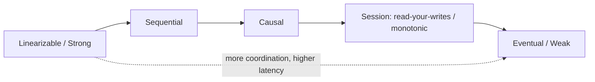

# Consistency Models

## 🧭 Overview
A consistency model defines the contract between a distributed data store and its clients about *when and in what order* writes become visible to reads. Models range from **strong** (everyone sees the latest write immediately) to **eventual** (replicas converge over time). Picking the right model is fundamental: it trades correctness guarantees against latency and availability, and it's a core distributed-systems interview theme.

---

## 🧠 Technical Explanation

### The Spectrum (strong → weak)
- **Linearizability (strong):** the system behaves as if there's a single copy; every read returns the most recent write, and operations appear instantaneous in real-time order. Most intuitive, most expensive.
- **Sequential consistency:** all clients see operations in the same order, but not necessarily real-time order.
- **Causal consistency:** operations that are causally related are seen in order by everyone; concurrent ops may be seen in different orders. A practical sweet spot.
- **Read-your-writes:** you always see your own previous writes (even if others don't yet).
- **Monotonic reads:** you never see data go "backwards" in time.
- **Eventual consistency (weak):** with no new writes, replicas eventually converge; reads may be stale meanwhile.

### Session Guarantees
Client-centric guarantees often combined for good UX: read-your-writes, monotonic reads, monotonic writes, writes-follow-reads.

### How Strong Consistency Is Achieved
Synchronous replication, quorums (`W + R > N`), consensus protocols (Raft/Paxos), or single-leader writes. All add coordination → latency.

### How Eventual Consistency Resolves Conflicts
- **Last-write-wins (LWW)** by timestamp (simple, can lose data).
- **Vector clocks / version vectors** to detect concurrent updates.
- **CRDTs** (Conflict-free Replicated Data Types) that merge deterministically.
- Application-level merge (e.g., merge shopping carts).

### Choosing
- **Strong:** money, inventory, locks, unique constraints.
- **Causal:** comments/replies, collaborative apps.
- **Eventual:** likes, view counts, feeds, DNS, caches.

---

## 🍎 Simple Explanation (ELI5 / Analogy)
Imagine a group of friends keeping a shared shopping list on whiteboards in different rooms. **Strong consistency** is everyone using one single whiteboard — any change is instantly seen by all, but only one person can write at a time (slow). **Eventual consistency** is each room having its own whiteboard that gets synced periodically — fast and always writable, but for a little while the rooms might disagree until they sync up. **Read-your-writes** means at least *you* always see your own additions immediately.

---

## 📊 Diagram / Flowchart

---

## ⚖️ Trade-offs

| Model | Pros | Cons |
|------|------|------|
| Strong (linearizable) | Easiest to reason about, correct | High latency, lower availability |
| Causal | Preserves cause/effect, scalable | More complex to implement |
| Eventual | Fast, highly available | Stale reads, conflict resolution needed |

---

## 🌍 Real-World Examples
- **Google Spanner** offers external (strong) consistency globally using TrueTime.
- **Amazon DynamoDB** defaults to eventual consistency (optional strong reads) for availability.
- **Collaborative editors (Google Docs)** use causal/CRDT-style merging so concurrent edits converge.

---

## 🎯 Interview Questions

### 🔵 Conceptual (Theory)
1. What is linearizability? → **Answer:** A strong guarantee where the system behaves like a single copy: every read sees the most recent write, and operations appear to occur instantaneously in real-time order.
2. What is causal consistency and why is it useful? → **Answer:** It preserves the order of causally related operations (e.g., a reply seen after its comment) while allowing concurrent operations to differ — a practical balance of correctness and scalability.
3. How do CRDTs help with eventual consistency? → **Answer:** They define data types that merge deterministically regardless of update order, so replicas converge without conflicts or coordination.

### 🟠 Design (Practical)
1. A user posts a comment but doesn't see it on refresh — which guarantee is missing? → **Answer:** Read-your-writes; route their reads to an up-to-date replica/leader or use a version token.
2. Which model would you choose for a bank balance vs a like counter? → **Answer:** Strong/linearizable for the balance (correctness critical); eventual for the like counter (staleness acceptable).

### 🔴 Company-Specific
1. [Google] How does Spanner provide strong consistency across regions despite latency? *(Hint: Paxos + TrueTime uncertainty intervals.)*
2. [Amazon] Why does DynamoDB default to eventual consistency? *(Hint: availability and latency at scale; strong reads optional.)*
3. [Meta] What session guarantees would you provide for a messaging app? *(Hint: read-your-writes + monotonic reads so messages never appear to vanish or reorder.)*

---

## 📚 Further Reading
- "Consistency Models" by Kyle Kingsbury (jepsen.io)
- *Designing Data-Intensive Applications*, Chapter 9

---

## 🔗 Related Topics
- [CAP Theorem](../02-scalability/04-cap-theorem.md)
- [ACID vs BASE](../03-databases/05-acid-vs-base.md)
- [Replication](../03-databases/04-replication.md)
- [Consensus Algorithms](03-consensus-algorithms.md)
