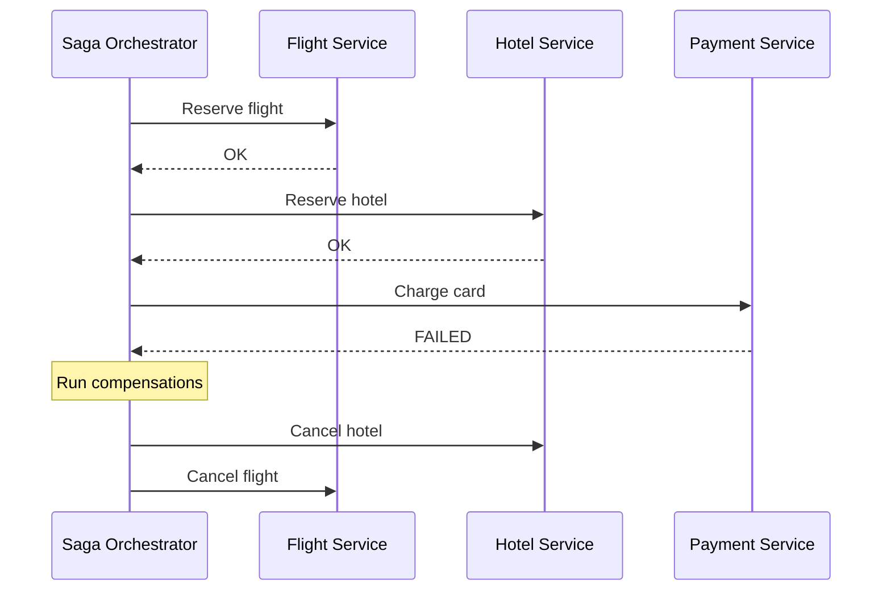

# Distributed Transactions

## 🧭 Overview
A distributed transaction spans multiple services or databases that must all succeed or all fail together — for example, debiting one account and crediting another in different systems. Achieving atomicity across nodes is genuinely hard, and the solutions (2PC, Sagas, outbox) each make different trade-offs. This is a frequent senior-level interview topic, especially for microservices and payments.

---

## 🧠 Technical Explanation

### The Problem
In a single database, ACID transactions give you atomicity for free. Across multiple services/databases (each with its own data store), there's no shared transaction — a partial failure can leave the system inconsistent (money debited but not credited).

### Two-Phase Commit (2PC)
A coordinator runs two phases:
1. **Prepare:** ask all participants to prepare and lock resources; each votes commit/abort.
2. **Commit/Abort:** if all voted commit, tell everyone to commit; otherwise abort.
- **Pros:** strong atomicity.
- **Cons:** **blocking** (participants hold locks awaiting the coordinator), coordinator is a **single point of failure**, poor availability, doesn't scale well. Rarely used across microservices.

### Three-Phase Commit (3PC)
Adds a phase to reduce blocking, but adds complexity and still struggles under network partitions. Mostly academic in practice.

### Saga Pattern (the practical choice)
Break a distributed transaction into a sequence of **local** transactions, each with a **compensating** action to undo it if a later step fails. Eventual consistency, no global locks.
- **Choreography:** services react to each other's events (decentralized).
- **Orchestration:** a central orchestrator directs each step (easier to monitor/debug).

Example: Book trip = reserve flight → reserve hotel → charge card. If charging fails, run compensations: cancel hotel, cancel flight.

### Transactional Outbox + CDC
To reliably publish events *and* commit DB changes atomically: write the event to an "outbox" table in the **same local transaction**, then a relay (or change-data-capture) publishes it. Avoids the "dual-write" problem.

### Idempotency
Because retries happen, every step must be idempotent (idempotency keys) so re-execution doesn't double-charge.

---

## 🍎 Simple Explanation (ELI5 / Analogy)
Imagine planning a group trip where you must book a flight, a hotel, and a rental car — each from a different company that won't coordinate with the others. **2PC** is like asking all three to "hold" your booking while you confirm everyone's ready, then telling them all "go" at once — but they're stuck waiting (and annoyed) if you're slow. The **Saga** approach is more realistic: book them one at a time, and if the car rental falls through, you call back to *cancel* the hotel and flight (compensating actions). It's not instantaneous, but it gets you to a consistent end state.

---

## 📊 Diagram / Flowchart

---

## ⚖️ Trade-offs

| Approach | Pros | Cons |
|------|------|------|
| 2PC | Strong atomicity | Blocking, coordinator SPOF, poor scale |
| Saga (choreography) | Decoupled, scalable | Hard to trace, cyclic-event risk |
| Saga (orchestration) | Centralized control, observable | Orchestrator is a key component |
| Outbox + CDC | Reliable event publishing | Extra infra (CDC), eventual consistency |

---

## 🌍 Real-World Examples
- **E-commerce order flows** use Sagas: reserve inventory → charge payment → create shipment, with compensations on failure.
- **Uber** uses orchestration-based sagas (e.g., Cadence/Temporal) for multi-step workflows.
- **Banking transfers** between separate systems use sagas + idempotency rather than 2PC for availability.

---

## 🎯 Interview Questions

### 🔵 Conceptual (Theory)
1. Why is 2PC rarely used across microservices? → **Answer:** It's blocking (participants hold locks awaiting the coordinator), the coordinator is a single point of failure, and it hurts availability and scalability under partitions.
2. What is a compensating transaction in a Saga? → **Answer:** An action that semantically undoes a previously completed local step when a later step fails (e.g., cancel a reservation), achieving eventual consistency without global rollback.
3. What is the dual-write problem and how does the outbox pattern solve it? → **Answer:** Writing to a DB and a message broker separately can leave them inconsistent on failure; the outbox writes the event in the same DB transaction, then a relay/CDC publishes it reliably.

### 🟠 Design (Practical)
1. Design an order checkout that touches inventory, payment, and shipping services. → **Answer:** Orchestrated Saga with idempotent steps and compensations (release inventory, refund payment) if any step fails.
2. How do you avoid double-charging when steps are retried? → **Answer:** Idempotency keys so a repeated charge request is recognized and not applied twice.

### 🔴 Company-Specific
1. [Uber] How would you implement a long-running multi-step workflow reliably? *(Hint: orchestration engine like Cadence/Temporal, durable state, retries.)*
2. [Amazon] Why prefer Sagas over 2PC for order processing at scale? *(Hint: availability, no global locks, resilience to partial failure.)*
3. [Stripe] How do you guarantee a payment event is published exactly once with the DB write? *(Hint: transactional outbox + idempotent consumers.)*

---

## 📚 Further Reading
- "Saga" pattern (microservices.io, Chris Richardson)
- *Designing Data-Intensive Applications*, Chapter 9 (atomic commit & 2PC)

---

## 🔗 Related Topics
- [Event-Driven Architecture](../05-messaging-and-queues/04-event-driven-architecture.md)
- [ACID vs BASE](../03-databases/05-acid-vs-base.md)
- [Consensus Algorithms](03-consensus-algorithms.md)
- [Consistency Models](01-consistency-models.md)
