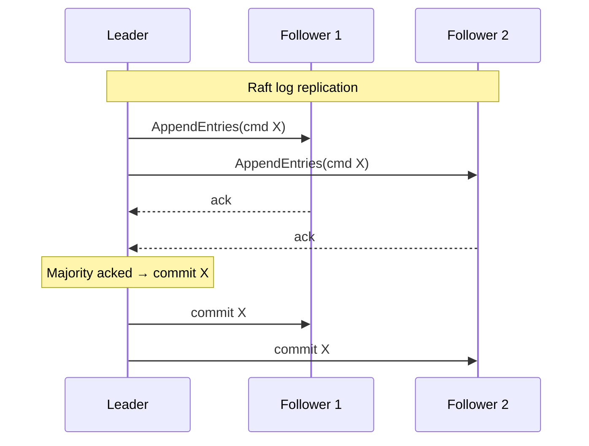

# Consensus Algorithms

## 🧭 Overview
Consensus is the problem of getting a group of distributed nodes to **agree on a single value** (or order of operations) despite failures and network delays. It underpins leader election, replicated state machines, distributed locks, and strongly consistent databases. Algorithms like **Paxos** and **Raft** solve it. Consensus is one of the deepest topics in distributed systems and a strong differentiator in senior interviews.

---

## 🧠 Technical Explanation

### Why Consensus Is Hard
Nodes can crash, messages can be delayed/lost/reordered, and there's no shared clock. The **FLP impossibility** result proves that in a fully asynchronous network, no deterministic algorithm can guarantee consensus if even one node may fail — so practical systems use timeouts (partial synchrony) to make progress.

### Quorums
Most algorithms require a **majority quorum** (`⌊N/2⌋ + 1`). With 5 nodes, 3 must agree. Majorities guarantee any two quorums overlap, preventing two conflicting decisions. This is why clusters use **odd numbers** (3, 5, 7) — better fault tolerance per node.

### Raft (designed for understandability)
- **Leader election:** nodes are followers; if they hear no leader (timeout), they become candidates and request votes; a majority elects a leader for a **term**.
- **Log replication:** the leader appends commands to its log and replicates to followers; once a majority store an entry, it's **committed** and applied to the state machine.
- **Safety:** only entries replicated to a majority are committed; a new leader must have all committed entries. Terms + log matching prevent inconsistency.

### Paxos
The original (Lamport) consensus algorithm — correct and influential but notoriously hard to understand and implement. **Multi-Paxos** handles a stream of decisions. Raft was created as a more understandable alternative with equivalent guarantees.

### Byzantine Fault Tolerance (BFT)
Raft/Paxos assume crash faults (nodes stop, don't lie). **BFT** algorithms (PBFT, Tendermint) tolerate *malicious/lying* nodes — needed in blockchains/untrusted environments — requiring `3f + 1` nodes to tolerate `f` traitors.

### Where It's Used
etcd, ZooKeeper (ZAB), Consul (Raft), CockroachDB/Spanner (Paxos-like), Kafka KRaft — for metadata, leader election, and replicated logs.

---

## 🍎 Simple Explanation (ELI5 / Analogy)
Imagine a group of friends deciding on a restaurant over a flaky group chat where messages sometimes don't arrive. To avoid half the group showing up at different places, they pick a **leader** to propose a choice. Everyone replies; once **more than half** agree, the decision is locked in and announced. If the leader goes silent, the others wait a bit, then hold a new vote to pick a fresh leader. Requiring a majority ensures two different restaurants can never both "win," because any two majorities share at least one person who'd object.

---

## 📊 Diagram / Flowchart

---

## ⚖️ Trade-offs

| Aspect | Benefit | Cost |
|------|------|------|
| Majority quorum | Tolerates minority failures, safe | Needs >half available; latency of round trips |
| Strong consistency | Single agreed order of operations | Higher write latency |
| Raft over Paxos | Understandable, implementable | Slightly less flexible than Multi-Paxos |
| BFT | Tolerates malicious nodes | Many more nodes/messages |

---

## 🌍 Real-World Examples
- **etcd (Kubernetes' backing store)** uses Raft to keep cluster state consistent.
- **ZooKeeper** uses ZAB (a consensus protocol) for coordination/leader election.
- **Google Spanner / Chubby** use Paxos for globally consistent replication and locking.

---

## 🎯 Interview Questions

### 🔵 Conceptual (Theory)
1. Why do consensus clusters use an odd number of nodes? → **Answer:** A majority quorum needs more than half; odd counts give better fault tolerance per node (e.g., 3 tolerates 1, 5 tolerates 2) without an even-split risk.
2. What does the FLP impossibility result say? → **Answer:** In a fully asynchronous system where a node may fail, no deterministic algorithm can guarantee consensus; real systems use timeouts (partial synchrony) to make progress.
3. How does Raft ensure a committed entry is never lost? → **Answer:** An entry is committed only after a majority store it, and leader election only elects candidates whose logs contain all committed entries.

### 🟠 Design (Practical)
1. You need a fault-tolerant distributed lock/leader election — what do you use? → **Answer:** A consensus-backed coordination service like etcd/ZooKeeper (Raft/ZAB) to elect a leader and hold the lock safely.
2. How many nodes to tolerate 2 simultaneous failures with crash-fault consensus? → **Answer:** 5 nodes (majority = 3), since `2f + 1` tolerates `f = 2` failures.

### 🔴 Company-Specific
1. [Google] How does Paxos enable Spanner's strongly consistent replication? *(Hint: replicated log via Paxos groups per shard.)*
2. [Amazon] When would you choose a consensus store over an eventually consistent one? *(Hint: metadata, leader election, configuration requiring agreement.)*
3. [Meta] What's the difference between crash-fault and Byzantine-fault tolerance? *(Hint: stopping vs lying nodes; node counts 2f+1 vs 3f+1.)*

---

## 📚 Further Reading
- "In Search of an Understandable Consensus Algorithm (Raft)" — Ongaro & Ousterhout
- "Paxos Made Simple" — Leslie Lamport

---

## 🔗 Related Topics
- [Replication](../03-databases/04-replication.md)
- [Consistency Models](01-consistency-models.md)
- [Service Discovery](04-service-discovery.md)
- [CAP Theorem](../02-scalability/04-cap-theorem.md)
