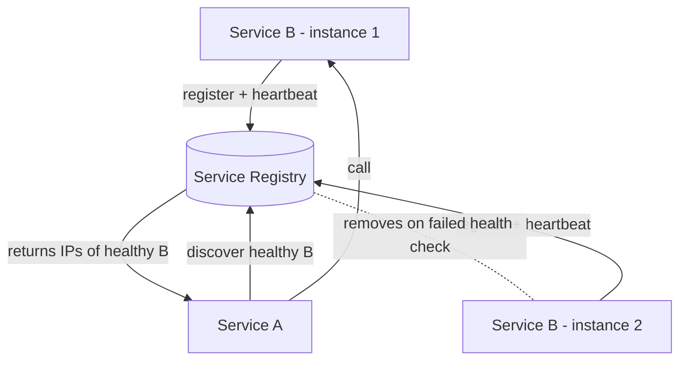

# Service Discovery

## 🧭 Overview
In a dynamic microservice environment, service instances come and go (autoscaling, deployments, failures) and their network locations (IP:port) change constantly. **Service discovery** is the mechanism by which services find the current, healthy network locations of the services they depend on — without hardcoding addresses. It's essential infrastructure for any microservice or container-orchestrated system.

---

## 🧠 Technical Explanation

### The Problem
Service A needs to call Service B. In the cloud, B's instances have ephemeral IPs that change on every deploy/scale event. Hardcoding IPs breaks immediately. Service discovery provides a dynamic, always-current "phone book."

### Core Components
- **Service registry:** a database of available service instances and their locations + health (e.g., Consul, etcd, ZooKeeper, Eureka).
- **Registration:** instances register themselves on startup and deregister on shutdown; health checks remove dead ones.
- **Discovery:** clients query the registry to find healthy instances.

### Client-Side vs Server-Side Discovery
- **Client-side:** the client queries the registry and picks an instance (often with client-side load balancing, e.g., Netflix Eureka + Ribbon). Fewer hops, but logic lives in every client.
- **Server-side:** the client calls a router/load balancer that queries the registry and forwards (e.g., AWS ELB, Kubernetes Service). Simpler clients, extra hop.

### Health Checks
- **Liveness:** is the instance alive?
- **Readiness:** is it ready to serve traffic (warmed up, dependencies ok)?
Unhealthy instances are removed from the pool automatically.

### DNS-Based Discovery
Kubernetes gives each Service a stable DNS name (`payments.default.svc.cluster.local`) backed by kube-proxy/endpoints, abstracting the changing pod IPs. Simple and language-agnostic.

### Self-Registration vs Third-Party Registration
- **Self-registration:** instances register themselves.
- **Third-party:** a separate registrar (e.g., the orchestrator) registers instances on their behalf — common in Kubernetes.

---

## 🍎 Simple Explanation (ELI5 / Analogy)
Service discovery is like a live company directory. Employees (service instances) move desks constantly, so a printed phone list (hardcoded IPs) is useless. Instead, when someone starts work they sign into the directory with their current desk number, and the directory removes anyone who's left (health checks). When you need to reach the "Payments team," you ask the directory for whoever's currently on duty, and it gives you a live, valid contact — never an outdated one.

---

## 📊 Diagram / Flowchart

---

## ⚖️ Trade-offs

| Aspect | Pros | Cons |
|------|------|------|
| Client-side discovery | Fewer hops, flexible LB | Discovery logic in every client/language |
| Server-side discovery | Simple clients | Extra hop; router must be HA |
| DNS-based | Language-agnostic, simple | DNS caching/TTL can serve stale entries |
| Central registry | Single source of truth | Must be highly available (it's critical) |

---

## 🌍 Real-World Examples
- **Kubernetes** provides built-in DNS-based service discovery via Services and Endpoints.
- **Netflix Eureka** popularized client-side discovery with client-side load balancing.
- **HashiCorp Consul** offers a service registry with health checks and DNS/HTTP interfaces.

---

## 🎯 Interview Questions

### 🔵 Conceptual (Theory)
1. Why can't you just hardcode service IP addresses in the cloud? → **Answer:** Instances are ephemeral — autoscaling, deployments, and failures change their IPs constantly, so hardcoded addresses quickly become invalid.
2. What's the difference between client-side and server-side discovery? → **Answer:** Client-side: the client queries the registry and chooses an instance itself; server-side: the client hits a router/LB that does the lookup and forwarding.
3. Why must the service registry be highly available? → **Answer:** It's a critical dependency — if it's down, services can't find each other, so it's typically backed by a consensus store and replicated.

### 🟠 Design (Practical)
1. How does Kubernetes hide changing pod IPs from callers? → **Answer:** A Service provides a stable virtual IP + DNS name; kube-proxy/Endpoints route to current healthy pods behind it.
2. How do you ensure traffic only goes to instances ready to serve? → **Answer:** Readiness health checks; only instances passing readiness are added to the discovery pool.

### 🔴 Company-Specific
1. [Netflix] Why did Netflix adopt client-side discovery with Eureka? *(Hint: resilience, client-side load balancing, avoid central LB bottleneck.)*
2. [Google] How does service discovery interact with load balancing in a service mesh? *(Hint: sidecars + control plane track endpoints, do LB.)*
3. [Amazon] How would you handle stale DNS entries causing calls to dead instances? *(Hint: short TTL, health checks, retries, connection draining.)*

---

## 📚 Further Reading
- microservices.io: "Service Registry" and "Discovery" patterns
- Kubernetes docs: Services and DNS

---

## 🔗 Related Topics
- [Load Balancing](../02-scalability/02-load-balancing.md)
- [Service Mesh](../13-hld-deep-dive/06-service-mesh.md)
- [Circuit Breaker Pattern](05-circuit-breaker-pattern.md)
- [Consensus Algorithms](03-consensus-algorithms.md)
