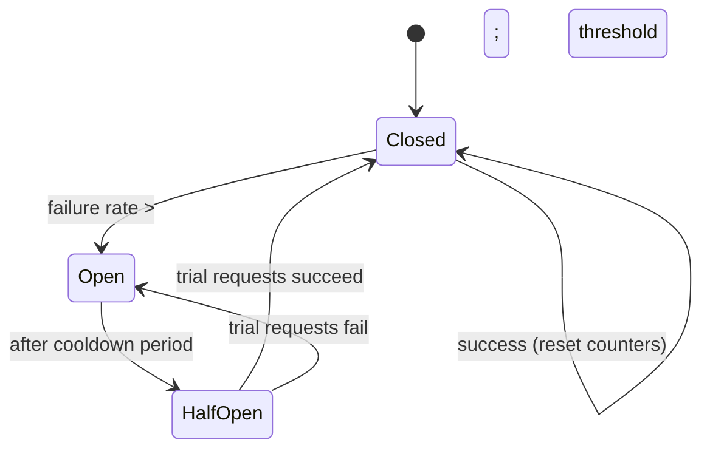

# Circuit Breaker Pattern

## 🧭 Overview
The circuit breaker is a resilience pattern that prevents a service from repeatedly calling a failing dependency, giving the dependency time to recover and stopping failures from cascading across a system. Like an electrical breaker that trips to prevent a fire, it "opens" to fail fast when a downstream service is unhealthy. It's a must-know pattern for building fault-tolerant distributed systems.

---

## 🧠 Technical Explanation

### The Problem It Solves
When a dependency (e.g., a payment service) is slow or down, callers keep retrying, threads pile up waiting on timeouts, resources exhaust, and the failure **cascades** upstream — a small outage takes down the whole system. The circuit breaker stops this by failing fast.

### The Three States
1. **Closed (normal):** requests flow through. The breaker counts failures. If failures exceed a threshold (e.g., 50% over a window), it **trips → Open**.
2. **Open (tripped):** requests **fail immediately** (or return a fallback) without calling the dependency, for a cooldown period. This protects both caller and callee.
3. **Half-Open (testing):** after the cooldown, a few trial requests are allowed. If they succeed → **Closed** (recovered); if they fail → back to **Open**.

### Key Parameters
- **Failure threshold** (count or error rate).
- **Cooldown / open duration.**
- **Half-open trial count.**
- **Timeout** per request (so slow calls count as failures).

### Companion Patterns
- **Timeouts:** never wait forever on a call.
- **Retries with exponential backoff + jitter:** retry transient failures, but cap and jitter to avoid synchronized retry storms.
- **Bulkheads:** isolate resources (thread pools) per dependency so one failing dependency can't starve others.
- **Fallbacks:** return cached/default data or a graceful degraded response when open.

### Tools
Resilience4j, Hystrix (legacy, Netflix), Polly (.NET), Envoy/Istio (at the mesh level).

---

## 🍎 Simple Explanation (ELI5 / Analogy)
A circuit breaker in your home cuts power when a circuit is overloaded, preventing a fire. A software circuit breaker works the same way for service calls. Imagine repeatedly calling a friend whose phone is off — instead of redialing 100 times and wasting your battery (resources), you stop calling for 10 minutes (open state). After a while you try once (half-open); if they answer, you resume normal calling (closed); if not, you wait again. This protects you from wasting effort and gives your friend time to turn their phone back on.

---

## 📊 Diagram / Flowchart

---

## ⚖️ Trade-offs

| Pros | Cons |
|------|------|
| Prevents cascading failures | Adds complexity & tuning (thresholds, timeouts) |
| Fails fast → frees resources | Risk of opening too eagerly (false positives) |
| Gives failing service time to recover | Needs good fallbacks for graceful degradation |
| Improves overall system resilience | Hard to set parameters correctly |

---

## 🌍 Real-World Examples
- **Netflix Hystrix** pioneered widespread circuit breaking to keep one failing microservice from taking down the streaming experience.
- **Service meshes (Istio/Envoy)** provide circuit breaking and outlier detection transparently at the proxy layer.
- **Payment systems** open a breaker to a slow processor and fall back to a secondary processor or a "try later" message.

---

## 🎯 Interview Questions

### 🔵 Conceptual (Theory)
1. Describe the three states of a circuit breaker. → **Answer:** Closed (normal, counting failures), Open (fail fast, skip the dependency during cooldown), Half-Open (allow a few trial requests to test recovery, then close or reopen).
2. How does a circuit breaker prevent cascading failures? → **Answer:** By failing fast when a dependency is unhealthy, it stops threads/resources from piling up on doomed calls, so the failure doesn't propagate upstream.
3. Why pair circuit breakers with timeouts and bulkheads? → **Answer:** Timeouts ensure slow calls are counted/aborted; bulkheads isolate resource pools so one failing dependency can't exhaust resources shared with healthy ones.

### 🟠 Design (Practical)
1. Your checkout depends on a flaky third-party tax API — how do you stay resilient? → **Answer:** Wrap it in a circuit breaker with a timeout; on open, fall back to a cached/estimated tax or degrade gracefully, and retry with backoff later.
2. What's the danger of aggressive retries without a breaker/backoff? → **Answer:** A retry storm that amplifies load on an already-struggling service, worsening or prolonging the outage.

### 🔴 Company-Specific
1. [Netflix] How did Hystrix improve streaming resilience? *(Hint: isolate dependencies, circuit break, fallbacks, bulkheads.)*
2. [Amazon] How do you choose circuit breaker thresholds and cooldowns? *(Hint: based on dependency SLAs, error budgets, observed recovery times.)*
3. [Google] How can a service mesh provide circuit breaking without app code changes? *(Hint: Envoy sidecar outlier detection at the proxy layer.)*

---

## 📚 Further Reading
- Martin Fowler: "CircuitBreaker"
- Resilience4j documentation; Netflix Hystrix wiki

---

## 🔗 Related Topics
- [Service Discovery](04-service-discovery.md)
- [Service Mesh](../13-hld-deep-dive/06-service-mesh.md)
- [Rate Limiting](../06-api-design/02-rate-limiting.md)
- [Observability](../13-hld-deep-dive/07-observability.md)
