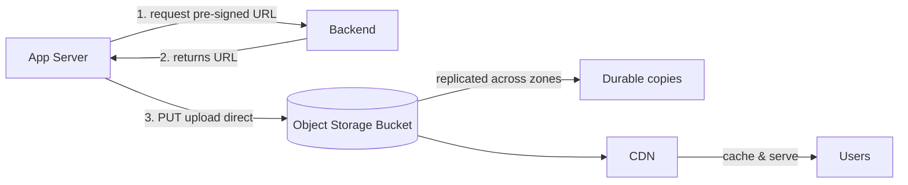

# Object Storage

## 🧭 Overview
Object storage manages data as discrete **objects** (a blob of bytes + metadata + a unique key) in a flat namespace, accessed via HTTP APIs rather than a file path or block device. It's the go-to storage for unstructured data at massive scale — images, video, backups, logs, data-lake files — because it's cheap, virtually limitless, and highly durable. You'll use it in almost every system that stores media or large files.

---

## 🧠 Technical Explanation

### What an Object Is
An object = **data (the blob)** + **metadata** (content type, custom tags) + a **globally unique key**. Objects live in **buckets** (containers). There are no real folders — "folders" are just key prefixes (`photos/2024/cat.jpg`).

### How You Access It
Via REST APIs (`PUT`, `GET`, `DELETE`) over HTTP, using the object's key. No file-system mounting; you don't edit objects in place — you replace them wholesale (immutable updates).

### Key Properties
- **Massive scalability:** effectively unlimited capacity and object count.
- **High durability:** providers replicate across machines/zones (e.g., S3's "11 nines" — 99.999999999% durability).
- **Cheap:** lowest cost per GB among storage types, with tiers (hot/cold/archive).
- **Rich metadata** and features: versioning, lifecycle policies, access control, encryption, event notifications.

### What It's NOT Good For
- **Frequent in-place edits / random writes** — you replace whole objects, not byte ranges.
- **Low-latency transactional workloads / databases** — use block storage.
- **POSIX file semantics** (locking, appends) — use file storage.

### Common Patterns
- **Pre-signed URLs:** let clients upload/download directly to/from the bucket without proxying through your server.
- **Static website + CDN:** serve assets from object storage fronted by a CDN.
- **Data lake:** store raw files for analytics (often Parquet) in object storage.

---

## 🍎 Simple Explanation (ELI5 / Analogy)
Object storage is like a giant valet parking garage with infinite spaces. You hand over your car (object) and get a unique ticket (key); you don't care *where* it's parked. To get it back, you present the ticket. You can't pop the hood and tweak one part while it's parked — if you want changes, you take the whole car out and bring back a new one. It's cheap, holds practically unlimited cars, and the garage keeps backup copies so your car is never lost.

---

## 📊 Diagram / Flowchart

---

## ⚖️ Trade-offs

| Pros | Cons |
|------|------|
| Virtually unlimited, cheap storage | No in-place edits (replace whole object) |
| Extremely durable & available | Higher per-request latency than block |
| HTTP-accessible, metadata-rich | No POSIX file semantics |
| Lifecycle tiering, versioning, events | Not for transactional/DB workloads |

---

## 🌍 Real-World Examples
- **Amazon S3** is the canonical object store; **Netflix** stores video masters and assets in S3.
- **Dropbox** stores file contents as objects (historically on S3, later their own "Magic Pocket").
- **Data lakes** (Spark/analytics) read/write Parquet files directly from S3/GCS.

---

## 🎯 Interview Questions

### 🔵 Conceptual (Theory)
1. Why is object storage unsuitable for a database's primary storage? → **Answer:** It has higher latency, no in-place/random byte writes, and no transactional semantics — databases need fast random block-level access.
2. What is a pre-signed URL and why use it? → **Answer:** A temporary, signed URL that lets a client upload/download directly to/from a bucket, offloading large transfers from your servers.
3. How does object storage achieve high durability? → **Answer:** By replicating each object across multiple devices/availability zones and continuously verifying integrity.

### 🟠 Design (Practical)
1. Design photo upload for a social app. → **Answer:** Client requests a pre-signed URL, uploads the image directly to object storage, stores only the key + metadata in the DB, and serves via CDN.
2. How do you reduce storage cost for rarely accessed backups? → **Answer:** Lifecycle policies that transition old objects to colder/archival tiers (e.g., S3 Glacier).

### 🔴 Company-Specific
1. [Amazon] How does S3 provide 11 nines of durability? *(Hint: redundant storage across devices/AZs, integrity checks, auto-repair.)*
2. [Netflix] Why store video assets in object storage rather than a database? *(Hint: huge unstructured blobs, cheap, durable, CDN-friendly.)*
3. [Dropbox] What are the trade-offs of building your own object store vs using S3? *(Hint: cost at scale, control, durability engineering effort.)*

---

## 📚 Further Reading
- AWS S3 documentation (durability, storage classes)
- Dropbox Tech Blog: "Inside the Magic Pocket"

---

## 🔗 Related Topics
- [Block vs File vs Object](02-block-vs-file-vs-object.md)
- [CDN](../04-caching/04-cdn.md)
- [Data Lakes and Warehouses](03-data-lakes-and-warehouses.md)
- [Design Google Drive](../10-real-world-case-studies/06-design-google-drive.md)
