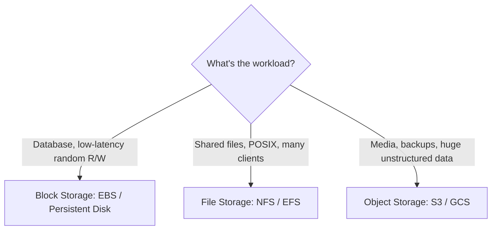

# Block vs File vs Object Storage

## 🧭 Overview
There are three fundamental storage paradigms — **block, file, and object** — each exposing data differently and suited to different workloads. Understanding their distinctions helps you pick the right storage for databases, shared file systems, or massive unstructured data. This comparison is a common knowledge-check in infrastructure and system-design interviews.

---

## 🧠 Technical Explanation

### Block Storage
Exposes raw, fixed-size **blocks** (like a virtual hard drive). The OS/file system or database manages how blocks are organized. Offers the lowest latency and random read/write — ideal for databases and boot volumes.
- **Access:** attached to one server as a volume (SAN, AWS EBS, GCP Persistent Disk).
- **Best for:** databases, transactional workloads, VM disks.

### File Storage
Exposes a hierarchical **file system** (folders/files) over a network, with POSIX semantics (permissions, locking, appends). Multiple clients can mount and share it.
- **Access:** network file protocols (NFS, SMB; AWS EFS, Azure Files).
- **Best for:** shared application data, home directories, legacy apps expecting a file system, content shared across servers.

### Object Storage
Stores data as **objects** (blob + metadata + key) in a flat namespace, accessed via HTTP APIs. Massively scalable, cheap, durable; no in-place edits.
- **Access:** REST APIs (S3, GCS, Azure Blob).
- **Best for:** media, backups, logs, data lakes, static assets.

### The Core Differences
| | Block | File | Object |
|---|------|------|--------|
| Unit | Blocks | Files in folders | Objects + metadata |
| Access | Volume attached to a host | Network mount (NFS/SMB) | HTTP REST API |
| Latency | Lowest | Medium | Higher |
| Scalability | Limited (per volume) | Moderate | Virtually unlimited |
| In-place edits | Yes (random R/W) | Yes | No (replace whole object) |
| Cost per GB | Highest | Medium | Lowest |
| Typical use | Databases, VM disks | Shared files | Media, backups, data lake |

---

## 🍎 Simple Explanation (ELI5 / Analogy)
- **Block storage** is like a stack of blank LEGO baseplates — raw and flexible; *you* decide how to build (the file system) on top. Fast and precise, but it's just for your one project.
- **File storage** is like a shared filing cabinet with labeled folders everyone in the office can open, organized in a familiar hierarchy.
- **Object storage** is like a massive coat-check: you hand over an item, get a ticket, and retrieve the whole thing later — you can't reach in and alter one sleeve, but it holds practically unlimited items cheaply.

---

## 📊 Diagram / Flowchart

---

## ⚖️ Trade-offs

| Storage | Pros | Cons |
|------|------|------|
| Block | Fastest, random R/W, transactional | Limited scale, costly, single-host attach |
| File | Shareable, familiar hierarchy, POSIX | Scaling/locking limits, medium cost |
| Object | Massive scale, cheap, durable, HTTP | Higher latency, no in-place edits |

---

## 🌍 Real-World Examples
- **Databases** (Postgres on AWS RDS) sit on **block** storage (EBS) for fast random access.
- **Render farms / shared media pipelines** use **file** storage (EFS/NFS) so many machines share files.
- **Streaming platforms** store video in **object** storage (S3) and serve via CDN.

---

## 🎯 Interview Questions

### 🔵 Conceptual (Theory)
1. Why do databases use block storage rather than object storage? → **Answer:** Databases need low-latency random reads/writes and in-place updates at the block level, which object storage (HTTP, whole-object replacement, higher latency) can't provide.
2. What does file storage offer that object storage doesn't? → **Answer:** A hierarchical file system with POSIX semantics (permissions, locking, partial appends) and shared network mounts across multiple clients.
3. Why is object storage the cheapest per GB? → **Answer:** It's optimized for scale and durability over latency, uses commodity hardware in a flat namespace, and offers tiered storage classes.

### 🟠 Design (Practical)
1. Choose storage for: a Postgres DB, a shared assets folder for 10 render servers, and user-uploaded videos. → **Answer:** Block (EBS) for Postgres, file (EFS/NFS) for the shared assets, object (S3) for videos.
2. You need to attach the same data to many servers simultaneously with a file API — which type? → **Answer:** File storage (NFS/EFS), since block volumes typically attach to one host and object storage isn't a mountable file system.

### 🔴 Company-Specific
1. [Amazon] When would you pick EFS over S3? *(Hint: shared POSIX file access across instances vs object/API access.)*
2. [Google] How do you store a database's data files for durability and performance? *(Hint: persistent block disks with snapshots/replication.)*
3. [Netflix] Why is object storage ideal for video assets? *(Hint: huge blobs, cheap, durable, CDN integration.)*

---

## 📚 Further Reading
- AWS storage services overview (EBS vs EFS vs S3)
- "Block vs File vs Object Storage" (cloud provider guides)

---

## 🔗 Related Topics
- [Object Storage](01-object-storage.md)
- [Data Lakes and Warehouses](03-data-lakes-and-warehouses.md)
- [Database Selection Guide](../03-databases/06-database-selection-guide.md)
