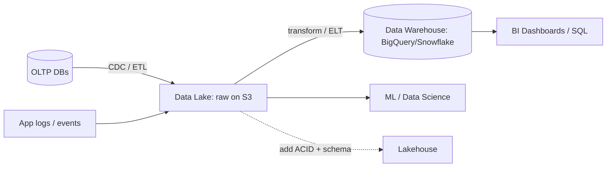

# Data Lakes and Data Warehouses

## 🧭 Overview
Data lakes and data warehouses are the two pillars of analytical (OLAP) data infrastructure. A **data warehouse** stores cleaned, structured data optimized for fast SQL analytics; a **data lake** stores raw data of any format cheaply at massive scale. Knowing how they differ — and how the modern "lakehouse" blends them — is important for designing analytics, ML, and reporting systems, and increasingly common in interviews.

---

## 🧠 Technical Explanation

### OLTP vs OLAP (the foundation)
- **OLTP** (online transaction processing): your operational databases — many small, fast reads/writes (orders, users).
- **OLAP** (online analytical processing): large scans and aggregations over historical data for analytics/BI. Warehouses and lakes serve OLAP.
Don't run heavy analytics on OLTP databases — it competes with live traffic. Move data to analytical stores via **ETL/ELT** or **CDC** (change data capture).

### Data Warehouse
- **What:** structured, schema-on-write, optimized for SQL analytics.
- **Storage:** columnar (great for aggregations over few columns across many rows) with compression.
- **Examples:** Snowflake, Google BigQuery, Amazon Redshift.
- **Pros:** fast queries, governed/clean data, BI-friendly. **Cons:** schema must be defined up front; less flexible for raw/unstructured data; can be costly.

### Data Lake
- **What:** raw data in any format (JSON, CSV, Parquet, images, logs), **schema-on-read**, on cheap object storage (S3/GCS).
- **Pros:** cheap, flexible, stores everything (good for ML/data science). **Cons:** without governance becomes a "data swamp"; querying raw data is slower/messier.

### Modern: ETL vs ELT
- **ETL:** transform *before* loading (classic warehouse).
- **ELT:** load raw first, transform inside the warehouse/lake (modern, leverages cheap storage + scalable compute).

### The Lakehouse
A hybrid (Databricks Delta Lake, Apache Iceberg, Hudi) that adds warehouse features — ACID transactions, schema enforcement, SQL performance — *on top of* a data lake's cheap object storage. Aims to get the best of both.

---

## 🍎 Simple Explanation (ELI5 / Analogy)
A **data warehouse** is like a well-organized library: every book is catalogued, shelved by topic, and easy to find — but someone had to sort and label everything first. A **data lake** is like a giant storage unit where you toss in everything as-is — receipts, photos, notebooks — cheaply and instantly; it's all there, but finding and making sense of it takes more work. A **lakehouse** is a storage unit that's also been given a catalogue system, so you get cheap "toss it all in" storage *plus* library-like findability.

---

## 📊 Diagram / Flowchart

---

## ⚖️ Trade-offs

| | Data Warehouse | Data Lake |
|---|------|------|
| Schema | Schema-on-write (structured) | Schema-on-read (any format) |
| Cost | Higher | Low (object storage) |
| Query speed | Fast (columnar, optimized) | Slower on raw data |
| Flexibility | Lower | High (stores everything) |
| Best for | BI, reporting, governed analytics | ML, raw/exploratory data |
| Risk | Up-front modeling effort | "Data swamp" without governance |

---

## 🌍 Real-World Examples
- **Netflix** runs a huge data lake on S3 with Iceberg, feeding analytics and ML for recommendations.
- **Most enterprises** use BigQuery/Snowflake/Redshift warehouses for BI dashboards.
- **Uber** built a lakehouse-style platform (Hudi) to support both batch analytics and near-real-time data.

---

## 🎯 Interview Questions

### 🔵 Conceptual (Theory)
1. Why shouldn't you run analytics directly on your OLTP database? → **Answer:** Large analytical scans/aggregations contend for resources and degrade latency-sensitive transactional queries; move data to a warehouse/lake instead.
2. What's the difference between schema-on-write and schema-on-read? → **Answer:** Schema-on-write (warehouse) enforces structure when data is loaded; schema-on-read (lake) stores raw data and applies structure when queried — more flexible, less governed.
3. What problem does a lakehouse solve? → **Answer:** It adds warehouse features (ACID, schema enforcement, fast SQL) on cheap lake storage, combining flexibility/cost of a lake with reliability/performance of a warehouse.

### 🟠 Design (Practical)
1. Design a pipeline from operational DBs to BI dashboards. → **Answer:** CDC/ETL from OLTP → land raw in a data lake → transform (ELT) into a warehouse → serve BI tools; keep raw in the lake for ML.
2. How do you prevent a data lake from becoming a "data swamp"? → **Answer:** Governance: catalogs, metadata, schemas (Iceberg/Delta), partitioning, access control, and data quality checks.

### 🔴 Company-Specific
1. [Netflix] Why store analytical data in a lake on S3 with a table format like Iceberg? *(Hint: cheap scale + ACID/schema + engine flexibility.)*
2. [Amazon] When would you choose Redshift vs querying S3 directly with Athena? *(Hint: governed fast BI vs ad-hoc serverless queries on raw data.)*
3. [Uber] How do you support both batch and near-real-time analytics on the same data? *(Hint: lakehouse with incremental processing, e.g., Hudi.)*

---

## 📚 Further Reading
- "What is a Data Lakehouse?" (Databricks)
- Google BigQuery & Snowflake architecture docs

---

## 🔗 Related Topics
- [Object Storage](01-object-storage.md)
- [Database Selection Guide](../03-databases/06-database-selection-guide.md)
- [Event-Driven Architecture](../05-messaging-and-queues/04-event-driven-architecture.md)
