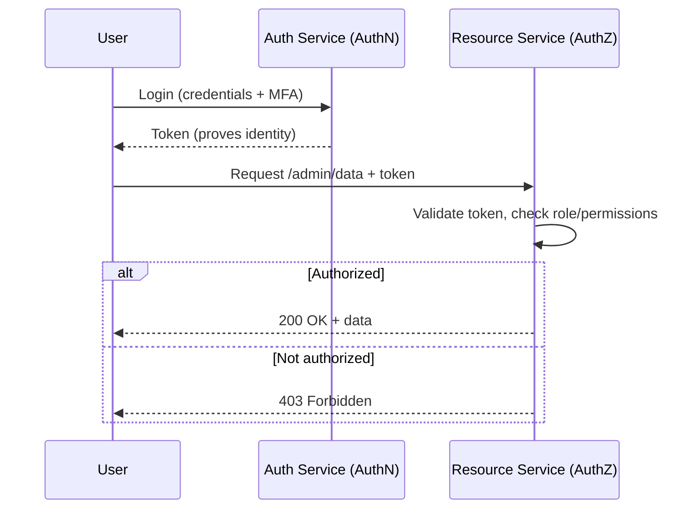

# Authentication vs Authorization

## 🧭 Overview
**Authentication (AuthN)** verifies *who you are*; **authorization (AuthZ)** determines *what you're allowed to do*. They're distinct but often confused, and getting them right is foundational to every secure system. You handle both whenever a user logs in and then accesses protected resources, and clear command of the distinction is expected in security and system-design interviews.

---

## 🧠 Technical Explanation

### Authentication (AuthN) — "Who are you?"
Proving identity, typically by one or more **factors**:
- **Something you know:** password, PIN.
- **Something you have:** phone (OTP), hardware key.
- **Something you are:** biometrics (fingerprint, face).
**MFA (multi-factor authentication)** combines factors for stronger security.

Common mechanisms: session cookies, JWTs, OAuth/OIDC, SSO, API keys, mTLS.

### Authorization (AuthZ) — "What can you do?"
Deciding which actions/resources an authenticated identity may access. Common models:
- **RBAC (Role-Based Access Control):** permissions granted via roles (admin, editor, viewer). Simple, widely used.
- **ABAC (Attribute-Based Access Control):** decisions based on attributes (user dept, resource owner, time, location). Flexible, fine-grained.
- **ACL (Access Control List):** explicit per-resource permission lists.
- **ReBAC (Relationship-Based):** permissions from relationships (Google Zanzibar — "user is owner of doc").

### Order Matters
AuthN happens **first** (establish identity), then AuthZ (check permissions). A valid login doesn't imply access to everything.

### Where Decisions Live
- **AuthN** at the edge/gateway or identity provider.
- **AuthZ** often a mix: coarse checks at the gateway, fine-grained checks in services (closest to the data) — the principle of **least privilege** and **defense in depth**.

### Best Practices
- Never store plaintext passwords — hash with bcrypt/argon2 + salt.
- Enforce least privilege; deny by default.
- Centralize identity (SSO/IdP) but enforce AuthZ near resources.

---

## 🍎 Simple Explanation (ELI5 / Analogy)
Going to a concert: **authentication** is showing your ID at the entrance to prove you're really you. **Authorization** is the wristband color that decides where you can go — general admission, VIP lounge, or backstage. Getting through the front door (authenticated) doesn't mean you can walk backstage (not authorized). First they confirm who you are, *then* they decide what you're allowed to do.

---

## 📊 Diagram / Flowchart

---

## ⚖️ Trade-offs

| Model | Pros | Cons |
|------|------|------|
| RBAC | Simple, easy to audit | Role explosion; coarse-grained |
| ABAC | Fine-grained, dynamic | Complex policies to manage |
| ACL | Precise per-resource control | Hard to scale/maintain at volume |
| ReBAC (Zanzibar) | Models relationships, scales | Complex infrastructure |

---

## 🌍 Real-World Examples
- **Google** uses Zanzibar (ReBAC) to authorize access across Docs/Drive/YouTube at massive scale.
- **AWS IAM** combines identities (AuthN) with fine-grained policies (AuthZ) using roles and attribute conditions.
- **Enterprise SSO (Okta/Azure AD)** centralizes authentication, while apps enforce role-based authorization.

---

## 🎯 Interview Questions

### 🔵 Conceptual (Theory)
1. What's the difference between authentication and authorization? → **Answer:** Authentication verifies identity (who you are); authorization decides permissions (what you can do). AuthN precedes AuthZ.
2. What is the principle of least privilege? → **Answer:** Grant each identity only the minimum permissions needed for its task, reducing blast radius if credentials are compromised.
3. Why hash passwords with bcrypt/argon2 + salt instead of plain hashing? → **Answer:** These are slow, salted algorithms that resist brute-force and rainbow-table attacks, unlike fast unsalted hashes.

### 🟠 Design (Practical)
1. Design access control for a SaaS app with admins, editors, and viewers. → **Answer:** RBAC with roles mapped to permissions, deny-by-default, enforced in services; centralize AuthN via an IdP/SSO.
2. A document app needs "owner can share with specific users" — which model? → **Answer:** ReBAC/ACL (relationship/list-based) since permissions derive from per-resource relationships, not just global roles.

### 🔴 Company-Specific
1. [Google] How does Zanzibar authorize billions of access checks consistently? *(Hint: relationship tuples, global consistency tokens, caching.)*
2. [Amazon] How does IAM separate authentication from authorization? *(Hint: principals/identities vs policies; roles assumed temporarily.)*
3. [Meta] How would you design authorization for a social graph (friends-only posts)? *(Hint: relationship-based checks against the graph.)*

---

## 📚 Further Reading
- OWASP Authentication & Authorization Cheat Sheets
- Google Zanzibar paper

---

## 🔗 Related Topics
- [OAuth2 and JWT](02-oauth2-and-jwt.md)
- [HTTPS and TLS](03-https-and-tls.md)
- [Common Attack Vectors](04-common-attack-vectors.md)
