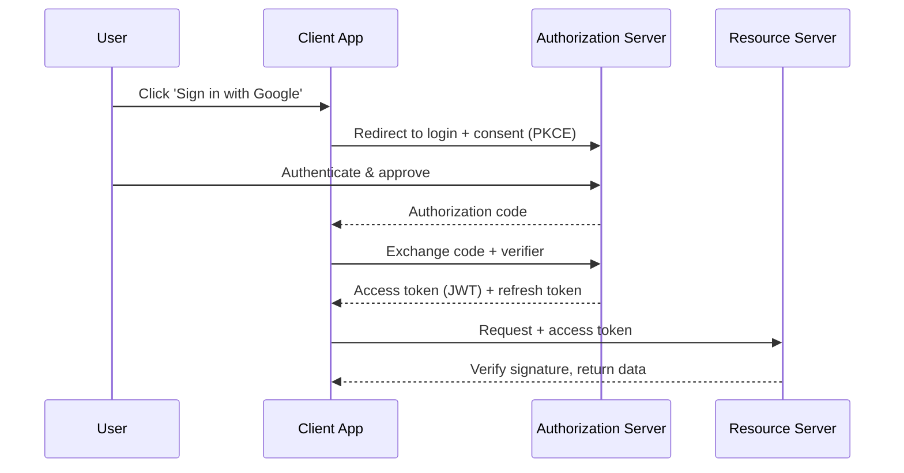

# OAuth 2.0 and JWT

## 🧭 Overview
**OAuth 2.0** is the industry-standard protocol for **delegated authorization** — letting an app access resources on a user's behalf without sharing their password ("Sign in with Google"). **JWT (JSON Web Token)** is a compact, self-contained token format commonly used to carry identity/claims. Together they power modern authentication/authorization across web, mobile, and microservices, making them essential knowledge.

---

## 🧠 Technical Explanation

### OAuth 2.0 Roles
- **Resource Owner:** the user.
- **Client:** the app wanting access.
- **Authorization Server:** issues tokens (e.g., Google's auth server).
- **Resource Server:** the API holding the user's data.

### Tokens
- **Access token:** short-lived credential to call APIs (often a JWT).
- **Refresh token:** long-lived; used to get new access tokens without re-login.

### Authorization Code Flow (+ PKCE) — the standard for web/mobile
1. App redirects user to the authorization server to log in and consent.
2. Server returns an **authorization code** to the app's redirect URI.
3. App exchanges the code (plus a PKCE verifier) for an **access token** (+ refresh token).
4. App calls the resource server with the access token.
**PKCE** protects public clients (mobile/SPA) from code-interception attacks. The deprecated *implicit* flow should no longer be used.

### Client Credentials Flow
For machine-to-machine (no user): the client authenticates directly to get a token.

### OpenID Connect (OIDC)
OAuth2 is for *authorization*; **OIDC** is a thin layer on top that adds *authentication* (an **ID token**, a JWT describing the user). "Sign in with Google" uses OIDC.

### JWT Structure
Three base64url parts: `header.payload.signature`.
- **Header:** algorithm/type.
- **Payload (claims):** `sub`, `exp`, `iat`, roles, etc.
- **Signature:** signed by the issuer (HMAC or RSA/EC) so it can be verified without a DB lookup.

### JWT Trade-offs
- **Stateless:** servers verify the signature locally — great for scaling.
- **Hard to revoke** before expiry (it's self-contained) → keep them short-lived, use refresh tokens and a denylist/rotation for revocation.
- **Don't store secrets** in the payload (it's readable, only signed not encrypted unless using JWE).

---

## 🍎 Simple Explanation (ELI5 / Analogy)
OAuth is like a hotel valet key. Instead of giving the valet your house key and full access (your password), the hotel issues a limited valet key that *only* starts the car and opens the trunk, expires at checkout, and can be revoked. "Sign in with Google" works the same way: you let an app use a limited, time-bound key to access just the data you approved — never your actual Google password. A **JWT** is like a tamper-proof wristband stamped with your details and a security seal: staff can check the seal instantly without phoning the front desk.

---

## 📊 Diagram / Flowchart

---

## ⚖️ Trade-offs

| Aspect | Pros | Cons |
|------|------|------|
| OAuth2 delegated auth | No password sharing, scoped, revocable | Protocol complexity, many flows |
| JWT (stateless) | Fast local verification, scales | Hard to revoke early; size; readable payload |
| Refresh tokens | Long sessions without re-login | Must be stored securely; rotation needed |
| OIDC | Standardized authentication on OAuth2 | Adds another spec to understand |

---

## 🌍 Real-World Examples
- **"Sign in with Google/Apple/GitHub"** uses OAuth2 + OIDC.
- **Auth0/Okta/Cognito** issue JWT access tokens validated by APIs.
- **Microservices** pass JWTs between services so each can verify identity without a central session store.

---

## 🎯 Interview Questions

### 🔵 Conceptual (Theory)
1. What problem does OAuth2 solve? → **Answer:** Delegated authorization — letting an app access a user's resources on their behalf with scoped, revocable tokens, without ever sharing the user's password.
2. Why is a JWT hard to revoke before expiry? → **Answer:** It's self-contained and verified by signature alone (no server lookup), so there's no built-in way to invalidate it early — mitigated with short lifetimes, denylists, and refresh-token rotation.
3. What's the difference between OAuth2 and OIDC? → **Answer:** OAuth2 handles authorization (access tokens); OIDC adds authentication on top, issuing an ID token (JWT) that describes who the user is.

### 🟠 Design (Practical)
1. Design auth for a mobile app talking to your API. → **Answer:** OAuth2 Authorization Code flow with PKCE → short-lived JWT access tokens + refresh tokens; APIs verify JWT signatures statelessly.
2. How do you handle JWT revocation on logout? → **Answer:** Keep access tokens short-lived, revoke/rotate the refresh token, and optionally maintain a token/jti denylist checked at the gateway.

### 🔴 Company-Specific
1. [Google] Why use PKCE for public clients? *(Hint: prevents authorization-code interception on mobile/SPA without a client secret.)*
2. [Amazon] How would microservices verify a caller's identity without a central session store? *(Hint: signed JWTs verified locally with the issuer's public key.)*
3. [Meta] What are the risks of putting too much data in a JWT? *(Hint: payload is readable, increases size, leaks info — keep claims minimal.)*

---

## 📚 Further Reading
- RFC 6749 (OAuth 2.0), RFC 7519 (JWT)
- "OAuth 2.0 Simplified" by Aaron Parecki

---

## 🔗 Related Topics
- [Authentication vs Authorization](01-authentication-vs-authorization.md)
- [HTTPS and TLS](03-https-and-tls.md)
- [Common Attack Vectors](04-common-attack-vectors.md)
- [API Gateway](../06-api-design/03-api-gateway.md)
