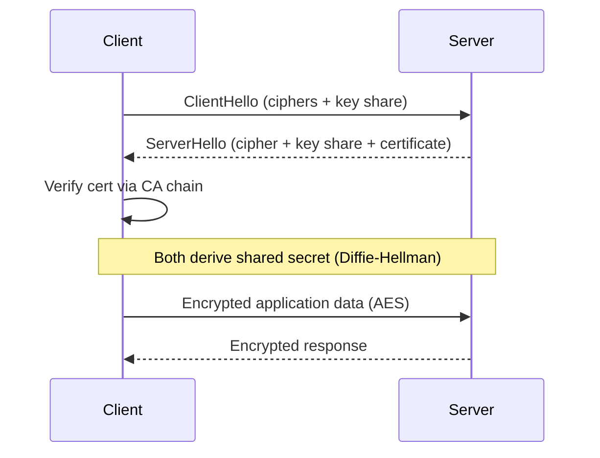

# HTTPS and TLS

## 🧭 Overview
HTTPS is HTTP secured by **TLS (Transport Layer Security)**, which encrypts data in transit, verifies server identity, and ensures integrity. It's the baseline for all secure web communication — protecting passwords, payments, and personal data from eavesdroppers and tampering. Understanding the TLS handshake and certificate trust is important for security questions and for reasoning about latency.

---

## 🧠 Technical Explanation

### Three Guarantees TLS Provides
1. **Confidentiality:** data is encrypted; eavesdroppers see gibberish.
2. **Integrity:** tampering is detected (MACs/AEAD).
3. **Authentication:** the server proves its identity via a certificate (and optionally the client via mTLS).

### Symmetric + Asymmetric Crypto
TLS combines both: **asymmetric** crypto (public/private keys) during the handshake to securely agree on a shared **symmetric** key, then fast symmetric encryption (AES) for the actual data. Asymmetric is secure but slow; symmetric is fast — so use asymmetric only to bootstrap.

### The Handshake (TLS 1.3, simplified)
1. **ClientHello:** client sends supported ciphers + a key share.
2. **ServerHello:** server picks a cipher, sends its key share + **certificate**.
3. Both derive the same shared secret (Diffie-Hellman) — keys are never sent over the wire.
4. Encrypted application data flows.
TLS 1.3 needs just **one round trip** (1-RTT), with 0-RTT resumption for repeat connections — much faster than TLS 1.2.

### Certificates & the Chain of Trust
A **CA (Certificate Authority)** signs the server's certificate. Browsers trust a set of root CAs; the server's cert chains up to a trusted root, proving the server owns the domain. **Let's Encrypt** provides free, automated certificates.

### Forward Secrecy
Ephemeral Diffie-Hellman keys mean that even if the server's private key is later stolen, past sessions can't be decrypted.

### mTLS (Mutual TLS)
Both client and server present certificates — common for service-to-service auth in microservices/service meshes.

---

## 🍎 Simple Explanation (ELI5 / Analogy)
Sending data over plain HTTP is like mailing a postcard — anyone handling it can read it. HTTPS/TLS is like putting your message in a locked box. Here's the clever part: you and the recipient publicly agree on a secret combination in a way that eavesdroppers *can't* reconstruct (the handshake), then use that secret to lock all future messages quickly. The recipient also shows a notarized ID card (the certificate, signed by a trusted notary — the CA) so you know you're really talking to your bank and not an impostor.

---

## 📊 Diagram / Flowchart

---

## ⚖️ Trade-offs

| Pros | Cons |
|------|------|
| Confidentiality, integrity, authentication | Handshake adds latency (mitigated by TLS 1.3/resumption) |
| Builds user trust; required for modern web | Certificate management/rotation overhead |
| Forward secrecy protects past sessions | Slight CPU cost (minor with modern hardware) |
| Enables HTTP/2, HTTP/3 | Misconfiguration can weaken security |

---

## 🌍 Real-World Examples
- **Let's Encrypt** issues billions of free certificates, making HTTPS ubiquitous.
- **CDNs (Cloudflare)** terminate TLS at the edge to reduce handshake latency globally.
- **Service meshes (Istio)** use **mTLS** to encrypt and authenticate all internal service traffic automatically.

---

## 🎯 Interview Questions

### 🔵 Conceptual (Theory)
1. Why does TLS use both asymmetric and symmetric encryption? → **Answer:** Asymmetric crypto securely establishes a shared secret during the handshake (slow but secure); symmetric crypto then encrypts the bulk data fast.
2. What is forward secrecy and why does it matter? → **Answer:** Using ephemeral session keys so that even if the server's long-term private key is later compromised, previously recorded sessions can't be decrypted.
3. How does a certificate prove a server's identity? → **Answer:** A trusted CA signs the cert binding a public key to a domain; the client verifies the signature chain up to a trusted root.

### 🟠 Design (Practical)
1. How would you reduce TLS handshake latency for global users? → **Answer:** Terminate TLS at CDN edge nodes near users, use TLS 1.3 (1-RTT) and session resumption/0-RTT.
2. How do you secure internal microservice traffic? → **Answer:** mTLS (mutual TLS), often automated by a service mesh, so services authenticate each other and traffic is encrypted.

### 🔴 Company-Specific
1. [Google] How does TLS 1.3 improve over 1.2? *(Hint: 1-RTT handshake, removed weak ciphers, 0-RTT resumption.)*
2. [Cloudflare] Why terminate TLS at the edge? *(Hint: latency, offload origin, central cert management.)*
3. [Amazon] How would you rotate certificates across thousands of services without downtime? *(Hint: automation/ACM, short-lived certs, rolling rotation.)*

---

## 📚 Further Reading
- "TLS 1.3" (RFC 8446) overview by Cloudflare
- *Bulletproof TLS and PKI* by Ivan Ristić

---

## 🔗 Related Topics
- [Network Basics](../01-fundamentals/03-network-basics.md)
- [OAuth2 and JWT](02-oauth2-and-jwt.md)
- [Common Attack Vectors](04-common-attack-vectors.md)
- [CDN](../04-caching/04-cdn.md)
