# Common Attack Vectors

## 🧭 Overview
Designing and operating secure systems requires knowing how they get attacked — the mechanism, the real-world damage, and the concrete defenses. This is a comprehensive, practical reference to the most important web/application attack vectors (largely the OWASP Top 10 and beyond), each with attack flow diagrams, documented incidents, vulnerable vs secure code, and interview questions. Use it for interviews **and** real engineering work.

> **Cross-cutting principles** that recur throughout: **defense in depth** (layered controls), **least privilege**, **never trust user input**, **fail securely**, and **encrypt everywhere**.

---

## 1. SQL Injection (SQLi)

### 🔍 What is it?
SQL Injection occurs when user-supplied input is concatenated directly into a SQL query without sanitization. The attacker injects malicious SQL syntax that the database engine then parses and executes as legitimate commands. Because the data and the code (query) travel together as one string, the database can't tell the difference. Step by step: (1) the app builds a query string by gluing in user input; (2) the attacker supplies input containing SQL meta-characters (`'`, `--`, `;`, `OR`); (3) the meaning of the query changes; (4) the engine executes the altered query — leaking data, bypassing auth, deleting tables, or (on some DBs) running OS commands via stacked queries or `xp_cmdshell`.

### 🍎 Simple Explanation
Imagine a bouncer checking a guest list. You say your name is `Alice OR 1=1`. The bouncer asks "Is `Alice OR 1=1` on the list?" — and since `1=1` is always true, everyone gets in.

### 🔄 Attack Flow Diagram

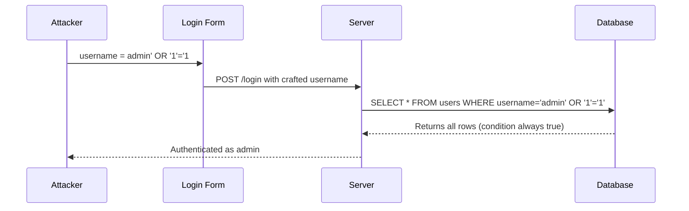

### 💥 Real-World Incidents
- **Heartland Payment Systems (2008):** SQLi led to a breach exposing ~130 million credit-card records; remediation and settlements cost the company well over $140 million.
- **TalkTalk (2015):** A SQL injection attack exposed personal data of ~157,000 customers and resulted in a record fine from UK regulators.

### 🛡️ Prevention Measures
1. **Use parameterized queries / prepared statements** — pass data as bound parameters (`%s`, `?`) so the driver sends query and data separately; the SQL engine never parses user input as code.
2. **Use a vetted ORM** (SQLAlchemy, Django ORM, Prisma, Hibernate) — these parameterize by default; avoid raw-string query builders.
3. **Whitelist input validation** — validate type/format (e.g., numeric IDs must be integers); reject anything that doesn't match an allowlist pattern.
4. **Least-privilege DB account** — the app's DB user should have only the privileges it needs (no `DROP`, no `GRANT`, separate read/write roles).
5. **Disable dangerous features** — turn off stacked queries where possible and remove `xp_cmdshell`/`LOAD_FILE` capabilities.
6. **Add a WAF** (AWS WAF, Cloudflare, ModSecurity) with managed SQLi rule sets as a detection/defense-in-depth layer, not the primary fix.

### 💻 Vulnerable Code Example

```python
# ❌ VULNERABLE — user input is concatenated directly into the SQL string
def get_user(username):
    # The value of `username` becomes part of the SQL CODE, not just data
    query = "SELECT * FROM users WHERE username = '" + username + "'"
    # username = "admin' OR '1'='1" turns the WHERE clause always-true
    return db.execute(query)
```

### ✅ Secure Code Example

```python
# ✅ SECURE — parameterized query: input is bound as DATA, never parsed as SQL
def get_user(username):
    query = "SELECT * FROM users WHERE username = %s"
    # The driver sends the query and the value separately to the DB engine
    return db.execute(query, (username,))

# ✅ Even better — an ORM parameterizes automatically
def get_user_orm(username):
    return User.query.filter_by(username=username).first()  # SQLAlchemy binds safely
```

### 🎯 Interview Questions
1. [Amazon] Explain how SQL injection works and why parameterized queries stop it. → **Hint:** data vs code separation; the engine never parses bound params as SQL.
2. [Google] How would you protect a reporting service that must accept dynamic column/sort inputs? → **Hint:** allowlist column names; you can't parameterize identifiers, so map to a fixed set.
3. [Stripe] Beyond parameterization, what defense-in-depth layers reduce SQLi blast radius? → **Hint:** least-privilege DB user, WAF, monitoring/alerting on anomalous queries.
4. How would you find SQLi in an existing codebase? → **Hint:** grep for string-concatenated queries, run SAST/DAST (Snyk, ZAP), review ORM `raw()`/`extra()` usage.

---

## 2. Cross-Site Scripting (XSS) — Stored & Reflected

### 🔍 What is it?
XSS happens when an application includes untrusted data in a web page without proper escaping, so the browser executes attacker-supplied JavaScript in the victim's session/origin. Because the script runs with the victim's privileges, it can steal cookies/tokens, perform actions as the user, keylog, or rewrite the page.
- **Stored (persistent) XSS:** the payload is saved server-side (a comment, profile bio) and served to every viewer.
- **Reflected XSS:** the payload is in the request (a URL query param) and echoed back immediately in the response; the attacker tricks the victim into clicking a crafted link.
- **DOM-based XSS:** the vulnerability is purely client-side — JS reads attacker-controlled input (`location.hash`) and writes it to the DOM unsafely (`innerHTML`).

### 🍎 Simple Explanation
You leave a "note" on a community bulletin board, but your note is actually a magic spell. Everyone who reads the board has the spell cast on them automatically — without realizing they read anything dangerous.

### 🔄 Attack Flow Diagram

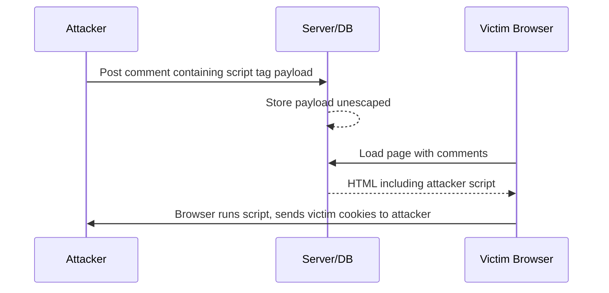

### 💥 Real-World Incidents
- **Samy worm on MySpace (2005):** a stored-XSS payload added "Samy is my hero" and friend-requested Samy from every profile that viewed an infected one — over 1 million infections in ~20 hours.
- **British Airways (2018, Magecart):** malicious JavaScript injected into the site skimmed payment details of ~380,000 customers, leading to a large GDPR fine.

### 🛡️ Prevention Measures
1. **Context-aware output encoding** — escape data for the context it's rendered in (HTML body, attribute, JS, URL). Use the framework's auto-escaping (React JSX, Angular, Jinja2 autoescape) and avoid bypasses like `dangerouslySetInnerHTML`/`innerHTML`.
2. **Sanitize rich HTML** with a vetted library (DOMPurify on the client, Bleach in Python) when you must allow some markup.
3. **Content Security Policy (CSP)** — set `Content-Security-Policy` to disallow inline scripts and restrict script sources, so injected scripts won't run even if they land.
4. **`HttpOnly` + `Secure` + `SameSite` cookies** — `HttpOnly` prevents JS from reading session cookies, limiting theft.
5. **Validate/normalize input** as a secondary layer, but never rely on input filtering alone — encoding on output is the real fix.

### 💻 Vulnerable Code Example

```javascript
// ❌ VULNERABLE — writing untrusted input straight into the DOM as HTML
function showComment(comment) {
  // innerHTML parses and executes any <script>/ in `comment`
  document.getElementById("comments").innerHTML += comment;
}
// comment = ''
```

### ✅ Secure Code Example

```javascript
// ✅ SECURE — treat input as TEXT, not HTML (browser will not execute it)
function showComment(comment) {
  const el = document.createElement("div");
  el.textContent = comment;            // textContent escapes everything automatically
  document.getElementById("comments").appendChild(el);
}

// ✅ If you must allow some HTML, sanitize with DOMPurify first
import DOMPurify from "dompurify";
function showRich(comment) {
  document.getElementById("comments").innerHTML = DOMPurify.sanitize(comment);
}
```

### 🎯 Interview Questions
1. [Meta] What's the difference between stored, reflected, and DOM-based XSS? → **Hint:** where the payload lives and when it executes.
2. [Google] How does a Content Security Policy mitigate XSS, and what are its limits? → **Hint:** blocks inline/unauthorized scripts; doesn't fix the bug, can be bypassed if `unsafe-inline` is allowed.
3. [Amazon] How would you prevent stored XSS in a user-generated-content platform? → **Hint:** output encoding + DOMPurify + CSP + HttpOnly cookies.
4. [Stripe] Why isn't input validation alone sufficient to stop XSS? → **Hint:** the same data is rendered in many contexts; output encoding for the right context is what matters.

---

## 3. Cross-Site Request Forgery (CSRF)

### 🔍 What is it?
CSRF tricks an authenticated user's browser into sending a state-changing request to a site where they're logged in, without their intent. It abuses the fact that browsers **automatically attach cookies** (including session cookies) to requests to a domain. The attacker hosts a page that auto-submits a form or fires a request to the victim's bank/app; because the victim's session cookie rides along, the server treats it as legitimate. CSRF targets actions (transfer money, change email), not data theft directly.

### 🍎 Simple Explanation
Someone mails you a pre-filled check made out to them and forges your signature using the fact that the bank already trusts envelopes from your address. The bank cashes it because everything "looks" like it came from you.

### 🔄 Attack Flow Diagram

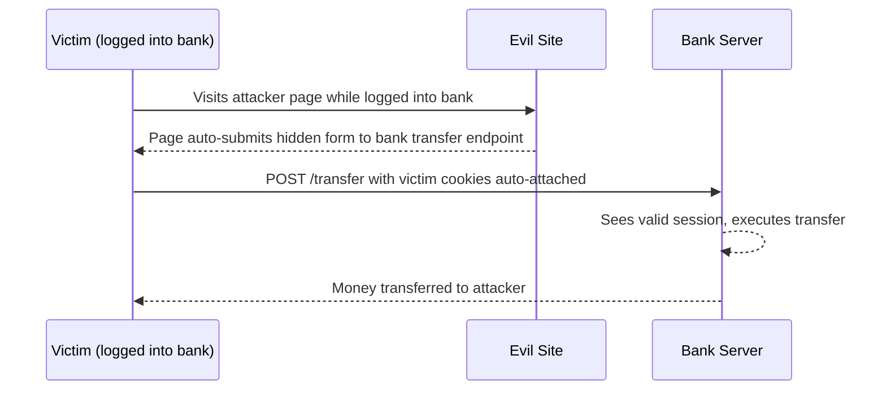

### 💥 Real-World Incidents
- **Netflix (2006):** CSRF flaws allowed attackers to add DVDs to a victim's queue and change shipping/account details via crafted requests.
- **ING Direct (2008):** researchers demonstrated CSRF that could perform fund transfers between a victim's accounts, a landmark example for financial apps.

### 🛡️ Prevention Measures
1. **Anti-CSRF tokens (synchronizer pattern)** — embed an unpredictable, per-session token in forms; the server rejects requests without a matching token. Frameworks (Django, Rails, Spring) provide this built-in.
2. **`SameSite` cookies** — set session cookies to `SameSite=Lax` (default in modern browsers) or `Strict` so they aren't sent on cross-site requests.
3. **Verify `Origin`/`Referer` headers** on state-changing requests as a secondary check.
4. **Require re-authentication / CSRF tokens for sensitive actions** (password/email change, transfers).
5. **Use proper HTTP methods** — never perform state changes on `GET`; pair with tokens on `POST/PUT/DELETE`.

### 💻 Vulnerable Code Example

```python
# ❌ VULNERABLE — accepts a state-changing POST with no CSRF protection
@app.route("/transfer", methods=["POST"])
def transfer():
    # Relies ONLY on the session cookie, which the browser attaches automatically
    to_acct = request.form["to"]
    amount = request.form["amount"]
    do_transfer(session["user_id"], to_acct, amount)  # forged request succeeds
    return "ok"
```

### ✅ Secure Code Example

```python
# ✅ SECURE — require a per-session CSRF token that an attacker cannot know
@app.route("/transfer", methods=["POST"])
def transfer():
    token = request.form.get("csrf_token")
    if not token or not hmac.compare_digest(token, session.get("csrf_token", "")):
        abort(403)  # reject forged cross-site requests
    do_transfer(session["user_id"], request.form["to"], request.form["amount"])
    return "ok"
# Also set: Set-Cookie: session=...; HttpOnly; Secure; SameSite=Lax
```

### 🎯 Interview Questions
1. [Meta] How does CSRF differ from XSS? → **Hint:** CSRF forces a request using existing auth; XSS runs attacker JS in the victim's origin.
2. [Amazon] How do SameSite cookies and CSRF tokens complement each other? → **Hint:** SameSite blocks most cross-site cookie sends; tokens defend remaining cases and older browsers.
3. [Stripe] Why are token-based APIs (Authorization header, not cookies) less susceptible to CSRF? → **Hint:** browsers don't auto-attach Authorization headers cross-site.
4. How would you protect a money-transfer endpoint? → **Hint:** CSRF token + SameSite + re-auth + POST-only + Origin check.


---

## 4. Man-in-the-Middle (MITM)

### 🔍 What is it?
In a MITM attack, the attacker secretly positions themselves between two communicating parties, relaying (and possibly altering) messages while each side believes it's talking directly to the other. Common mechanisms: ARP spoofing on a LAN, rogue Wi-Fi access points ("evil twin"), DNS spoofing, BGP hijacking, or TLS stripping (downgrading HTTPS to HTTP). Once in the middle, the attacker can read credentials/session tokens, inject content, or tamper with transactions. Encryption (TLS) with proper certificate validation is the primary defense because it makes intercepted traffic unreadable and detects tampering.

### 🍎 Simple Explanation
You pass notes to a friend through a "trusted" classmate. Unknown to both of you, that classmate reads every note, sometimes changes the words, then passes it on. You both think you're talking privately.

### 🔄 Attack Flow Diagram

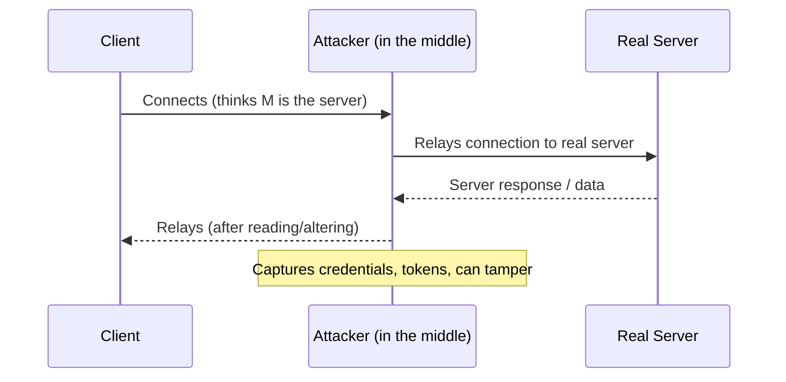

### 💥 Real-World Incidents
- **Superfish on Lenovo laptops (2015):** pre-installed adware injected a self-signed root CA, enabling MITM interception of HTTPS traffic on affected machines.
- **Public Wi-Fi evil-twin attacks:** widely documented at airports/cafés where rogue hotspots intercept unencrypted or downgraded traffic to harvest credentials.

### 🛡️ Prevention Measures
1. **Enforce TLS everywhere (HTTPS)** with modern TLS 1.2/1.3 and strong cipher suites; redirect all HTTP to HTTPS.
2. **HSTS (`Strict-Transport-Security`)** — tells browsers to only ever use HTTPS for your domain, preventing TLS-stripping downgrades; consider HSTS preload.
3. **Validate certificates strictly** and use **certificate pinning** in mobile/native apps to reject rogue CAs.
4. **Use mTLS for service-to-service** traffic so both ends authenticate each other.
5. **Avoid trusting untrusted networks** — VPNs for sensitive work; educate users about public Wi-Fi.

### 💻 Vulnerable Code Example

```python
# ❌ VULNERABLE — TLS certificate verification disabled
import requests
def fetch(url):
    # verify=False accepts ANY certificate, including an attacker's forged one
    return requests.get(url, verify=False)  # MITM can intercept/alter freely
```

### ✅ Secure Code Example

```python
# ✅ SECURE — verify certificates (default) and pin a trusted CA bundle if needed
import requests
def fetch(url):
    # verify=True (default) validates the server cert against trusted CAs
    return requests.get(url, verify=True, timeout=10)

# ✅ For native/mobile clients, pin the expected cert/public key to block rogue CAs
# session.mount("https://api.example.com", FingerprintAdapter(EXPECTED_SHA256))
```

### 🎯 Interview Questions
1. [Cloudflare] How does HSTS prevent TLS-stripping MITM attacks? → **Hint:** browser refuses plain HTTP for the domain after first visit / preload.
2. [Google] What does certificate pinning add over standard TLS validation? → **Hint:** protects against compromised/rogue CAs by trusting only specific certs.
3. [Amazon] How would you secure service-to-service traffic inside a cluster against MITM? → **Hint:** mTLS via a service mesh; rotate certs automatically.
4. Why is `verify=False` (or `rejectUnauthorized:false`) dangerous in production? → **Hint:** disables the only thing stopping an attacker's forged certificate.

---

## 5. DDoS (Distributed Denial of Service)

### 🔍 What is it?
A DDoS attack overwhelms a target with traffic from many sources (often a botnet) so legitimate users can't be served. It comes in three layers:
- **Volumetric (L3/L4):** saturate bandwidth with sheer volume (UDP floods, **amplification/reflection** using DNS/NTP/memcached where a small spoofed request triggers a huge response to the victim).
- **Protocol attacks (L4):** exhaust server/firewall connection state (SYN floods that leave half-open TCP connections).
- **Application layer (L7):** cheap-to-send but expensive-to-process requests (HTTP floods hitting search/login endpoints), hardest to distinguish from real traffic.
The goal is resource exhaustion: bandwidth, CPU, memory, connection tables, or downstream dependencies.

### 🍎 Simple Explanation
A flash mob crowds a small shop's doorway, all pretending to be customers. Real customers can't get in, and the staff are too busy with the fake crowd to serve anyone.

### 🔄 Attack Flow Diagram

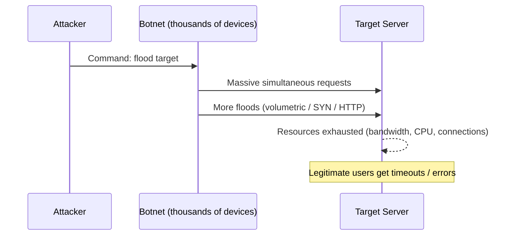

### 💥 Real-World Incidents
- **Dyn DNS attack (2016, Mirai botnet):** IoT-device botnet generated ~1.2 Tbps, taking down Twitter, Reddit, Netflix, Spotify, and more via Dyn's DNS.
- **GitHub (2018):** a 1.35 Tbps memcached **amplification** attack — at the time the largest recorded — mitigated within minutes via traffic scrubbing.

### 🛡️ Prevention Measures
1. **Edge DDoS protection / scrubbing** — front your app with Cloudflare, AWS Shield, or Akamai to absorb and filter volumetric attacks before they reach origin.
2. **Anycast network** — distribute traffic across many global PoPs so attack volume is spread and absorbed.
3. **Rate limiting & throttling** at the gateway (per-IP, per-API-key) plus connection limits to blunt L7 floods.
4. **Autoscaling + load balancing** to absorb surges; combine with circuit breakers so a flooded dependency fails fast.
5. **Disable/secure amplifiers** — don't run open DNS/NTP resolvers; apply BCP38 anti-spoofing upstream.
6. **WAF + bot management** — block known-bad patterns and challenge suspicious clients (JS challenge, CAPTCHA) for L7 attacks.

### 💻 Vulnerable Code Example

```python
# ❌ VULNERABLE — an expensive endpoint with no rate limiting or protection
@app.route("/search")
def search():
    q = request.args["q"]
    # Each call runs a heavy, unbounded full-text scan — cheap to request, costly to serve
    return expensive_full_table_search(q)  # L7 flood here exhausts CPU/DB
```

### ✅ Secure Code Example

```python
# ✅ SECURE — rate limit, cap work, and rely on edge protection for volume
from flask_limiter import Limiter
limiter = Limiter(key_func=lambda: request.headers.get("X-API-Key") or request.remote_addr)

@app.route("/search")
@limiter.limit("20/minute")          # throttle abusive clients (429 on excess)
def search():
    q = request.args.get("q", "")[:100]   # bound input size
    return cached_search(q, max_results=50)  # cache + cap work per request
# Plus: deploy behind Cloudflare/AWS Shield + WAF + autoscaling for volumetric/protocol layers
```

### 🎯 Interview Questions
1. [Cloudflare] Explain the three DDoS layers and how mitigation differs for each. → **Hint:** volumetric=scrubbing/anycast, protocol=SYN cookies/firewalls, L7=rate limit/WAF/bot challenges.
2. [Amazon] How does your system handle a sudden DDoS spike? → **Hint:** edge protection first, then rate limiting, autoscaling, graceful degradation, shed non-critical load.
3. [Google] What is a DNS amplification attack and how do you prevent being a reflector? → **Hint:** spoofed source IP + open resolver; close open resolvers, anti-spoofing (BCP38).
4. [Meta] How do you distinguish a flash crowd (legit traffic) from an L7 DDoS? → **Hint:** behavioral analysis, fingerprinting, request patterns, challenges.

---

## 6. Broken Authentication & Session Hijacking

### 🔍 What is it?
This covers weaknesses in how identity and sessions are managed: weak/guessable passwords, missing rate limits on login, predictable or non-rotated session IDs, session tokens exposed in URLs or over HTTP, missing logout/expiry, and lack of MFA. **Session hijacking** specifically means an attacker obtains a valid session token (via XSS, network sniffing, fixation, or prediction) and reuses it to impersonate the user — no password needed. **Session fixation** is forcing a known session ID onto a victim before they log in, then reusing it after.

### 🍎 Simple Explanation
A coat-check ticket gets you your coat without proving who you are. If someone copies or steals your ticket, they walk out with your coat — the attendant never asks for ID.

### 🔄 Attack Flow Diagram

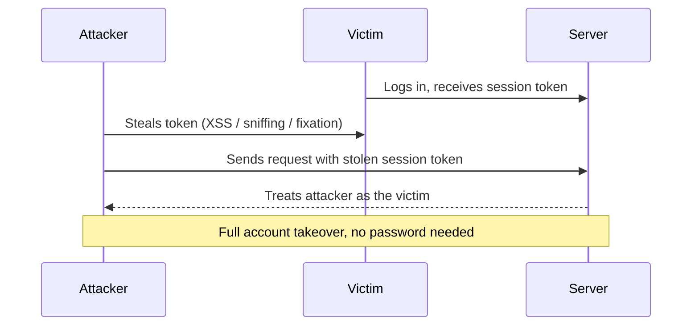

### 💥 Real-World Incidents
- **Firesheep (2010):** a browser extension let anyone on open Wi-Fi hijack sessions of sites that didn't use HTTPS, by capturing session cookies — pushed the industry toward full-site HTTPS.
- **Numerous account-takeover breaches** stem from sessions that never expired or tokens leaked in logs/URLs (a recurring finding in OWASP testing and bug bounties).

### 🛡️ Prevention Measures
1. **Strong password storage** — hash with **bcrypt/argon2/scrypt** + per-user salt; never MD5/SHA-1/plaintext.
2. **MFA** for sensitive accounts and admin access.
3. **Secure session cookies** — `HttpOnly`, `Secure`, `SameSite`; never put session IDs in URLs.
4. **Rotate session IDs on login/privilege change** (defeats fixation) and **expire** sessions (idle + absolute timeouts); invalidate on logout.
5. **Rate-limit + lockout/backoff** on login to slow guessing (see Credential Stuffing).
6. **Short-lived tokens + refresh tokens**; bind tokens to context (device/IP) where feasible.

### 💻 Vulnerable Code Example

```python
# ❌ VULNERABLE — plaintext-ish password check + no session rotation/expiry
def login(username, password):
    user = User.query.filter_by(username=username).first()
    if user and user.password == password:   # comparing plaintext / weak hash
        session["user_id"] = user.id          # reuses any existing session id (fixation)
        return "ok"                            # cookie not marked HttpOnly/Secure
    return "fail"
```

### ✅ Secure Code Example

```python
# ✅ SECURE — strong hashing, session rotation, hardened cookie, lockout handled upstream
from argon2 import PasswordHasher
ph = PasswordHasher()

def login(username, password):
    user = User.query.filter_by(username=username).first()
    if user and ph.verify(user.password_hash, password):  # argon2 verify (constant-time)
        session.clear()                       # rotate: drop any pre-set session id (anti-fixation)
        session["user_id"] = user.id
        session.permanent = True              # apply configured idle/absolute timeout
        return "ok"
    return "fail"
# Cookie config: SESSION_COOKIE_HTTPONLY=True, _SECURE=True, _SAMESITE="Lax"
```

### 🎯 Interview Questions
1. [Amazon] Why hash passwords with bcrypt/argon2 instead of SHA-256? → **Hint:** deliberately slow + salted, resists brute force and rainbow tables.
2. [Meta] What is session fixation and how do you prevent it? → **Hint:** rotate/regenerate the session ID on login.
3. [Stripe] How would you design secure session management for a banking app? → **Hint:** short-lived tokens, HttpOnly/Secure/SameSite, MFA, rotation, idle+absolute expiry, device binding.
4. [Google] How do you safely store and validate "remember me" tokens? → **Hint:** random selector+validator, hash the validator, rotate on use.

---

## 7. Insecure Direct Object Reference (IDOR)

### 🔍 What is it?
IDOR is a type of broken access control where an application exposes a direct reference to an internal object (a database ID, filename, key) and **fails to verify that the requesting user is authorized to access that object**. The attacker simply changes the identifier (`/invoice/123` → `/invoice/124`) and the server returns someone else's data because it only checks *authentication* ("are you logged in?") not *authorization* ("is this yours?"). It's extremely common and often high-impact (mass data exposure) because it's trivial to exploit by incrementing IDs.

### 🍎 Simple Explanation
A hotel gives you room key #305, but the keys are just numbered and any key opens its matching room. You try key #306 and walk right into your neighbor's room — nobody checked it was actually yours.

### 🔄 Attack Flow Diagram

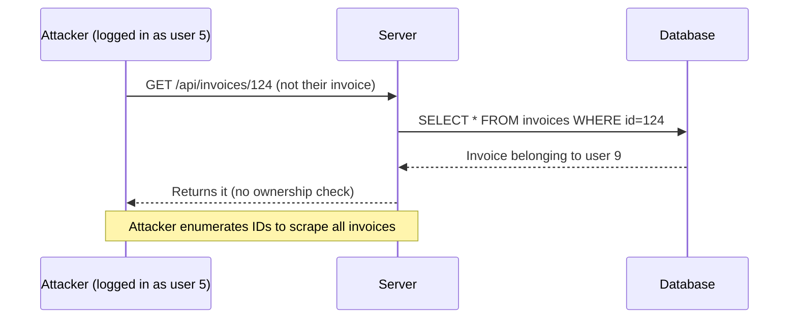

### 💥 Real-World Incidents
- **First American Financial (2019):** an IDOR-style flaw exposed ~885 million sensitive mortgage documents simply by changing a numeric URL parameter.
- **Numerous mobile/API breaches:** changing an account/order ID in API calls has repeatedly leaked other users' PII (a top finding in API security testing).

### 🛡️ Prevention Measures
1. **Enforce object-level authorization on every request** — check that the current user owns or may access the specific object, server-side, on each access.
2. **Scope queries to the user** — `WHERE id = ? AND owner_id = current_user` so a wrong ID returns nothing.
3. **Use unguessable identifiers** (UUIDv4) as defense-in-depth — but never rely on obscurity alone; still authorize.
4. **Centralize access-control checks** (policy layer/middleware) instead of per-handler ad hoc checks that are easy to forget.
5. **Deny by default**; add automated tests that attempt cross-user access.

### 💻 Vulnerable Code Example

```python
# ❌ VULNERABLE — fetches by id with NO ownership check
@app.route("/api/invoices/<int:invoice_id>")
@login_required
def get_invoice(invoice_id):
    # Any logged-in user can read ANY invoice by changing the id
    invoice = Invoice.query.get(invoice_id)
    return jsonify(invoice.to_dict())
```

### ✅ Secure Code Example

```python
# ✅ SECURE — scope the lookup to the current user (object-level authorization)
@app.route("/api/invoices/<int:invoice_id>")
@login_required
def get_invoice(invoice_id):
    invoice = Invoice.query.filter_by(
        id=invoice_id, owner_id=current_user.id    # wrong/other ids return None
    ).first()
    if invoice is None:
        abort(404)                                  # don't reveal existence
    return jsonify(invoice.to_dict())
```

### 🎯 Interview Questions
1. [Meta] What is IDOR and why is "logged-in" not enough to prevent it? → **Hint:** authentication ≠ authorization; need per-object ownership checks.
2. [Amazon] How would you systematically prevent IDOR across a large API? → **Hint:** centralized authorization layer, query scoping, automated cross-user tests.
3. [Google] Do UUIDs fix IDOR? → **Hint:** they raise the bar (hard to enumerate) but you must still authorize; not a substitute.
4. [Stripe] How would you detect IDOR attempts in production? → **Hint:** alert on users accessing many objects they don't own / 404 spikes / enumeration patterns.


---

## 8. Server-Side Request Forgery (SSRF)

### 🔍 What is it?
SSRF tricks a server into making HTTP (or other protocol) requests to a destination the attacker chooses. The app takes a user-supplied URL (for fetching images, webhooks, link previews, PDF generation) and naively requests it server-side. Because the request originates from *inside* the trusted network, the attacker can reach internal services unreachable from outside: cloud **metadata endpoints** (`169.254.169.254` to steal IAM credentials), internal admin panels, databases, or `localhost`. SSRF was the pivot in major cloud breaches. Variants include blind SSRF (no response returned, but side effects/timing leak info) and protocol smuggling (`file://`, `gopher://`).

### 🍎 Simple Explanation
You hand a trusted office courier an envelope with an address on it. Instead of an outside address, you write "go to the CEO's private safe and bring back what's inside." The courier has access you don't — and just follows instructions.

### 🔄 Attack Flow Diagram

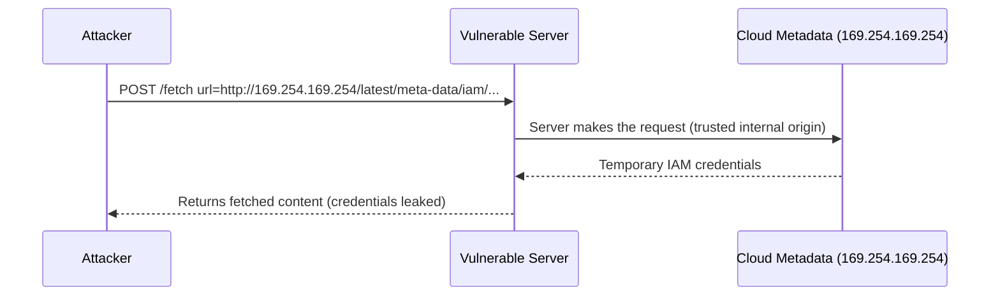

### 💥 Real-World Incidents
- **Capital One (2019):** an SSRF flaw let an attacker reach the AWS metadata service, steal IAM role credentials, and exfiltrate data on ~100 million customers — one of the most cited SSRF breaches.
- **Various webhook/PDF-render features** have been abused via SSRF to scan internal networks and hit metadata endpoints.

### 🛡️ Prevention Measures
1. **Allowlist outbound destinations** — only permit requests to known, required domains/hosts; reject everything else.
2. **Block internal ranges & metadata IPs** — deny requests to RFC1918 private ranges, `127.0.0.0/8`, `169.254.169.254`, and resolve-then-validate to prevent DNS rebinding.
3. **Disable dangerous URL schemes** — allow only `https` (and maybe `http`); block `file://`, `gopher://`, `ftp://`.
4. **Use IMDSv2 / hop limits** on AWS so metadata requires a session token, neutralizing classic SSRF credential theft.
5. **Network egress controls** — run fetchers in an isolated subnet with strict egress firewall rules; no direct access to internal services.
6. **Don't return raw responses** for blind operations; strip/limit response data.

### 💻 Vulnerable Code Example

```python
# ❌ VULNERABLE — fetches any user-supplied URL server-side
@app.route("/fetch")
def fetch():
    url = request.args["url"]
    # Attacker sets url=http://169.254.169.254/... to reach internal/metadata services
    return requests.get(url, timeout=5).text
```

### ✅ Secure Code Example

```python
# ✅ SECURE — allowlist host + block internal IPs + restrict scheme
import ipaddress, socket
from urllib.parse import urlparse
ALLOWED_HOSTS = {"api.partner.com", "images.cdn.com"}

def is_safe(url):
    p = urlparse(url)
    if p.scheme != "https" or p.hostname not in ALLOWED_HOSTS:  # scheme + host allowlist
        return False
    ip = ipaddress.ip_address(socket.gethostbyname(p.hostname))  # resolve then check
    return not (ip.is_private or ip.is_loopback or ip.is_link_local)  # block internal/metadata

@app.route("/fetch")
def fetch():
    url = request.args["url"]
    if not is_safe(url):
        abort(400)
    return requests.get(url, timeout=5, allow_redirects=False).text  # no redirect to bypass
```

### 🎯 Interview Questions
1. [Amazon] What made the Capital One breach possible and how does IMDSv2 help? → **Hint:** SSRF → metadata creds; IMDSv2 requires a session token + hop limit.
2. [Google] How do you prevent SSRF when a feature must fetch user-provided URLs? → **Hint:** allowlist, block private/metadata IPs, https-only, no redirects, egress firewall.
3. [Cloudflare] What is DNS rebinding and how does it bypass naive SSRF checks? → **Hint:** resolve at check time vs request time differ; pin/validate resolved IP.
4. [Stripe] Why is blocking `169.254.169.254` alone insufficient? → **Hint:** redirects, DNS rebinding, alternate encodings, IPv6, other internal hosts.

---

## 9. Command Injection

### 🔍 What is it?
Command injection occurs when an application passes unsanitized user input into a system shell command. Because the shell interprets meta-characters (`;`, `|`, `&&`, `$()`, backticks), an attacker can append or chain their own OS commands, executing with the privileges of the application process. This often leads to full server compromise (read files, install malware, pivot internally). The root cause is invoking a shell (`os.system`, `subprocess` with `shell=True`, `exec`) on a string that mixes trusted command text with untrusted input.

### 🍎 Simple Explanation
You ask an assistant to "print the file named ___" and let someone fill in the blank. They write "report.txt; then delete everything." The assistant dutifully prints the report *and* deletes everything, because it just runs whatever was said.

### 🔄 Attack Flow Diagram

```mermaid
sequenceDiagram
    participant A as Attacker
    participant S as Server
    participant OS as Operating System
    A->>S: filename = report.txt; rm -rf /
    S->>OS: shell runs: cat report.txt; rm -rf /
    OS-->>S: Executes BOTH commands
    S-->>A: Output (and damage done)
    Note over OS: Attacker now has code execution
```

### 💥 Real-World Incidents
- **Shellshock (2014, CVE-2014-6271):** a Bash flaw allowed command injection via crafted environment variables, widely exploited against web servers (CGI) to run arbitrary commands.
- **Numerous router/IoT/CCTV CVEs:** unsanitized parameters passed to shell commands in firmware have enabled mass device takeover (feeding botnets like Mirai).

### 🛡️ Prevention Measures
1. **Avoid the shell entirely** — call programs directly with an argument array (`subprocess.run([...], shell=False)`); the OS treats each arg as data, not parseable shell syntax.
2. **Prefer native libraries over shelling out** — e.g., use a language's file/image library instead of invoking CLI tools.
3. **Strict allowlist validation** of any value that must reach a command (e.g., filenames matching `^[\w.-]+$`).
4. **Never pass user input as shell options/flags**; separate flags from values; reject path traversal (`..`).
5. **Run with least privilege** in a sandbox/container so a successful injection has minimal reach.

### 💻 Vulnerable Code Example

```python
# ❌ VULNERABLE — user input goes into a shell string
import os
def make_thumbnail(filename):
    # shell parses ;, |, && — filename = "a.jpg; rm -rf /" runs extra commands
    os.system("convert " + filename + " -resize 100x100 thumb.png")
```

### ✅ Secure Code Example

```python
# ✅ SECURE — no shell; pass arguments as a list + validate the filename
import subprocess, re
def make_thumbnail(filename):
    if not re.fullmatch(r"[\w.-]+\.(jpg|png)", filename):   # allowlist safe filenames
        raise ValueError("invalid filename")
    # shell=False: each list item is a literal argument, never parsed as shell syntax
    subprocess.run(["convert", filename, "-resize", "100x100", "thumb.png"],
                   shell=False, check=True, timeout=30)
```

### 🎯 Interview Questions
1. [Amazon] Why does passing an argument list with `shell=False` prevent command injection? → **Hint:** no shell to interpret meta-characters; args are literal data.
2. [Google] When is `shell=True` ever acceptable, and how do you make it safe? → **Hint:** avoid it; if unavoidable, fully control the string with no user input / strict quoting.
3. How does command injection differ from SQL injection? → **Hint:** OS shell vs SQL engine; both stem from mixing untrusted input with an interpreter's syntax.
4. [Stripe] How would you contain the blast radius if command injection occurred? → **Hint:** least privilege, containers/seccomp, no outbound egress, monitoring.

---

## 10. Broken Access Control / Privilege Escalation

### 🔍 What is it?
Broken Access Control (the #1 item on the OWASP Top 10) is the failure to properly enforce *what an authenticated user is allowed to do*. It includes IDOR (object-level), but also **function-level** flaws (a normal user calling admin-only endpoints), **vertical privilege escalation** (gaining higher privileges, e.g., user → admin by tampering with a role field), **horizontal escalation** (accessing peers' data), forced browsing to protected URLs, and trusting client-side checks. The root cause is usually checks that are missing, only on the client, applied inconsistently, or "allow by default."

### 🍎 Simple Explanation
A building has an "Employees Only" door, but it's unlocked and there's no guard. Anyone who simply walks through is treated as staff — the only thing stopping people was a polite sign.

### 🔄 Attack Flow Diagram

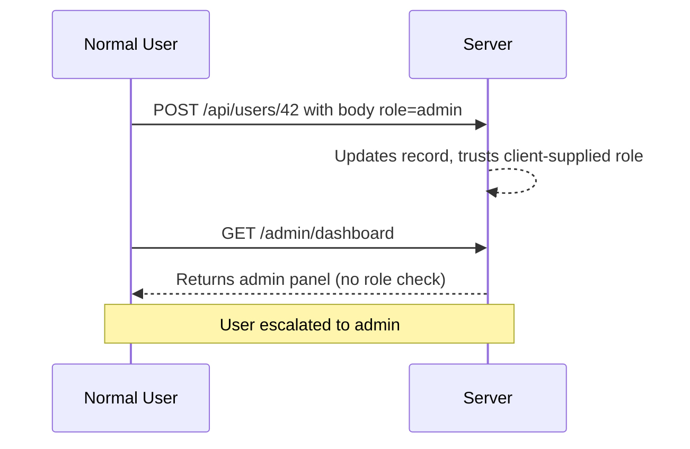

### 💥 Real-World Incidents
- **Broken access control is consistently the most common serious web vulnerability** (OWASP Top 10 2021 #1), implicated in countless breaches where admin functions or other users' data were reachable without proper checks.
- **Mass-assignment escalations** (e.g., setting `isAdmin=true` via an unfiltered update) have repeatedly appeared in bug bounties against SaaS apps.

### 🛡️ Prevention Measures
1. **Deny by default** — every endpoint requires an explicit authorization decision; unknown = denied.
2. **Enforce authorization server-side** for both data (object-level) and functions (role/permission checks); never trust hidden fields or client UI state.
3. **Centralize access control** — a policy engine/middleware (RBAC/ABAC, OPA, Casbin) rather than scattered ad-hoc `if` checks.
4. **Prevent mass assignment** — bind only allowlisted fields to models; never let clients set `role`, `is_admin`, `owner_id`.
5. **Re-check on every request** (stateless), including for cached/precomputed responses.
6. **Audit + test** — log access decisions; add automated tests for vertical/horizontal escalation.

### 💻 Vulnerable Code Example

```python
# ❌ VULNERABLE — mass assignment + no admin check
@app.route("/api/users/<int:uid>", methods=["PATCH"])
@login_required
def update_user(uid):
    user = User.query.get(uid)
    for key, value in request.json.items():
        setattr(user, key, value)   # client can set role="admin" (privilege escalation)
    db.session.commit()
    return "ok"
```

### ✅ Secure Code Example

```python
# ✅ SECURE — allowlist fields, enforce ownership, separate admin-only changes
ALLOWED = {"display_name", "email"}   # role/is_admin NOT user-editable

@app.route("/api/users/<int:uid>", methods=["PATCH"])
@login_required
def update_user(uid):
    if uid != current_user.id and not current_user.is_admin:  # function + object authz
        abort(403)
    user = User.query.get_or_404(uid)
    for key in (request.json.keys() & ALLOWED):   # only allowlisted fields applied
        setattr(user, key, request.json[key])
    db.session.commit()
    return "ok"
```

### 🎯 Interview Questions
1. [Meta] What's the difference between vertical and horizontal privilege escalation? → **Hint:** higher role vs same-level peer data.
2. [Amazon] What is mass assignment and how do you prevent it? → **Hint:** allowlist bindable fields; never trust client-set role/owner.
3. [Google] Why is broken access control #1 on OWASP, and how do you systematically prevent it? → **Hint:** easy to miss a check; centralize policy, deny-by-default, automated tests.
4. [Stripe] How would you design RBAC vs ABAC for a multi-tenant SaaS? → **Hint:** roles per tenant + attribute checks (tenant_id, ownership); enforce server-side.

---

## 11. Sensitive Data Exposure / Insecure Storage

### 🔍 What is it?
This is the failure to adequately protect sensitive data (passwords, PII, payment data, health records, secrets) both **in transit** and **at rest**. Causes include: transmitting data over plain HTTP, storing passwords with weak/no hashing, leaving databases/backups/object-storage buckets unencrypted or publicly accessible, logging secrets, hardcoding API keys in code, and using weak/deprecated crypto. The attacker doesn't need a clever exploit — the data is simply readable once they reach it (a misconfigured S3 bucket, a stolen laptop, a leaked log).

### 🍎 Simple Explanation
You write your bank PIN on a sticky note and leave it on a public café table. No "hacking" needed — anyone walking by can read it because it was never protected in the first place.

### 🔄 Attack Flow Diagram

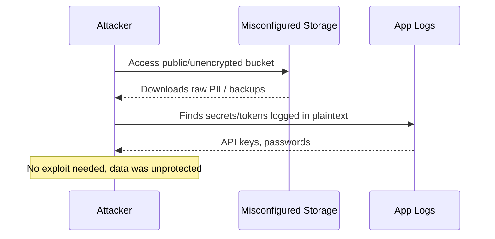

### 💥 Real-World Incidents
- **Equifax (2017):** ~147 million people's PII exposed; sensitive data handling and an unpatched component combined for one of the largest breaches ever.
- **Countless public S3 bucket leaks** (e.g., misconfigured buckets exposing millions of records across many companies) — a persistent, easily avoidable class of exposure.

### 🛡️ Prevention Measures
1. **Encrypt in transit** — TLS everywhere + HSTS; no plaintext endpoints.
2. **Encrypt at rest** — enable storage/db encryption (KMS-managed keys); encrypt backups too.
3. **Hash passwords** with bcrypt/argon2 + salt; **never** store them reversibly.
4. **Use a secrets manager** (HashiCorp Vault, AWS Secrets Manager) — never hardcode keys in code or commit them; rotate regularly.
5. **Data minimization & masking** — don't collect/retain what you don't need; mask PII in logs (never log full PANs, tokens, passwords).
6. **Lock down storage** — private buckets by default, least-privilege IAM, block public access; scan for misconfigurations.
7. **Use strong, current crypto** — no MD5/SHA-1/DES/ECB; use AEAD ciphers (AES-GCM) and vetted libraries.

### 💻 Vulnerable Code Example

```python
# ❌ VULNERABLE — hardcoded secret, weak hash, logs sensitive data
import hashlib, logging
API_KEY = "sk_live_9f8a7b6c5d4e"          # secret committed to source control
def register(email, password):
    pw_hash = hashlib.md5(password.encode()).hexdigest()  # MD5 is broken, unsalted
    logging.info(f"Registering {email} with password {password}")  # logs plaintext PII
    save_user(email, pw_hash)
```

### ✅ Secure Code Example

```python
# ✅ SECURE — secret from manager, strong salted hash, no sensitive logging
import os, logging
from argon2 import PasswordHasher
ph = PasswordHasher()
API_KEY = os.environ["API_KEY"]           # injected from secrets manager, not in code

def register(email, password):
    pw_hash = ph.hash(password)            # argon2: salted + slow, resists cracking
    logging.info("Registering user id=%s", mask(email))  # mask PII, never log password
    save_user(email, pw_hash)             # DB/backups encrypted at rest via KMS
```

### 🎯 Interview Questions
1. [Stripe] How do you store payment-card data securely (or avoid storing it)? → **Hint:** tokenization/PCI-DSS scope reduction, encryption, never log PANs.
2. [Amazon] How do you manage secrets across many services without hardcoding? → **Hint:** secrets manager + rotation + least-privilege IAM + no secrets in images/logs.
3. [Google] What's wrong with MD5/SHA-256 for passwords, and what should you use? → **Hint:** too fast/unsalted; use bcrypt/argon2 with per-user salt.
4. [Meta] How would you prevent accidental public exposure of a storage bucket? → **Hint:** block-public-access, IAM least privilege, config scanning, default-private.


---

## 12. XML External Entity (XXE) Injection

### 🔍 What is it?
XXE abuses XML parsers that process **external entities** (a feature of the XML/DTD spec). If an app parses untrusted XML with a parser that resolves external entities, an attacker can define an entity pointing at a local file (`file:///etc/passwd`), an internal URL (turning XXE into SSRF), or a remote DTD. When the parser expands the entity, it includes that resource in the parsed output — leaking files, scanning internal networks, or causing DoS (the "billion laughs" entity-expansion bomb). Root cause: parsers historically had DTD/external-entity processing enabled by default.

### 🍎 Simple Explanation
You give a mail-merge robot a template that says "insert the contents of [whatever file I name here]." You name a secret file, and the robot happily pastes its contents into the output for you to read.

### 🔄 Attack Flow Diagram

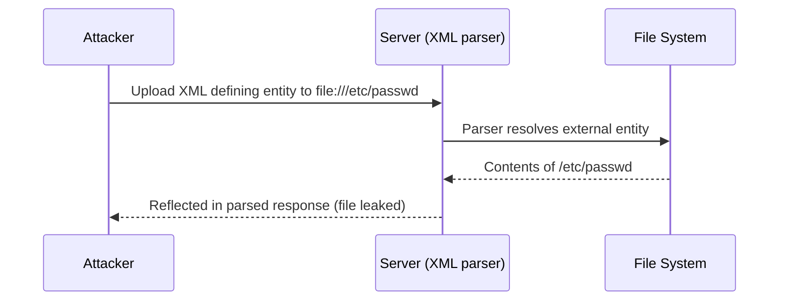

### 💥 Real-World Incidents
- **Various enterprise apps & SOAP/REST XML endpoints** have been hit by XXE to read internal files and reach internal services; it remained common enough to earn a dedicated spot in the OWASP Top 10 (2017).
- **Document/SVG/Office-format upload features** (which are XML under the hood) have repeatedly been exploited via XXE to exfiltrate server files.

### 🛡️ Prevention Measures
1. **Disable DTDs and external entities** in the XML parser (the definitive fix) — e.g., `defusedxml` in Python, `setFeature(disallow-doctype-decl, true)` in Java.
2. **Prefer less complex data formats** — use JSON instead of XML where possible (no entity expansion).
3. **Use safe libraries** — `defusedxml` hardens Python's parsers against XXE and entity-expansion bombs.
4. **Validate/whitelist** uploaded document types and parse them in a sandbox.
5. **Patch/configure parsers** — keep XML libraries updated; never enable external entity resolution for untrusted input.

### 💻 Vulnerable Code Example

```python
# ❌ VULNERABLE — default lxml/ElementTree parsing resolves external entities
import lxml.etree as ET
def parse(xml_bytes):
    # Attacker XML can declare <!ENTITY x SYSTEM "file:///etc/passwd"> and read files
    parser = ET.XMLParser()                 # external entities not disabled
    return ET.fromstring(xml_bytes, parser)
```

### ✅ Secure Code Example

```python
# ✅ SECURE — use defusedxml, which disables DTDs/external entities/entity bombs
import defusedxml.ElementTree as ET
def parse(xml_bytes):
    # defusedxml raises on DTDs/external entities by default
    return ET.fromstring(xml_bytes)

# ✅ Or with lxml: explicitly forbid DTDs and entity resolution
# parser = lxml.etree.XMLParser(resolve_entities=False, no_network=True, dtd_validation=False)
```

### 🎯 Interview Questions
1. [Amazon] How does XXE work and how can it turn into SSRF? → **Hint:** external entity points to an internal URL; parser fetches it server-side.
2. [Google] What's the single most effective fix for XXE? → **Hint:** disable DTD/external-entity processing (e.g., defusedxml).
3. What is the "billion laughs" attack? → **Hint:** nested entity expansion causing memory exhaustion (DoS).
4. [Stripe] How would you safely accept XML/SVG/Office uploads? → **Hint:** hardened parser, sandbox, type validation, prefer JSON when possible.

---

## 13. Clickjacking

### 🔍 What is it?
Clickjacking ("UI redress") tricks a user into clicking something different from what they perceive. The attacker loads the target site in an invisible/transparent `<iframe>` overlaid on a decoy page, then positions it so the victim's click on (say) a "Play" button actually lands on a hidden "Transfer funds" or "Grant permission" button on the framed site. Since the victim is logged into the framed site, the action executes with their session. It exploits the browser's willingness to frame other sites and overlay/opacity CSS.

### 🍎 Simple Explanation
A prankster places a clear glass pane over a "Like" button but paints a "Win a Prize!" button on the glass. You tap "Win a Prize!" — but your finger actually presses the real button hidden underneath.

### 🔄 Attack Flow Diagram

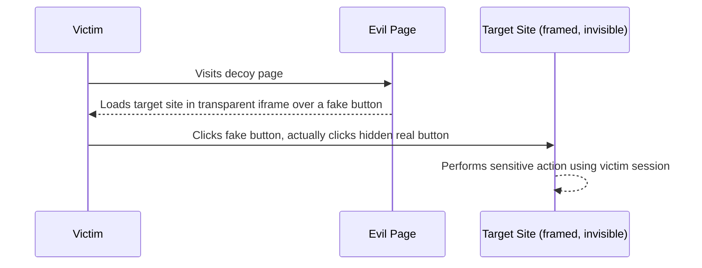

### 💥 Real-World Incidents
- **Twitter "Don't Click" worm (2009):** a clickjacking attack caused users to unknowingly post a tweet by clicking a disguised button.
- **Likejacking on Facebook:** widespread campaigns tricked users into "Liking"/sharing pages via hidden framed buttons, spreading spam virally.

### 🛡️ Prevention Measures
1. **`X-Frame-Options: DENY` (or `SAMEORIGIN`)** — instructs browsers not to render your pages in frames on other origins.
2. **CSP `frame-ancestors` directive** — the modern replacement: `Content-Security-Policy: frame-ancestors 'self'` (more flexible, supports allowlists).
3. **Frame-busting as defense-in-depth** (JS that breaks out of frames) — but headers are the reliable fix.
4. **Require confirmation / re-auth** for sensitive actions so a single hijacked click can't complete them.
5. **`SameSite` cookies** reduce impact of framed cross-site actions.

### 💻 Vulnerable Code Example

```html
<!-- ❌ VULNERABLE — page can be embedded in any site's invisible iframe -->
<!-- Server sends NO X-Frame-Options or CSP frame-ancestors header -->
<form action="/transfer" method="POST">
  <button>Confirm Transfer</button>   <!-- attacker overlays this under a decoy -->
</form>
```

```python
# ❌ No framing protection on responses
@app.route("/transfer-page")
def transfer_page():
    return render_template("transfer.html")   # missing security headers
```

### ✅ Secure Code Example

```python
# ✅ SECURE — send anti-framing headers on every response
@app.after_request
def set_frame_protection(resp):
    resp.headers["X-Frame-Options"] = "DENY"                  # legacy browsers
    resp.headers["Content-Security-Policy"] = "frame-ancestors 'self'"  # modern, preferred
    return resp
# Now other origins cannot frame the page, so click overlays are impossible.
```

### 🎯 Interview Questions
1. [Meta] How does clickjacking work and which header stops it? → **Hint:** invisible iframe overlay; `X-Frame-Options`/CSP `frame-ancestors`.
2. [Google] Why is CSP `frame-ancestors` preferred over `X-Frame-Options`? → **Hint:** more flexible (allowlists), standardized, supersedes the older header.
3. [Amazon] How would you protect a "confirm payment" flow from clickjacking? → **Hint:** frame-ancestors deny + re-auth/confirmation + SameSite cookies.
4. What's "likejacking"? → **Hint:** clickjacking applied to social "Like"/share buttons.

---

## 14. Credential Stuffing & Brute Force

### 🔍 What is it?
Both attacks target the login endpoint.
- **Brute force:** systematically trying many passwords for an account (or many accounts) until one works; **password spraying** tries a few common passwords across many accounts to dodge per-account lockouts.
- **Credential stuffing:** replaying **username/password pairs leaked from other breaches**, betting that users reuse passwords. It's highly effective because of password reuse and is automated at scale via bots, often distributed across many IPs and using rotating proxies to evade simple defenses.

### 🍎 Simple Explanation
A thief finds a huge list of keys that worked on *other* people's houses and tries each one on your front door — because lots of people use the same key for every house.

### 🔄 Attack Flow Diagram

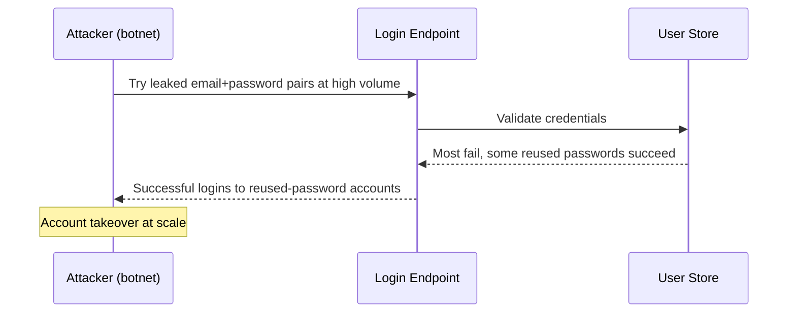

### 💥 Real-World Incidents
- **Disney+ (2019):** shortly after launch, accounts were hijacked via credential stuffing using passwords leaked from earlier breaches; compromised accounts were sold online.
- **Many retail/streaming/financial services** report ongoing large-scale credential-stuffing campaigns; it's one of the most common causes of account takeover today.

### 🛡️ Prevention Measures
1. **Multi-factor authentication (MFA)** — the strongest single defense; a stolen password alone is useless.
2. **Rate limiting + exponential backoff + lockout** per account *and* per IP/device; add delays after failed attempts.
3. **Bot mitigation / CAPTCHA challenges** triggered on suspicious patterns (impossible travel, many accounts from one IP).
4. **Check against breached-password lists** (e.g., HaveIBeenPwned k-anonymity API) and block known-compromised passwords at signup/login.
5. **Device fingerprinting & risk-based auth** — step up authentication for anomalous logins.
6. **Strong hashing + no user enumeration** — uniform responses/timing so attackers can't tell which usernames exist.

### 💻 Vulnerable Code Example

```python
# ❌ VULNERABLE — unlimited login attempts, no MFA, leaks which accounts exist
@app.route("/login", methods=["POST"])
def login():
    user = User.query.filter_by(email=request.form["email"]).first()
    if not user:
        return "No such user", 404          # user enumeration
    if user.check_password(request.form["password"]):  # unlimited tries allowed
        login_user(user)
        return "ok"
    return "Wrong password", 401
```

### ✅ Secure Code Example

```python
# ✅ SECURE — rate limit, generic errors, breached-password check, MFA hook
from flask_limiter import Limiter
limiter = Limiter(key_func=lambda: request.form.get("email", request.remote_addr))

@app.route("/login", methods=["POST"])
@limiter.limit("5/minute;20/hour")          # throttle per account+IP, slows stuffing
def login():
    user = User.query.filter_by(email=request.form["email"]).first()
    pw = request.form["password"]
    # constant-time, identical response whether or not the user exists (no enumeration)
    if user and user.check_password(pw) and not is_pwned(pw):
        if user.mfa_enabled:
            return start_mfa_challenge(user)   # require second factor
        login_user(user); return "ok"
    return "Invalid credentials", 401          # generic message
```

### 🎯 Interview Questions
1. [Cloudflare] Walk me through how you'd protect a login endpoint from brute force and credential stuffing. → **Hint:** MFA + rate limit/lockout + bot mitigation + breached-password checks + risk-based auth.
2. [Amazon] Why is credential stuffing so effective and what's the best mitigation? → **Hint:** password reuse; MFA neutralizes stolen passwords.
3. [Google] How do you rate-limit logins without harming legitimate users (e.g., behind shared NAT)? → **Hint:** per-account + per-device limits, progressive delays, CAPTCHAs on anomalies.
4. [Stripe] How do you avoid username enumeration on login/forgot-password? → **Hint:** identical responses and timing regardless of account existence.

---

## 15. Supply Chain Attacks

### 🔍 What is it?
A supply chain attack compromises software not by attacking the target directly, but by poisoning something the target *trusts and includes*: an open-source dependency, a build tool, a CI/CD pipeline, an update mechanism, or a vendor. Mechanisms include **dependency/package poisoning** (publishing malware to npm/PyPI), **typosquatting** (`reqeusts` instead of `requests`), **dependency confusion** (publishing a public package with the same name as a company's internal one so the resolver pulls the malicious public version), **account/maintainer takeover** of a popular package, and **compromised build systems**. Because the malicious code runs with the trust and privileges of your application/build, the impact is huge and stealthy.

### 🍎 Simple Explanation
A restaurant carefully checks its own kitchen, but a supplier secretly poisons an ingredient before delivery. The restaurant unknowingly serves it to everyone — the danger came from something they trusted, not from someone breaking in.

### 🔄 Attack Flow Diagram

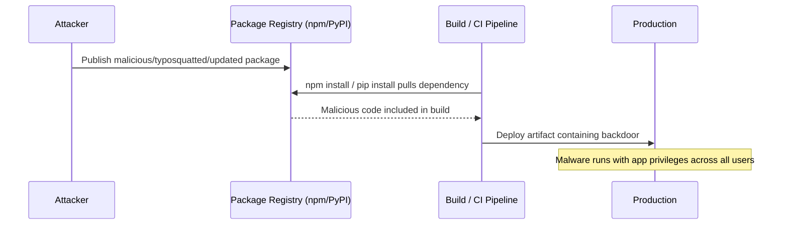

### 💥 Real-World Incidents
- **SolarWinds (2020):** attackers inserted a backdoor ("SUNBURST") into the Orion software update; ~18,000 organizations (including US government agencies) installed the trojanized update.
- **event-stream npm package (2018):** a popular package was handed to a malicious maintainer who added code to steal cryptocurrency wallet credentials, affecting countless downstream projects.
- **Codecov (2021):** a compromised CI script exfiltrated secrets/environment variables from many customers' build pipelines.

### 🛡️ Prevention Measures
1. **Pin and lock dependencies** — commit lockfiles (`package-lock.json`, `poetry.lock`) and pin versions/hashes so builds are reproducible and can't silently pull a poisoned update.
2. **Automated dependency scanning** — Snyk, Dependabot, `npm audit`, `pip-audit` to flag known-vulnerable/malicious packages and auto-PR upgrades.
3. **Prevent dependency confusion** — scope internal packages, configure registries to prefer the private source, reserve internal names publicly.
4. **Verify integrity & provenance** — use signatures (Sigstore/cosign), SLSA provenance, and an **SBOM** (software bill of materials) to know exactly what's in your build.
5. **Lock down CI/CD** — least-privilege build tokens, isolated runners, no plaintext secrets in pipelines, review third-party CI actions and pin them by commit SHA.
6. **Vet dependencies** — prefer well-maintained packages; watch for typosquats; review new/maintainer changes for critical deps.

### 💻 Vulnerable Code Example

```json
// ❌ VULNERABLE — floating version ranges + no lockfile pull whatever is latest
// package.json
{
  "dependencies": {
    "left-pad": "^1.0.0",        // ^ allows any 1.x — a poisoned 1.9.9 gets installed
    "requesocks": "*"            // typosquat of a real package, any version
  }
}
// `npm install` may silently fetch a maliciously updated/typosquatted package
```

### ✅ Secure Code Example

```json
// ✅ SECURE — exact pins + committed lockfile + integrity hashes
// package.json (exact versions)
{ "dependencies": { "left-pad": "1.3.0" } }

// package-lock.json (committed) records integrity hashes:
// "left-pad": { "version": "1.3.0", "integrity": "sha512-...verified-hash..." }
// CI runs: `npm ci` (installs strictly from lockfile) + `npm audit` + Snyk scan
// Internal pkgs are scoped (@myco/util) with registry config to block dependency confusion
```

### 🎯 Interview Questions
1. [Google] What is dependency confusion and how do you prevent it? → **Hint:** resolver pulls a public package over an internal same-named one; scope names + registry priority + reserve names.
2. [Amazon] How would you secure a CI/CD pipeline against supply-chain compromise? → **Hint:** least-privilege tokens, pinned actions by SHA, no plaintext secrets, isolated runners, SBOM + signing.
3. [Stripe] What lessons did SolarWinds teach about trusting updates? → **Hint:** verify provenance/signatures, monitor build integrity, zero-trust the supply chain.
4. [Meta] How do `npm ci`/lockfiles + Snyk/Dependabot reduce risk? → **Hint:** reproducible pinned installs + continuous vulnerability/malware scanning.


---

## 🗺️ Attack Surface Map

Where each attack vector targets in a typical web application architecture:

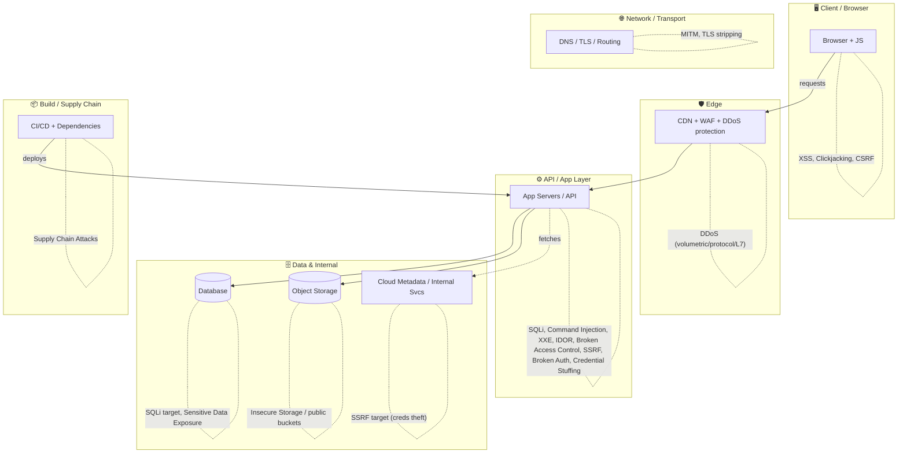

| Layer | Primary attack vectors |
|-------|------------------------|
| Client / Browser | XSS, Clickjacking, CSRF |
| Network / Transport | MITM, TLS stripping, DNS spoofing |
| Edge | DDoS (volumetric, protocol, application) |
| API / App layer | SQLi, Command Injection, XXE, IDOR, Broken Access Control, SSRF, Broken Auth, Credential Stuffing |
| Database | SQL Injection, Sensitive Data Exposure |
| Object storage | Insecure storage, public-bucket exposure |
| Cloud metadata / internal | SSRF (credential theft), lateral movement |
| Build / CI/CD | Supply chain attacks, secret leakage |

---

## 🔐 Security Headers Cheatsheet

| Header | What it prevents | Example value |
|--------|------------------|---------------|
| `Content-Security-Policy` (CSP) | XSS, data injection, clickjacking (via `frame-ancestors`) | `default-src 'self'; script-src 'self'; object-src 'none'; frame-ancestors 'self'` |
| `X-Frame-Options` | Clickjacking (legacy browsers) | `DENY` (or `SAMEORIGIN`) |
| `Strict-Transport-Security` (HSTS) | MITM / TLS stripping (forces HTTPS) | `max-age=63072000; includeSubDomains; preload` |
| `X-Content-Type-Options` | MIME-sniffing (drive-by XSS) | `nosniff` |
| `Referrer-Policy` | Leaking sensitive URLs/tokens in `Referer` | `strict-origin-when-cross-origin` |
| `Permissions-Policy` | Abuse of browser features (camera, geo, mic) | `geolocation=(), camera=(), microphone=()` |
| `Access-Control-Allow-Origin` (CORS) | Unauthorized cross-origin reads | `https://app.example.com` (never `*` for credentialed requests) |
| `Access-Control-Allow-Credentials` (CORS) | Leaking credentialed responses cross-origin | `true` only with a specific (non-`*`) origin |
| `Cross-Origin-Opener-Policy` (COOP) | Cross-window attacks (Spectre/XS-Leaks) | `same-origin` |
| `Cross-Origin-Resource-Policy` (CORP) | Cross-origin resource theft | `same-origin` |
| `Cache-Control` (sensitive pages) | Caching sensitive data in shared caches | `no-store` |
| `Set-Cookie` flags | Session theft / CSRF | `Secure; HttpOnly; SameSite=Lax` |

---

## 🧰 Security Tools Reference

| Tool | Category | What it does | When to use |
|------|----------|--------------|-------------|
| **OWASP ZAP** | DAST (dynamic scanner) | Open-source proxy that scans running apps for XSS, SQLi, etc. | CI security scans; free pentesting of a deployed app |
| **Burp Suite** | DAST / pentest proxy | Intercept, modify, and fuzz HTTP traffic; manual + automated testing | Manual pentesting, finding IDOR/auth/logic flaws |
| **Snyk** | SCA / SAST | Scans dependencies & code for known vulns; suggests fixes | Continuous dependency + code scanning in CI |
| **Dependabot** | SCA | Auto-detects vulnerable deps and opens upgrade PRs | GitHub repos; automated dependency hygiene |
| **Nmap** | Network scanner | Port scanning, service/version detection, host discovery | Recon, attack-surface inventory, audits |
| **Wireshark** | Packet analyzer | Captures and inspects network traffic | Debugging protocols, detecting MITM/plaintext leaks |
| **HashiCorp Vault** | Secrets management | Stores/rotates secrets, dynamic credentials, encryption-as-a-service | Centralized secret storage instead of hardcoding |
| **AWS WAF** | Web Application Firewall | Managed rules to block SQLi/XSS/bots at the edge | Protecting AWS-fronted apps; rate-based rules |
| **Cloudflare** | Edge security / CDN | DDoS protection, WAF, bot management, TLS, rate limiting | Absorbing DDoS, edge filtering, global TLS |
| **fail2ban** | Intrusion prevention | Bans IPs after repeated failed attempts (e.g., SSH/login) | Slowing brute-force on servers/login endpoints |

---

## 📋 Security Review Checklist

Run before shipping any feature:

**Input & Output**
- [ ] Input validation (allowlist) on all user-supplied data
- [ ] Parameterized queries / ORM used everywhere (no string-concatenated SQL)
- [ ] Output is context-encoded; rich HTML sanitized (DOMPurify/Bleach)
- [ ] No shell invocation with user input (`shell=False`, argument arrays)
- [ ] XML parsed with external entities/DTDs disabled (defusedxml)
- [ ] User-supplied URLs validated (allowlist, block internal/metadata IPs) — SSRF

**Authentication & Sessions**
- [ ] Passwords hashed with bcrypt/argon2 + salt
- [ ] MFA available/required for sensitive & admin accounts
- [ ] Session IDs rotate on login; idle + absolute timeouts enforced
- [ ] Login rate-limited / lockout; breached-password check; no user enumeration

**Authorization**
- [ ] Object-level authorization on every resource (no IDOR)
- [ ] Function-level/role checks on every privileged endpoint (deny by default)
- [ ] Mass assignment prevented (allowlist bindable fields; no client-set role)

**API & Transport**
- [ ] HTTPS/TLS enforced everywhere + HSTS
- [ ] Security headers set (CSP, X-Frame-Options, X-Content-Type-Options, etc.)
- [ ] CORS configured to specific origins (no `*` with credentials)
- [ ] CSRF protection (tokens + SameSite) on state-changing requests
- [ ] Rate limiting on public/expensive endpoints

**Data & Secrets**
- [ ] Sensitive data encrypted at rest (KMS) and in transit
- [ ] No secrets in code/repo; pulled from a secrets manager; rotated
- [ ] No sensitive data (passwords, tokens, PII) in logs
- [ ] Storage buckets private by default; least-privilege IAM

**Infrastructure & Supply Chain**
- [ ] Dependencies pinned + lockfile committed; `npm audit`/Snyk clean
- [ ] CI/CD uses least-privilege tokens; third-party actions pinned by SHA
- [ ] WAF / DDoS protection in front of public endpoints
- [ ] Services run with least privilege (containers, restricted egress)
- [ ] Logging, monitoring, and alerting on auth failures & anomalies

---

## 🎯 Mega Interview Question Bank

System-design-level security questions (beyond single attacks):

### Architecture & System Design
1. **[Stripe]** How would you secure an API that handles financial transactions end-to-end? → **Hint:** TLS+HSTS, strong authN + MFA, per-request authZ, idempotency keys, parameterized queries, rate limiting, audit logging, encryption at rest, PCI scope reduction/tokenization, least-privilege infra.
2. **[Cloudflare]** Walk me through how you'd protect a login endpoint from brute force and credential stuffing. → **Hint:** MFA, per-account+IP rate limiting with backoff, bot/CAPTCHA challenges, breached-password checks, no enumeration, device fingerprinting/risk-based auth.
3. **[Amazon]** How does your system handle a sudden DDoS spike? → **Hint:** edge scrubbing (Shield/Cloudflare) + anycast, WAF + bot management, gateway rate limiting, autoscaling, circuit breakers, graceful degradation/load shedding.
4. **[Google]** Design authentication and authorization for a multi-tenant SaaS. → **Hint:** OIDC/SSO for authN, per-tenant RBAC/ABAC enforced server-side, tenant isolation in data layer, deny-by-default, centralized policy engine.
5. **[Meta]** How would you secure service-to-service communication in a microservices cluster? → **Hint:** mTLS via service mesh, short-lived rotating certs, service identity, network policies/least-privilege egress, no shared static secrets.

### Defense-in-Depth & Operations
6. **[Amazon]** How do you manage secrets across hundreds of services without hardcoding them? → **Hint:** secrets manager/Vault, dynamic short-lived credentials, rotation, least-privilege IAM, no secrets in images/logs/CI.
7. **[Google]** What is "defense in depth" and how would you apply it to a public web app? → **Hint:** layered controls — edge WAF, app validation/authZ, DB least privilege, encryption, monitoring; no single point of failure.
8. **[Stripe]** How would you design an audit trail for security-sensitive actions? → **Hint:** append-only/immutable logs, who-did-what-when, tamper-evidence, separate store, retention + access controls.
9. **[Cloudflare]** How would you protect against bot-driven abuse (scraping, carding, stuffing)? → **Hint:** bot fingerprinting/challenges, rate limiting, anomaly detection, proof-of-work/CAPTCHA, velocity checks.
10. **[Meta]** How do you roll out a security fix to a vulnerability already in production? → **Hint:** assess/contain, patch + deploy via canary, rotate exposed secrets, monitor, post-incident review; feature-flag kill switch.

### Data, Privacy & Compliance
11. **[Stripe]** How do you minimize PCI/PII scope in your architecture? → **Hint:** tokenization, isolate the cardholder-data environment, don't store what you don't need, encrypt + access controls, vault sensitive fields.
12. **[Amazon]** How would you design for "encryption everywhere" (transit + rest)? → **Hint:** TLS+HSTS, KMS-managed keys, encrypted DB/backups/object storage, key rotation, envelope encryption.
13. **[Google]** How do you prevent accidental data exposure (public buckets, leaked logs)? → **Hint:** default-private + block-public-access, config scanning/IaC policies, PII masking in logs, least-privilege IAM, DLP.

### Threat Modeling & Process
14. **[Meta]** How would you threat-model a new feature before building it? → **Hint:** STRIDE — identify assets, entry points, trust boundaries, enumerate threats per category, rank by risk, design mitigations.
15. **[Amazon]** How do you secure your software supply chain and CI/CD pipeline? → **Hint:** pinned deps + lockfiles, SCA scanning (Snyk/Dependabot), signed artifacts/SLSA provenance, SBOM, least-privilege CI tokens, pinned actions, prevent dependency confusion.
16. **[Cloudflare]** When a zero-day drops in a dependency you use, what's your response playbook? → **Hint:** inventory via SBOM, assess exposure, patch/mitigate (WAF virtual patch), rotate secrets if needed, monitor exploitation, communicate.
17. **[Stripe]** How do you balance security controls against developer velocity and UX? → **Hint:** secure defaults/paved roads, automate scanning in CI, risk-based controls (MFA on sensitive actions), avoid friction where risk is low.

---

## 📚 Further Reading
- OWASP Top 10 and OWASP Cheat Sheet Series (owasp.org)
- OWASP Application Security Verification Standard (ASVS)
- PortSwigger Web Security Academy (free labs)
- *The Web Application Hacker's Handbook* by Stuttard & Pinto

---

## 🔗 Related Topics
- [Authentication vs Authorization](01-authentication-vs-authorization.md)
- [OAuth2 and JWT](02-oauth2-and-jwt.md)
- [HTTPS and TLS](03-https-and-tls.md)
- [Rate Limiting](../06-api-design/02-rate-limiting.md)
- [API Gateway](../06-api-design/03-api-gateway.md)
- [CDN](../04-caching/04-cdn.md)
