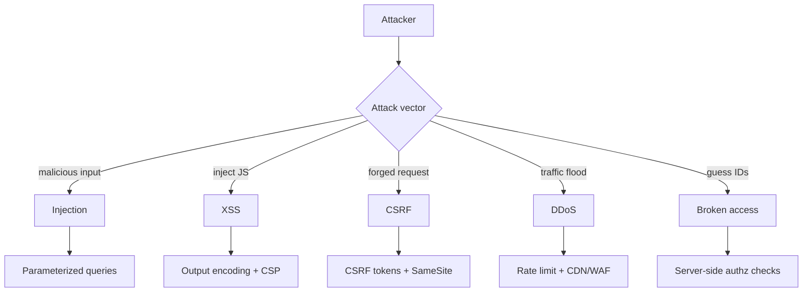

# Common Attack Vectors

## 🧭 Overview
Designing secure systems requires knowing how they get attacked. This file surveys the most common web/application attack vectors — injection, XSS, CSRF, DDoS, and more (largely the OWASP Top 10) — along with how to defend against each. Security questions appear in system-design interviews, and "how would you secure this?" is a frequent follow-up to any design.

---

## 🧠 Technical Explanation

### 1. Injection (SQL/NoSQL/Command)
Attacker sends malicious input that the app executes as code/query (e.g., `'; DROP TABLE users;--`).
**Defense:** parameterized queries / prepared statements, ORMs, input validation, least-privilege DB accounts.

### 2. Cross-Site Scripting (XSS)
Attacker injects malicious JavaScript that runs in other users' browsers (stored, reflected, or DOM-based), stealing cookies/sessions.
**Defense:** output encoding/escaping, Content Security Policy (CSP), sanitize inputs, `HttpOnly` cookies.

### 3. Cross-Site Request Forgery (CSRF)
Tricks a logged-in user's browser into making unwanted authenticated requests.
**Defense:** anti-CSRF tokens, `SameSite` cookies, verify `Origin`/`Referer`.

### 4. Broken Authentication / Session Hijacking
Weak passwords, exposed tokens, predictable sessions.
**Defense:** MFA, strong hashing (bcrypt/argon2), secure session management, short-lived tokens, rotate on privilege change.

### 5. (D)DoS — Denial of Service
Overwhelming a service with traffic.
**Defense:** rate limiting, CDN/edge filtering (Cloudflare/AWS Shield), autoscaling, WAF, anycast.

### 6. Broken Access Control / IDOR
Users access resources they shouldn't (e.g., changing `/orders/123` to `/orders/124`).
**Defense:** server-side authorization checks on every request, deny-by-default, never trust client-supplied IDs.

### 7. Sensitive Data Exposure
Unencrypted data at rest/in transit, leaked secrets.
**Defense:** TLS everywhere, encrypt at rest, secrets managers (never in code), data minimization.

### 8. Security Misconfiguration & Vulnerable Dependencies
Default creds, open ports, outdated libraries.
**Defense:** hardening, least privilege, automated dependency scanning, patching.

### 9. Server-Side Request Forgery (SSRF)
Tricking the server into making requests to internal resources.
**Defense:** allowlist outbound destinations, block internal IP ranges, validate URLs.

### Cross-Cutting Principles
**Defense in depth** (layered controls), **least privilege**, **never trust user input**, **fail securely**, and **encrypt everywhere**.

---

## 🍎 Simple Explanation (ELI5 / Analogy)
Think of your app as a house. **Injection** is a burglar slipping a fake instruction note under the door that the butler blindly obeys. **XSS** is leaving a booby-trapped gift that harms the next guest who opens it. **CSRF** is tricking your loyal dog into fetching your keys for a stranger. **DDoS** is a mob crowding your doorway so real guests can't get in. **Broken access control** is one guest wandering into another's private bedroom. Good security means checking every note (validate input), locking every room (authorize), and posting guards at multiple points (defense in depth).

---

## 📊 Diagram / Flowchart

---

## ⚖️ Trade-offs

| Control | Pros | Cons |
|------|------|------|
| WAF / rate limiting | Blocks common attacks/floods | False positives, added latency |
| MFA | Strong account protection | User friction |
| Strict CSP | Stops most XSS | Can break legitimate scripts; setup effort |
| Encryption everywhere | Protects data | Key management overhead |

---

## 🌍 Real-World Examples
- **The 2017 Equifax breach** stemmed from an unpatched vulnerable dependency (Apache Struts).
- **Cloudflare/AWS Shield** absorb massive DDoS attacks at the edge for major sites.
- **GitHub** survived one of the largest recorded DDoS attacks using traffic scrubbing.

---

## 🎯 Interview Questions

### 🔵 Conceptual (Theory)
1. How do you prevent SQL injection? → **Answer:** Use parameterized queries/prepared statements (never string-concatenate input into SQL), validate input, and run DB accounts with least privilege.
2. What's the difference between XSS and CSRF? → **Answer:** XSS injects malicious scripts that run in victims' browsers; CSRF tricks an authenticated user's browser into making unwanted requests — defenses differ (encoding/CSP vs CSRF tokens/SameSite).
3. What is IDOR and how do you stop it? → **Answer:** Insecure Direct Object Reference — accessing others' resources by changing an ID; stop it with server-side authorization checks on every resource access.

### 🟠 Design (Practical)
1. How would you protect a public login endpoint from abuse? → **Answer:** Rate limiting + account lockout/backoff, MFA, CAPTCHA on anomalies, strong hashing, and WAF/CDN in front.
2. How do you defend against DDoS at scale? → **Answer:** Edge filtering via CDN/WAF (Cloudflare/AWS Shield), anycast, rate limiting, autoscaling, and dropping malicious traffic early.

### 🔴 Company-Specific
1. [Amazon] How would you secure secrets/credentials in a large microservice system? *(Hint: secrets manager, rotation, no secrets in code/images, least privilege.)*
2. [Google] How do you prevent SSRF in a service that fetches user-provided URLs? *(Hint: allowlist, block internal IP ranges/metadata endpoints, validate.)*
3. [Meta] How would you mitigate stored XSS in user-generated content? *(Hint: sanitize/encode output, CSP, HttpOnly cookies.)*

---

## 📚 Further Reading
- OWASP Top 10 (owasp.org)
- OWASP Cheat Sheet Series

---

## 🔗 Related Topics
- [Authentication vs Authorization](01-authentication-vs-authorization.md)
- [OAuth2 and JWT](02-oauth2-and-jwt.md)
- [HTTPS and TLS](03-https-and-tls.md)
- [Rate Limiting](../06-api-design/02-rate-limiting.md)
