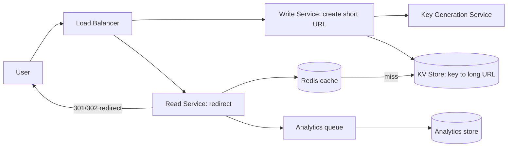

# Design: URL Shortener (TinyURL / bit.ly)

## 🧭 Overview
A URL shortener converts a long URL into a short, unique alias (e.g., `bit.ly/3xYz9`) that redirects to the original. It's the canonical "warm-up" system-design question because it's simple to state yet touches ID generation, key-value storage, caching, and read-heavy scaling. The core challenges are generating unique short keys and serving redirects with very low latency at huge read volume.

---

## ✅ Requirements Gathering

### Functional Requirements
- Create a short URL from a long URL (optionally custom alias + expiry).
- Redirect a short URL to the original (HTTP 301/302).
- (Optional) Analytics: click counts.

### Non-Functional Requirements
- **Read-heavy:** redirects vastly outnumber creations (~100:1).
- **Low latency:** redirects in < 50 ms.
- **High availability:** redirects must basically never fail (a dead link is bad).
- **Scalability:** billions of URLs over time.
- **Short keys:** as short as possible.

---

## 📐 Capacity Estimation
Assume **100M new URLs/month**.
- **Writes/sec:** 100M / (30 × 86,400) ≈ **~40 writes/sec** (avg); peak ~4x ≈ 160/sec.
- **Reads/sec:** 100:1 read:write → **~4,000 reads/sec** avg; peak ~16,000/sec.
- **Storage:** each record ≈ short key (7B) + long URL (~500B) + metadata (~100B) ≈ **~600 bytes**.
  - Per month: 100M × 600B = **60 GB/month** → **~720 GB/year** → ~3.6 TB over 5 years. Easily fits a sharded KV store.
- **Key space:** base62 (`[A-Za-z0-9]`). 62^7 ≈ **3.5 trillion** combos — 7 chars is plenty for many years.
- **Bandwidth:** reads 4,000/sec × ~600B ≈ 2.4 MB/sec (redirect responses are tiny).
- **Cache:** 20% of URLs drive 80% of reads → cache hot set; hot keys per day ≈ 4,000 × 86,400 × 0.2 reads, but unique hot URLs are far fewer → a few GB of cache covers most reads.

---

## 🏗️ High-Level Architecture

---

## 🔍 Deep Dive — Key Components

### Key Generation (the crux)
**Option A — Hash the URL** (e.g., MD5, take first 7 base62 chars): risk of collisions → check and rehash. Same URL maps to same key (dedup), but custom aliases complicate.
**Option B — Counter + base62 encode (preferred):** a globally unique incrementing ID encoded to base62 yields short, collision-free keys. Use a distributed ID generator (e.g., a **Key Generation Service** pre-generating keys, ranges handed to servers, or Snowflake-style IDs) to avoid a single counter bottleneck. Pre-generating keys in a pool also removes write-time latency.

### Storage
A **key-value store** (DynamoDB/Cassandra) fits perfectly: lookups are by short key. Sharded by key hash. Strong durability; reads are simple point lookups.

### Read Path (redirects)
1. Look up short key in **Redis** (cache-aside). 2. On miss, read DB, populate cache. 3. Return **301** (permanent, cacheable by browsers) or **302** (if you want to count every click).

### Analytics
Don't block redirects: fire a click event to a **queue** (Kafka) processed asynchronously.

---

## 🤔 Design Decisions & Trade-offs
- **Counter+base62 over hashing:** avoids collisions and keeps keys short; needs a distributed ID scheme.
- **301 vs 302:** 301 is cached by browsers/CDNs (fewer hits, but you lose per-click analytics); 302 forces a server hit (accurate analytics, more load). Choose per product need.
- **KV store over SQL:** access is pure key lookup; KV scales reads horizontally easily.
- **Cache-aside Redis:** redirects are extremely read-heavy and cacheable → huge latency/load win.
- **Custom aliases:** require a uniqueness check (reserve in DB).

---

## 🎯 Interview Questions
1. [Common] How do you generate unique keys without collisions at scale? *(Hint: distributed counter + base62, or pre-generated key pool.)*
2. [Google] How do you avoid a single point of contention in ID generation? *(Hint: hand out ID ranges per server, or Snowflake IDs.)*
3. [Amazon] 301 vs 302 — what's the trade-off for analytics and load? *(Hint: caching vs per-click counting.)*
4. [Meta] How would you support custom aliases and expiry? *(Hint: uniqueness check + TTL field / cleanup job.)*
5. [Bit.ly] How do you make redirects highly available across regions? *(Hint: multi-region replicas, edge caching, read-local.)*
6. How would you prevent abuse (malicious links/spam)? *(Hint: rate limiting, URL scanning/blocklists.)*

---

## 🔗 Related Topics
- [Relational vs NoSQL](../03-databases/01-relational-vs-nosql.md)
- [Caching Strategies](../04-caching/02-cache-strategies.md)
- [Sharding](../03-databases/03-sharding.md)
- [Estimation and Back-of-Envelope](../11-interview-playbook/02-estimation-and-back-of-envelope.md)
