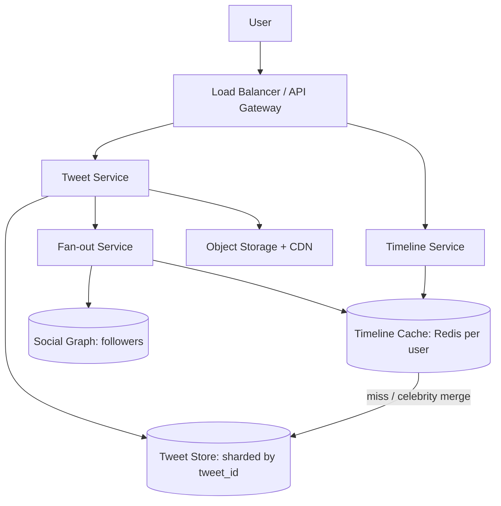

# Design: Twitter / News Feed

## 🧭 Overview
Design a Twitter-like service where users post tweets and see a timeline of tweets from people they follow. The defining challenge is the **timeline/feed generation** at massive scale with a heavy read load and the "celebrity" (high-follower) problem. This is a classic HLD interview question that tests fan-out strategies, caching, and read/write trade-offs.

---

## ✅ Requirements Gathering

### Functional Requirements
- Post a tweet (text, media).
- Follow/unfollow users.
- View **home timeline** (tweets from followees, reverse-chronological or ranked).
- View **user timeline** (a user's own tweets).
- Like/retweet (optional).

### Non-Functional Requirements
- **Read-heavy:** timeline reads ≫ writes.
- **Low latency:** timeline loads in < 200 ms.
- **High availability**, eventual consistency acceptable (a tweet appearing a few seconds late is fine).
- **Scale:** hundreds of millions of users.

---

## 📐 Capacity Estimation
Assume **300M MAU**, **150M DAU**, avg user posts **2 tweets/day**, reads timeline **~10×/day**.
- **Write QPS (tweets):** 150M × 2 / 86,400 ≈ **~3,500 tweets/sec**; peak ~3x ≈ 10,000/sec.
- **Read QPS (timeline):** 150M × 10 / 86,400 ≈ **~17,000 reads/sec**; peak ~50,000/sec.
- **Storage per tweet:** ~300 bytes text + metadata ≈ **~500 B** (media stored separately in object storage).
  - Tweets/day: 150M × 2 = 300M → 300M × 500B = **150 GB/day** → **~55 TB/year** (text/metadata only; media far larger in S3).
- **Fan-out cost:** avg user has ~200 followers; a tweet by an avg user means ~200 timeline inserts. 300M tweets/day × 200 = **60B timeline writes/day** — this is why fan-out strategy matters.

---

## 🏗️ High-Level Architecture

---

## 🔍 Deep Dive — Key Components

### Fan-out on Write (push) vs Read (pull)
- **Fan-out on write:** when a user tweets, push the tweet ID into each follower's precomputed timeline cache (Redis list). **Reads are O(1)/cheap** — just read your list. Cost: expensive for users with millions of followers (write amplification).
- **Fan-out on read:** store tweets once; build a timeline at read time by merging followees' recent tweets. Cheap writes, **expensive reads**.

### Hybrid (the real answer)
Use **fan-out on write for normal users**, but **fan-out on read for celebrities** (don't push to 50M timelines). At read time, merge a user's cached timeline with the latest tweets from the few celebrities they follow. This solves the celebrity hotspot.

### Storage
- **Tweets:** sharded KV/wide-column store by tweet ID (or user ID), with Snowflake-style time-sortable IDs.
- **Timeline cache:** Redis lists of tweet IDs per user (bounded, e.g., latest 800).
- **Social graph:** a graph/KV store optimized for "get followers of X."
- **Media:** object storage + CDN.

### Ranking
Reverse-chronological is simplest; ranked feeds add an ML scoring layer (engagement signals) over candidate tweets.

---

## 🤔 Design Decisions & Trade-offs
- **Hybrid fan-out:** balances cheap reads (push) against celebrity write blow-up (pull). Pure push fails on celebrities; pure pull is too slow for normal reads.
- **Precomputed timelines in Redis:** trades extra write work + memory for very fast reads — correct for a read-heavy system.
- **Eventual consistency:** acceptable; a tweet can take seconds to fan out.
- **Time-sortable IDs (Snowflake):** enable ordering and cursor pagination without extra sorting.

---

## 🎯 Interview Questions
1. [Twitter/Meta] Explain fan-out on write vs read and when each wins. *(Hint: read-heavy favors push; celebrities favor pull.)*
2. [Meta] How do you handle a celebrity with 100M followers posting? *(Hint: don't push; merge at read time.)*
3. [Google] How do you paginate an infinite-scroll timeline consistently? *(Hint: cursor on time-sortable tweet IDs.)*
4. [Amazon] How do you keep timeline reads under 200 ms at 50k QPS? *(Hint: precomputed Redis timelines, caching, sharding.)*
5. [Twitter] How would you add ranking/relevance to the feed? *(Hint: candidate generation + ML scoring layer.)*
6. How do you bound timeline cache memory? *(Hint: store only latest N tweet IDs, lazily rebuild.)*

---

## 🔗 Related Topics
- [Caching Fundamentals](../04-caching/01-caching-fundamentals.md)
- [Sharding](../03-databases/03-sharding.md)
- [Pub/Sub](../05-messaging-and-queues/02-pub-sub.md)
- [Pagination](../06-api-design/04-pagination.md)
