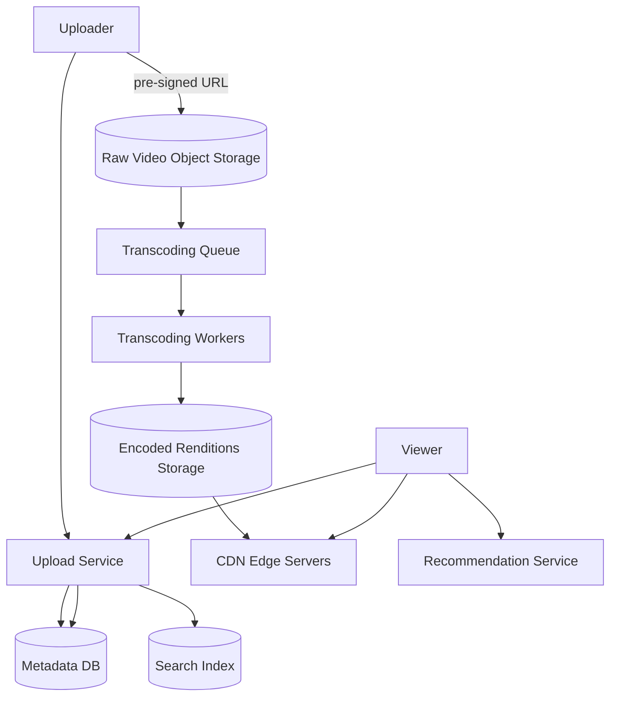

# Design: YouTube / Video Streaming

## 🧭 Overview
Design a video platform where users upload, process, store, and stream videos to a global audience. The defining challenges are **massive storage**, **video transcoding** into multiple resolutions/formats, and **low-latency global delivery** via CDN. It's a rich HLD question that exercises object storage, async processing pipelines, CDNs, and read-heavy scaling.

---

## ✅ Requirements Gathering

### Functional Requirements
- Upload videos.
- Transcode to multiple resolutions/formats (240p–4K, HLS/DASH).
- Stream videos with adaptive bitrate.
- Search and view videos; view counts, recommendations (optional).

### Non-Functional Requirements
- **Very read-heavy** (views ≫ uploads).
- **High availability** and global low-latency playback (low startup/buffering).
- **Massive, durable storage**.
- **Scalable** ingestion and delivery.

---

## 📐 Capacity Estimation
Assume **2B users**, **video views = 5B/day**, uploads **~500 hours/min** (YouTube-scale; we'll size conservatively at **1M uploads/day**, avg 10 min, 50 MB raw before transcode).
- **View QPS:** 5B / 86,400 ≈ **~58,000 views/sec** avg; peak ~3x ≈ 175,000/sec — served mostly from **CDN edges**, not origin.
- **Upload storage/day:** 1M × 50 MB = **50 TB/day raw**. Transcoding to ~5 renditions can **3–5x** that → ~150–250 TB/day stored → **~50–90 PB/year**. Object storage, tiered.
- **Bandwidth (delivery):** if avg view streams ~30 MB: 5B × 30 MB = **150 PB/day egress** — overwhelmingly served by CDN (origin offload is critical).
- **Transcoding compute:** 1M videos/day must be transcoded in parallel → a large worker fleet with a job queue; scale with backlog.

---

## 🏗️ High-Level Architecture

---

## 🔍 Deep Dive — Key Components

### Upload & Storage
Client gets a **pre-signed URL** and uploads directly to object storage (don't proxy huge files through app servers). Large uploads use **chunked/resumable** uploads. Metadata (title, owner, status) goes to a DB.

### Transcoding Pipeline
A raw upload triggers a job on a **queue**. Workers transcode into multiple resolutions and segment into chunks (HLS/DASH) for **adaptive bitrate streaming** (ABR) — the player switches quality based on bandwidth. This is embarrassingly parallel; scale workers by queue depth. Often split into a DAG (split → transcode segments in parallel → merge) for speed.

### Delivery (the most important part)
Encoded chunks are pushed to a **CDN**. Viewers stream from the nearest edge, dramatically cutting latency and origin load. Popular videos stay hot at edges; long-tail fetched from origin on demand.

### Metadata, Search, Views
- **Metadata DB** (sharded SQL/NoSQL) for video info.
- **Search index** (Elasticsearch) for discovery.
- **View counts**: eventually consistent, aggregated asynchronously (don't update a counter synchronously on every view).

---

## 🤔 Design Decisions & Trade-offs
- **Object storage + CDN over a database** for video bytes: cheap, durable, globally fast; DBs can't hold/serve petabytes of blobs.
- **Async transcoding via queue:** decouples upload from heavy processing; upload returns immediately ("processing…").
- **Adaptive bitrate:** trades extra storage (many renditions) for smooth playback across network conditions.
- **Eventual-consistent view counts:** accuracy vs scale — exact synchronous counting wouldn't scale.
- **Pre-signed direct uploads:** offload bandwidth from app servers.

---

## 🎯 Interview Questions
1. [YouTube/Google] Walk through the video upload-to-playable pipeline. *(Hint: upload → queue → transcode renditions → segment → CDN.)*
2. [Netflix] How does adaptive bitrate streaming work and why? *(Hint: multiple renditions + client switches by bandwidth.)*
3. [Amazon] How do you store and serve petabytes of video cost-effectively? *(Hint: object storage tiers + CDN, hot/cold.)*
4. [Google] How do you scale transcoding for spiky upload volume? *(Hint: queue + autoscaled workers by backlog, parallel segment encoding.)*
5. [Meta] How do you keep view counts at scale without hammering the DB? *(Hint: async aggregation, approximate/eventual counts.)*
6. How do you minimize playback startup latency globally? *(Hint: CDN edge proximity, prefetch first segments.)*

---

## 🔗 Related Topics
- [Object Storage](../08-storage/01-object-storage.md)
- [CDN](../04-caching/04-cdn.md)
- [Message Queues](../05-messaging-and-queues/01-message-queues.md)
- [Auto Scaling](../02-scalability/03-auto-scaling.md)
