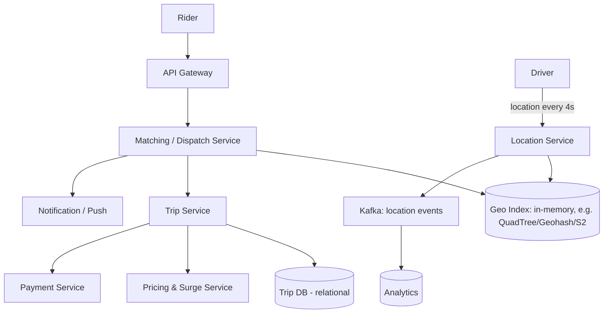

# Design: Uber / Ride-Hailing

## 🧭 Overview
Design a ride-hailing service that matches riders with nearby drivers in real time, tracks live locations, and manages trips and payments. The defining challenges are **real-time geospatial matching**, **high-frequency location updates** from millions of moving drivers, and **low-latency dispatch**. It's a popular HLD question that tests geospatial indexing, real-time systems, and event-driven design.

---

## ✅ Requirements Gathering

### Functional Requirements
- Riders request a ride from A → B; system matches a nearby driver.
- Drivers continuously share location; riders see driver location live.
- Trip lifecycle: request → match → pickup → in-progress → complete → pay.
- Fare estimation & dynamic (surge) pricing.

### Non-Functional Requirements
- **Low latency** matching (seconds).
- **High availability**; real-time location accuracy.
- **Scalability:** millions of concurrent drivers/riders.
- **Geo-distributed** (operate per city/region).

---

## 📐 Capacity Estimation
Assume **5M active drivers**, location update **every 4 seconds**, **5M rides/day**.
- **Location update QPS:** 5M / 4 = **~1.25M updates/sec** — the dominant write load. Must use efficient geospatial storage + in-memory.
- **Ride request QPS:** 5M / 86,400 ≈ **~58/sec** avg; peak (rush hour, big cities) ~10x ≈ 600/sec.
- **Location data:** each update ~100 B (driver_id, lat, lon, ts). 1.25M/sec × 100B = **125 MB/sec** of location writes → keep "current location" in memory (overwrite, don't persist every ping); persist trip tracks separately if needed.
- **Trip storage:** 5M rides/day × ~1 KB = **5 GB/day** → ~1.8 TB/year of trip records (relational).
- **Matching read:** for each request, query drivers within a radius (e.g., ~3 km) → needs a fast geospatial index.

---

## 🏗️ High-Level Architecture

---

## 🔍 Deep Dive — Key Components

### Geospatial Indexing (the crux)
To find "drivers near me" fast, partition the map:
- **Geohash:** encode lat/lon into a string; nearby points share prefixes → range query by prefix.
- **QuadTree:** recursively subdivide regions; dense areas get finer cells.
- **Google S2 / Uber H3:** map the sphere into hierarchical cells (Uber built **H3**, a hexagonal grid). Hexagons have uniform neighbor distances — great for radius queries and surge zones.
Keep the index **in memory** (Redis with geo commands, or a dedicated service) because location changes constantly.

### Handling 1M+ location updates/sec
- **Overwrite current location** in memory keyed by driver (no need to persist every ping).
- Shard by **geographic region/city** — Uber runs largely independently per city, so load is naturally partitioned.
- Stream raw pings to **Kafka** for analytics/replay without slowing the hot path.

### Matching / Dispatch
On a request: find candidate drivers in nearby cells, rank by ETA (not just distance — consider traffic, direction), offer to the best driver, handle accept/decline with timeouts. This is latency-sensitive and benefits from in-memory data.

### Trip & Payment
Trip lifecycle modeled as **events** (state machine). Payment runs as a saga (authorize → capture) with idempotency. Surge pricing computed per geo cell from supply/demand.

---

## 🤔 Design Decisions & Trade-offs
- **In-memory geo index over a disk DB:** location updates are too frequent/ephemeral for durable per-ping writes; memory gives the needed speed.
- **Geohash/H3 cells:** trade exact distance for fast bucketed neighbor lookups; hexagons (H3) give more uniform neighbors than squares.
- **Per-city sharding:** rides are local, so partitioning by region scales naturally and isolates failures.
- **Event-driven trips:** decouples matching, pricing, notifications, payments; resilient and auditable.
- **ETA-based matching over raw distance:** better real-world matches at extra compute cost.

---

## 🎯 Interview Questions
1. [Uber] How do you efficiently find nearby drivers? *(Hint: geohash/QuadTree/H3 cells, in-memory index.)*
2. [Uber] How do you handle 1M+ location updates per second? *(Hint: overwrite-in-memory, per-region sharding, stream to Kafka.)*
3. [Google] Why match on ETA instead of straight-line distance? *(Hint: traffic, one-way roads, real arrival time.)*
4. [Amazon] How do you model the trip lifecycle reliably? *(Hint: event-driven state machine, saga for payment.)*
5. [Uber] How would you implement surge pricing? *(Hint: per-cell supply/demand ratio, periodic recompute.)*
6. How do you ensure a rider sees the driver's live position smoothly? *(Hint: push/websocket updates, interpolation client-side.)*

---

## 🔗 Related Topics
- [Event-Driven Architecture](../05-messaging-and-queues/04-event-driven-architecture.md)
- [Caching Fundamentals](../04-caching/01-caching-fundamentals.md)
- [Distributed Transactions](../07-distributed-systems/02-distributed-transactions.md)
- [Sharding](../03-databases/03-sharding.md)
