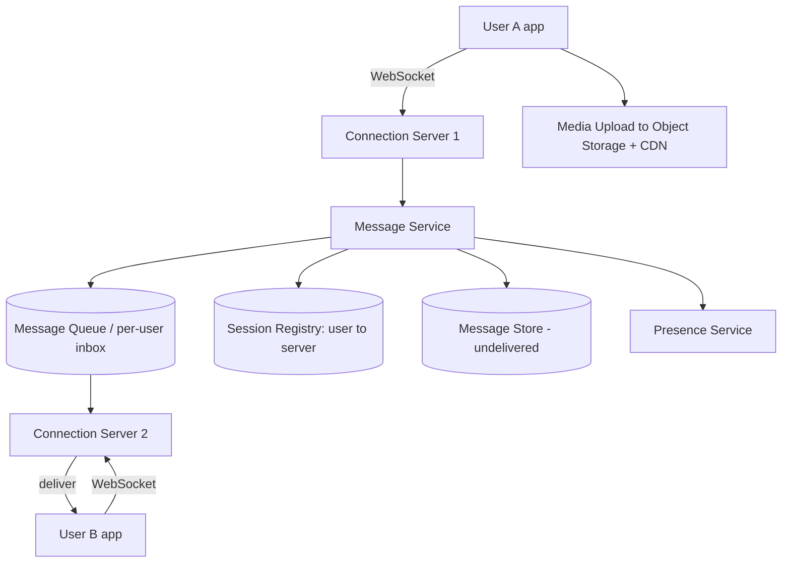

# Design: WhatsApp / Chat System

## 🧭 Overview
Design a real-time messaging app supporting one-to-one and group chat, online/last-seen presence, delivery/read receipts, and offline message delivery. The defining challenges are **maintaining millions of persistent connections**, **real-time low-latency delivery**, and **reliable message storage/sync** across devices. It's a top-tier HLD question covering WebSockets, message queues, and fan-out.

---

## ✅ Requirements Gathering

### Functional Requirements
- 1:1 and group messaging (text, media).
- Real-time delivery; offline users get messages on reconnect.
- Delivery & read receipts (sent/delivered/read).
- Presence (online/last seen).
- (Optional) end-to-end encryption.

### Non-Functional Requirements
- **Low latency** (< 100 ms delivery when both online).
- **High availability & reliability** (never lose a message).
- **Massive concurrency:** hundreds of millions of simultaneous connections.
- **Ordered** message delivery within a conversation.

---

## 📐 Capacity Estimation
Assume **500M DAU**, each sends **40 messages/day**.
- **Messages/day:** 500M × 40 = **20B messages/day**.
- **Write QPS:** 20B / 86,400 ≈ **~230,000 messages/sec** avg; peak ~3x ≈ 700,000/sec.
- **Concurrent connections:** if ~50% online at peak → **~250M persistent WebSocket connections**. A single server holds ~100k–1M connections → need **hundreds to thousands of connection servers**.
- **Storage:** each message ~200 B (encrypted blob + metadata). 20B × 200B = **4 TB/day** (if retained). WhatsApp historically deletes from servers after delivery to save storage — a key decision.
- **Bandwidth:** 230k msgs/sec × 200B ≈ 46 MB/sec (text); media handled separately via object storage.

---

## 🏗️ High-Level Architecture

---

## 🔍 Deep Dive — Key Components

### Persistent Connections
Clients hold a **WebSocket** (or XMPP-like) connection to a **connection server**, enabling the server to push messages instantly. A **session registry** (e.g., Redis) maps `user_id → connection_server` so the system knows where to route a message.

### Message Delivery Flow
1. A sends message to its connection server → **Message Service**.
2. Service persists it (for reliability/ordering) and looks up B's session.
3. If **B is online**, route to B's connection server, which pushes it; B acks → mark **delivered**.
4. If **B is offline**, store in B's inbox/queue; deliver on reconnect, then delete.
Receipts (sent/delivered/read) are themselves small messages flowing back.

### Group Messaging
A message to a group **fans out** to each member: look up members, enqueue/deliver to each. For very large groups, fan-out is the cost center (similar to feed fan-out). Maintain per-conversation ordering using sequence numbers.

### Ordering & Idempotency
Use per-conversation **sequence numbers / monotonic IDs** so clients render messages in order and dedupe retries.

### Presence
Heartbeats update last-seen; presence is best-effort and eventually consistent (don't over-engineer exactness).

### Storage Strategy
Store **undelivered** messages durably; optionally delete after delivery (privacy + storage savings). Device sync/history may keep more, often E2E-encrypted so servers store only ciphertext.

---

## 🤔 Design Decisions & Trade-offs
- **WebSockets over polling:** real-time push with far less overhead than constant HTTP polling.
- **Connection server + session registry:** decouples "who's connected where" from message logic; enables routing across a huge fleet.
- **Store-and-forward queue:** guarantees offline delivery and reliability at the cost of storage.
- **Delete-after-delivery:** saves storage and improves privacy, but limits server-side history (rely on device backups).
- **Sequence numbers for ordering:** simple, conversation-scoped ordering without global coordination.

---

## 🎯 Interview Questions
1. [WhatsApp/Meta] How do you maintain hundreds of millions of live connections? *(Hint: many connection servers, session registry, efficient event loops.)*
2. [Meta] How is a message delivered when the recipient is offline? *(Hint: store-and-forward inbox, deliver on reconnect.)*
3. [Google] How do you guarantee message ordering in a conversation? *(Hint: per-conversation sequence numbers.)*
4. [Amazon] How do you implement delivery/read receipts? *(Hint: ack messages flowing back, state updates.)*
5. [Meta] How does group message fan-out scale for large groups? *(Hint: fan-out to members, batching, limits.)*
6. How would you add end-to-end encryption? *(Hint: client-side keys, server stores only ciphertext; Signal protocol.)*

---

## 🔗 Related Topics
- [Client-Server Model](../01-fundamentals/02-client-server-model.md)
- [Message Queues](../05-messaging-and-queues/01-message-queues.md)
- [Pub/Sub](../05-messaging-and-queues/02-pub-sub.md)
- [Consistency Models](../07-distributed-systems/01-consistency-models.md)
