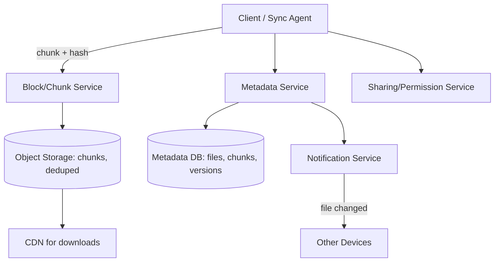

# Design: Google Drive / Dropbox (File Storage & Sync)

## 🧭 Overview
Design a cloud file-storage and synchronization service where users upload files, sync them across devices, share with others, and recover versions. The defining challenges are **efficient sync** (especially of large or partially-changed files), **storage deduplication**, and **conflict resolution** across devices. It's a strong HLD question covering object storage, chunking, metadata services, and notifications.

---

## ✅ Requirements Gathering

### Functional Requirements
- Upload/download files; organize in folders.
- Sync files across multiple devices automatically.
- Share files/folders with permissions.
- File versioning and recovery.

### Non-Functional Requirements
- **Durability** (never lose files) and high availability.
- **Efficient sync** (only transfer what changed).
- **Scalable** storage (exabytes) and many concurrent users.
- **Consistency** of metadata; reasonable conflict handling.

---

## 📐 Capacity Estimation
Assume **500M users**, **100M DAU**, avg **10 files uploaded/day**, avg file **1 MB** (many small, some huge).
- **Upload QPS:** 100M × 10 / 86,400 ≈ **~11,600 uploads/sec** avg; peak ~3x ≈ 35,000/sec.
- **Storage/day:** 100M × 10 × 1 MB = **1 PB/day** of new data (before dedup). **Deduplication** can cut this substantially (identical chunks stored once).
- **Total storage:** with 500M users averaging, say, 10 GB each → **~5 EB** — object storage, tiered, dedup'd.
- **Metadata:** billions of file/chunk records → sharded metadata DB. Each file → many chunk references.
- **Sync notifications:** each change notifies the user's other devices → a notification/long-poll system at scale.

---

## 🏗️ High-Level Architecture

---

## 🔍 Deep Dive — Key Components

### Chunking + Deduplication (the crux)
Split each file into **fixed or content-defined chunks** (e.g., 4 MB). Hash each chunk (SHA-256). Store chunks in object storage keyed by hash → **identical chunks stored once** (dedup across all users saves enormous space). A file = an ordered list of chunk hashes in metadata.

### Efficient Sync (delta sync)
When a file changes, the client re-chunks and **only uploads chunks whose hashes are new** — for a 1 GB file with a small edit, you transfer only the changed chunk(s), not the whole file. The server sends back which chunks it already has.

### Metadata Service
Tracks files, folders, versions, and the chunk list per file version. This is the **source of truth** for "what the file looks like." Versioning = keep old chunk lists. Sharded by user/workspace.

### Sync & Notifications
A device watches for local changes and pushes them; the **Notification Service** tells the user's *other* devices to pull updates (via long-poll/WebSocket). Offline devices catch up on reconnect.

### Conflict Resolution
Concurrent edits to the same file from two devices → detect via version vectors; resolve by keeping both as **conflicted copies** (simplest, user-safe) or last-writer-wins with history. Avoid silently losing edits.

### Sharing & Permissions
ACL/relationship-based permissions per file/folder, checked server-side on every access.

---

## 🤔 Design Decisions & Trade-offs
- **Chunking + dedup:** saves bandwidth and storage massively; adds metadata complexity and hashing cost.
- **Delta sync:** trades client CPU (re-chunking/hashing) for huge network savings — right for large files.
- **Separate metadata vs block storage:** metadata needs fast consistent lookups (DB); blocks need cheap durable bulk storage (object store).
- **Conflicted copies over auto-merge:** safe and simple for arbitrary file types (you can't merge a binary).
- **Notification-driven pull:** scalable; devices pull changes rather than the server pushing full files.

---

## 🎯 Interview Questions
1. [Dropbox] How do you sync a 1 GB file after a tiny edit efficiently? *(Hint: chunking + only upload changed chunks.)*
2. [Google] How does deduplication save storage across users? *(Hint: content-hash chunks, store identical chunks once.)*
3. [Amazon] How do you handle two devices editing the same file offline? *(Hint: version vectors, conflicted copies.)*
4. [Dropbox] How do you notify other devices of a change quickly? *(Hint: notification service + long-poll/WebSocket pull.)*
5. [Google] How do you store metadata vs file content? *(Hint: DB for metadata/chunk lists, object storage for blocks.)*
6. How do you implement file versioning and recovery? *(Hint: keep historical chunk lists per version.)*

---

## 🔗 Related Topics
- [Object Storage](../08-storage/01-object-storage.md)
- [Block vs File vs Object](../08-storage/02-block-vs-file-vs-object.md)
- [Consistency Models](../07-distributed-systems/01-consistency-models.md)
- [Notification System](07-design-notification-system.md)
