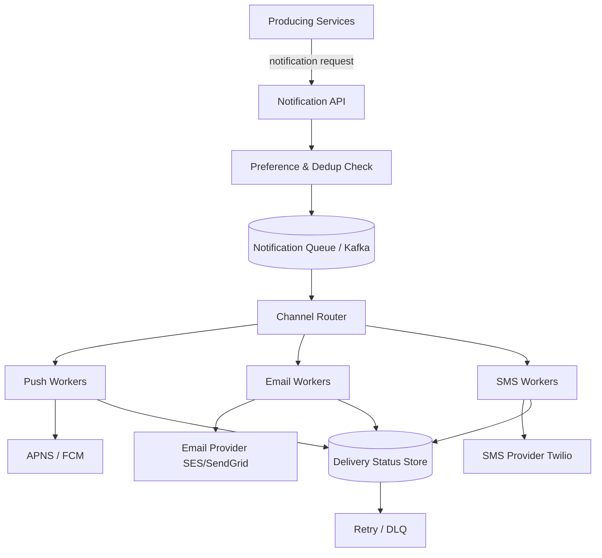

# Design: Notification System

## 🧭 Overview
Design a system that delivers notifications to users across multiple channels — **push (mobile/web), SMS, and email** — reliably and at scale. The defining challenges are **multi-channel fan-out**, **reliability/retries with third-party providers**, **rate limiting/throttling**, and **user preferences**. It's a common HLD question that ties together queues, the fan-out pattern, and integration with external services.

---

## ✅ Requirements Gathering

### Functional Requirements
- Send notifications via push, SMS, and email.
- Support transactional (OTP, receipts) and bulk/marketing notifications.
- Respect user preferences (opt-in/out per channel/type).
- Templates and personalization.
- Track delivery status; retry failures.

### Non-Functional Requirements
- **High throughput** (millions/min during campaigns).
- **Reliability:** don't lose transactional notifications; at-least-once delivery.
- **Low latency** for transactional (OTP must be near-instant).
- **Deduplication** (don't spam users).

---

## 📐 Capacity Estimation
Assume **100M users**, avg **5 notifications/day**, plus campaign bursts.
- **Steady QPS:** 100M × 5 / 86,400 ≈ **~5,800 notifications/sec** avg.
- **Burst (campaign):** sending to 50M users in 30 min = 50M / 1,800 ≈ **~28,000/sec** — must absorb via queues + scaling.
- **Channel split** (example): 70% push, 20% email, 10% SMS → size each channel's worker fleet and provider rate limits accordingly.
- **Storage:** notification logs/status: 100M × 5 × ~300 B = **150 GB/day** of events (retained per policy) → archive older data.
- **Provider limits:** SMS/email providers cap throughput → must throttle and shard across providers.

---

## 🏗️ High-Level Architecture

---

## 🔍 Deep Dive — Key Components

### Ingestion & Preferences
Services call a **Notification API** with (user, type, payload). The system checks **user preferences** (is this user opted in to this channel/type?) and **deduplicates** (idempotency key, so a retried request doesn't double-send). Rejected/suppressed notifications are logged.

### Queue + Channel Workers
Accepted notifications go to a **durable queue** (Kafka/SQS) to absorb bursts and decouple ingestion from delivery. A **channel router** dispatches to per-channel worker pools (push/email/SMS), each integrating with external providers (APNS/FCM, SES/SendGrid, Twilio).

### Reliability & Retries
External providers fail/throttle. Workers implement **retries with exponential backoff + jitter**, **circuit breakers** around providers, and a **dead-letter queue** for repeated failures. Track per-notification status (queued → sent → delivered → failed).

### Rate Limiting & Throttling
Respect provider rate limits and avoid spamming users (e.g., cap N marketing messages/day/user). Separate **priority lanes**: transactional (OTP) must not be stuck behind a marketing campaign — use priority queues or dedicated channels.

### Templating & Personalization
A template service renders content per channel/locale with user data.

### Idempotency & Dedup
Idempotency keys prevent duplicates from retries; dedup windows prevent sending the same alert multiple times.

---

## 🤔 Design Decisions & Trade-offs
- **Queue-based async over synchronous sends:** absorbs campaign bursts and isolates slow providers; trades immediate delivery for reliability/scale.
- **Separate priority lanes:** ensures latency-critical OTPs aren't delayed by bulk campaigns (extra complexity).
- **At-least-once + idempotency:** guarantees delivery without duplicates (need dedup keys).
- **Multi-provider with circuit breakers:** resilience to provider outages; adds routing complexity.
- **Preference/dedup gate up front:** prevents spam and respects compliance (CAN-SPAM/GDPR) at the cost of an extra lookup.

---

## 🎯 Interview Questions
1. [Common] How do you absorb a campaign sending to 50M users without overload? *(Hint: durable queue + autoscaled workers + provider throttling.)*
2. [Amazon] How do you ensure OTPs aren't delayed behind marketing blasts? *(Hint: priority queues / dedicated lanes.)*
3. [Google] How do you handle a flaky SMS provider? *(Hint: retries w/ backoff, circuit breaker, failover provider, DLQ.)*
4. [Meta] How do you prevent sending duplicate notifications? *(Hint: idempotency keys + dedup window.)*
5. [Stripe] How do you guarantee transactional notifications aren't lost? *(Hint: durable queue, at-least-once, status tracking, retries.)*
6. How do you respect user preferences and compliance? *(Hint: preference service + opt-out enforcement before enqueue.)*

---

## 🔗 Related Topics
- [Message Queues](../05-messaging-and-queues/01-message-queues.md)
- [Pub/Sub](../05-messaging-and-queues/02-pub-sub.md)
- [Circuit Breaker Pattern](../07-distributed-systems/05-circuit-breaker-pattern.md)
- [Rate Limiting](../06-api-design/02-rate-limiting.md)
