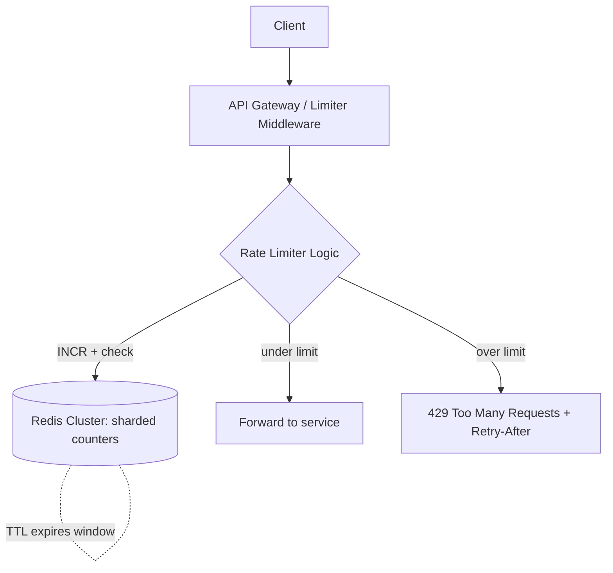

# Design: Distributed Rate Limiter

## 🧭 Overview
Design a distributed rate limiter that caps how many requests a client (user/IP/API key) can make in a time window, enforced consistently across many servers. The defining challenges are **accuracy across a distributed fleet**, **low added latency**, and **choosing the right algorithm**. It's both a focused HLD question and a frequent component within larger designs. (See also the [Rate Limiting concept page](../06-api-design/02-rate-limiting.md).)

---

## ✅ Requirements Gathering

### Functional Requirements
- Limit requests per client to N per time window (e.g., 100/min).
- Support different rules per endpoint / user tier.
- Return clear responses when limited (HTTP 429 + `Retry-After`).

### Non-Functional Requirements
- **Low latency:** the limiter adds < 1–2 ms.
- **Accurate enough** across a distributed cluster (avoid each node allowing the full limit).
- **Highly available:** the limiter must not take down the service if it fails (fail-open vs fail-closed decision).
- **Scalable** to millions of clients.

---

## 📐 Capacity Estimation
Assume the API handles **1M requests/sec** at peak across the fleet.
- **Counter ops:** every request needs ≥1 read/increment on a shared counter → **~1M counter ops/sec** against the store (Redis). A single Redis can do ~100k–200k ops/sec → **shard counters across ~10–20 Redis nodes** (by client key hash).
- **Memory:** counters are tiny (key + int + TTL ≈ ~100 B). 10M active clients × ~100 B = **~1 GB** — trivially fits in memory.
- **Latency budget:** one in-memory round trip (~0.5 ms) + atomic op; keep the limiter co-located/near the gateway.
- **Key cardinality:** per-user + per-endpoint keys → millions of keys, expired by TTL each window.

---

## 🏗️ High-Level Architecture

---

## 🔍 Deep Dive — Key Components

### Algorithm Choice
- **Token bucket** (popular): each client has a bucket of tokens refilled at a rate; a request consumes one; empty → reject. Allows controlled bursts.
- **Sliding window counter:** weighted blend of current + previous fixed windows → smooth, accurate, memory-efficient. Avoids the fixed-window boundary-burst problem.
Implement atomically in Redis via a **Lua script** (read counter, check, increment) so the check-and-set is race-free.

### Distributed Consistency (the crux)
With many gateway nodes, a naive per-node counter lets each node permit the full limit → total = N × nodes. Fix by keeping counters in a **shared store** (Redis), keyed by client. Trade-offs:
- **Centralized Redis:** accurate but adds a network hop and is a hot dependency → shard by client key to scale and reduce blast radius.
- **Local + sync (approximate):** each node keeps a local count and periodically syncs/reconciles — lower latency, slightly less accurate (good enough for many cases).

### Where to Enforce
At the **API gateway / edge** (central choke point) so bad traffic is rejected before hitting services. Provide rule config per route/tier.

### Failure Handling
If Redis is unavailable: **fail-open** (allow traffic, prioritize availability) or **fail-closed** (reject, prioritize protection) — a deliberate product decision. Often fail-open with local fallback limits.

### Response Contract
Return **429** with `Retry-After` and `X-RateLimit-Limit/Remaining/Reset` headers so clients back off gracefully (with jitter to avoid synchronized retries).

---

## 🤔 Design Decisions & Trade-offs
- **Sliding window over fixed window:** avoids boundary bursts at modest extra cost.
- **Shared Redis (sharded) over per-node counters:** accuracy across the fleet vs a network hop; sharding mitigates the hotspot.
- **Atomic Lua scripts:** correctness under concurrency vs slightly more complex ops.
- **Fail-open vs fail-closed:** availability vs protection — pick based on what the API guards.
- **Edge enforcement:** rejects abuse early, protecting downstream, at the cost of centralizing policy.

---

## 🎯 Interview Questions
1. [Common] Compare token bucket vs sliding window counter. *(Hint: bursts vs smooth accuracy.)*
2. [Stripe] How do you keep limits accurate across many gateway nodes? *(Hint: shared sharded Redis + atomic ops.)*
3. [Google] How do you keep the limiter's added latency tiny? *(Hint: in-memory store, co-located, single atomic op.)*
4. [Amazon] What happens if the limiter's datastore goes down? *(Hint: fail-open vs fail-closed trade-off + local fallback.)*
5. [Meta] How do you support different limits per user tier and endpoint? *(Hint: rule config keyed by tier+route.)*
6. How do you prevent a thundering herd when windows reset? *(Hint: sliding window, jittered Retry-After.)*

---

## 🔗 Related Topics
- [Rate Limiting (concept)](../06-api-design/02-rate-limiting.md)
- [Caching Fundamentals](../04-caching/01-caching-fundamentals.md)
- [API Gateway](../06-api-design/03-api-gateway.md)
- [Circuit Breaker Pattern](../07-distributed-systems/05-circuit-breaker-pattern.md)
