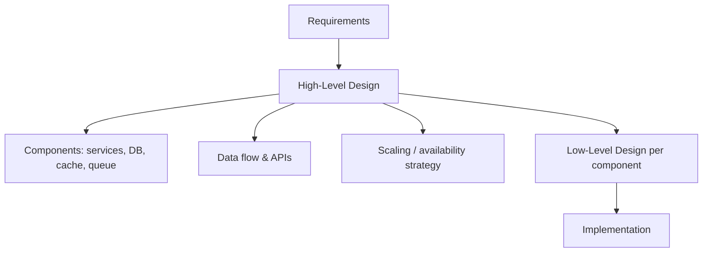

# What Is High-Level Design (HLD)

## 🧭 Overview
High-Level Design is the architecture-level view of a system: the major components, how data flows between them, and how the system meets its scalability, availability, and performance goals. It's the "boxes and arrows" altitude — above individual classes/code (LLD) but below physical deployment details. HLD is what the dedicated "System Design" interview round tests, and it's how teams agree on a system's shape before building.

---

## 🧠 Technical Explanation

### Where HLD Sits
- **Requirements** → what to build.
- **HLD** → the major components and their interactions (services, databases, caches, queues, gateways).
- **LLD** → the internal class/method design of each component.
- **Implementation** → the code.

### What an HLD Includes
- **Component diagram:** services and infrastructure (LB, app servers, DB, cache, queue, CDN, object storage).
- **Data flow:** how a request travels and where data lives.
- **Data model (high level):** main entities and which store holds them.
- **API surface:** key endpoints between components.
- **Non-functional strategy:** how scaling, caching, replication, and failover meet the NFRs.
- **Trade-offs:** justified technology and pattern choices.

### Key HLD Concerns
- **Scalability** — handle growth (horizontal scaling, sharding).
- **Availability** — survive failures (redundancy, replication).
- **Performance** — latency/throughput targets (caching, CDNs).
- **Consistency** — strong vs eventual per use case.
- **Cost & operability** — right-sized, observable, deployable.

### HLD vs LLD
HLD answers "what are the pieces and how do they connect at scale?"; LLD answers "how is each piece coded with clean, extensible classes?" Both are separate interview rounds at top companies.

---

## 🍎 Simple Explanation (ELI5 / Analogy)
HLD is the architect's blueprint of a building: where the floors, elevators, plumbing, and electrical systems go, and how they connect — drawn before anyone pours concrete. It doesn't specify the exact wiring inside each wall (that's LLD), but it ensures the building can hold the intended number of people, won't collapse, and has working utilities. You design the blueprint first because fixing a bad foundation after construction is enormously expensive.

---

## 📊 Diagram / Flowchart

---

## ⚖️ Trade-offs

| Pros of doing HLD well | Costs/Risks |
|------|------|
| Aligns the team before building | Time investment up front |
| Surfaces bottlenecks & SPOFs early | Can over-engineer for imagined scale |
| Guides component (LLD) design | May drift as requirements change |
| Enables cost & capacity planning | Too much detail too early slows iteration |

---

## 🌍 Real-World Examples
- **Engineering design docs** (Google, Amazon) are essentially written HLDs reviewed before implementation.
- **Architecture diagrams** in tech blogs (Netflix, Uber) communicate HLD to the broader org.
- **RFCs/ADRs** (Architecture Decision Records) capture HLD trade-offs and decisions.

---

## 🎯 Interview Questions

### 🔵 Conceptual (Theory)
1. What's the difference between HLD and LLD? → **Answer:** HLD defines system-wide components and data flow at scale; LLD defines the internal classes/methods/patterns of each component.
2. What non-functional concerns drive HLD? → **Answer:** Scalability, availability, performance/latency, consistency, cost, and operability.
3. Why produce an HLD before coding? → **Answer:** To align the team, surface bottlenecks/SPOFs early, and avoid expensive architectural mistakes after build.

### 🟠 Design (Practical)
1. What would your HLD for a photo app include? → **Answer:** Clients → LB → app services, object storage + CDN for media, DB for metadata, cache for hot reads, queue for async processing, plus the scaling/availability strategy.
2. How do you decide the level of detail for an HLD? → **Answer:** Enough to convey components, data flow, and how NFRs are met; defer class-level details to LLD.

### 🔴 Company-Specific
1. [Amazon] What goes into a one-pager design doc before building a service? *(Hint: requirements, architecture, data flow, trade-offs, risks.)*
2. [Google] How do you present an HLD so reviewers can assess scalability? *(Hint: clear diagram, capacity estimates, bottleneck analysis.)*
3. [Meta] How does HLD inform the subsequent LLD? *(Hint: each component box becomes an LLD class-design exercise.)*

---

## 📚 Further Reading
- "Design Docs at Google" (industry articles)
- *Fundamentals of Software Architecture* — Richards & Ford

---

## 🔗 Related Topics
- [HLD Interview Framework](02-hld-interview-framework.md)
- [What is System Design](../01-fundamentals/01-what-is-system-design.md)
- [What is LLD](../14-lld/01-what-is-lld.md)
- [LLD vs HLD Cheatsheet](../12-cheatsheets/lld-vs-hld-cheatsheet.md)
