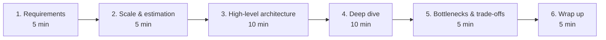

# The HLD Interview Framework (6 Steps)

## 🧭 Overview
A repeatable, time-boxed framework is the single biggest lever for performing well in HLD interviews. This is a **6-step, ~40-minute structure**. For each step you'll see **what to say**, **what good looks like**, **what bad looks like**, and **common mistakes**. Internalize this so you never freeze on an open-ended prompt.

---

## ⏱️ The Framework at a Glance

---

## Step 1 — Clarify Requirements (≈5 min)
**What to say:** "Let me clarify the scope first." Separate **functional** ("users can post, follow, view feed") from **non-functional** ("read-heavy, < 200 ms, highly available, eventual consistency OK"). Confirm what's in and out of scope.
- ✅ **Good:** A crisp, agreed list of FR + NFR; explicit assumptions; scoped MVP.
- ❌ **Bad:** Listing every feature; designing before agreeing on scope.
- ⚠️ **Common mistakes:** Skipping NFRs; not confirming scale expectations; assuming the prompt.

## Step 2 — Define Scale & Back-of-Envelope Estimation (≈5 min)
**What to say:** State assumptions (DAU, actions/user/day), then compute **QPS, storage, bandwidth**. "100M DAU × 5 reads = 500M/day ≈ 5,800 QPS avg, ~3x peak."
- ✅ **Good:** Quick, sane math that *justifies* later choices (e.g., "read-heavy → cache + replicas").
- ❌ **Bad:** Either skipping math entirely or getting lost in precise arithmetic.
- ⚠️ **Common mistakes:** No peak factor; numbers that don't influence the design; over-precision.

## Step 3 — High-Level Architecture (≈10 min)
**What to say:** Draw the core components and data flow: client → LB/gateway → services → DB/cache/queue/storage. Define the **key APIs** and **data model** at a high level.
- ✅ **Good:** A clean diagram a viewer can follow; clear request path; sensible component choices.
- ❌ **Bad:** A tangle of boxes with no clear flow; missing obvious pieces (no cache in a read-heavy system).
- ⚠️ **Common mistakes:** Over-engineering early; not stating why each component exists.

## Step 4 — Deep Dive on 2–3 Key Components (≈10 min)
**What to say:** Pick the hardest/most scale-critical parts (e.g., feed fan-out, DB sharding, the matching algorithm) and go deep: storage choice, schema, caching, scaling, edge cases. Follow the interviewer's hints.
- ✅ **Good:** Concrete mechanisms (e.g., "hybrid fan-out for celebrities"), justified with trade-offs.
- ❌ **Bad:** Staying shallow everywhere; deep-diving a trivial part.
- ⚠️ **Common mistakes:** Ignoring hints; not addressing the obvious hard problem.

## Step 5 — Bottlenecks & Trade-offs (≈5 min)
**What to say:** "The main bottleneck is X; here's how I'd mitigate it." Address SPOFs, hot keys, the DB write path, and your consistency choices. Compare alternatives you rejected.
- ✅ **Good:** Proactively naming weaknesses and mitigations; honest trade-off discussion.
- ❌ **Bad:** Presenting the design as flawless.
- ⚠️ **Common mistakes:** Single points of failure left unaddressed; no consistency discussion.

## Step 6 — Wrap Up & Future Improvements (≈5 min)
**What to say:** Summarize the design in 30 seconds, restate how it meets the NFRs, and list improvements (multi-region, analytics, better ranking, cost optimizations).
- ✅ **Good:** Concise recap tying back to requirements; thoughtful next steps.
- ❌ **Bad:** Trailing off with no summary.
- ⚠️ **Common mistakes:** Running out of time; forgetting to connect back to the original goals.

---

## 🧰 Phrases That Signal Seniority
- "Given it's read-heavy, I'll prioritize caching and read replicas."
- "I'll start simple and scale this part if the numbers demand it."
- "The trade-off here is consistency vs availability; I'll choose ___ because ___."
- "The bottleneck will be ___; I'd mitigate with ___."

---

## ⚖️ Time Management Table

| Step | Time | Output |
|------|------|--------|
| Requirements | 5 min | FR + NFR list |
| Estimation | 5 min | QPS, storage, bandwidth |
| Architecture | 10 min | Component diagram + APIs |
| Deep dive | 10 min | 2–3 components in detail |
| Bottlenecks | 5 min | Weaknesses + mitigations |
| Wrap up | 5 min | Recap + improvements |

---

## 🎯 Interview Questions
1. What should you do in the first 5 minutes? → **Answer:** Clarify functional and non-functional requirements and agree on scope.
2. Why estimate scale before architecting? → **Answer:** The numbers justify component choices (e.g., caching for read-heavy) and right-size the design.
3. How do you choose what to deep dive on? → **Answer:** Pick the hardest, most scale-critical components, and follow the interviewer's hints.
4. How do you demonstrate seniority in step 5? → **Answer:** Proactively name bottlenecks/SPOFs and discuss mitigations and rejected alternatives.
5. What's a strong way to wrap up? → **Answer:** A concise recap tying the design back to the NFRs plus thoughtful future improvements.

---

## 🔗 Related Topics
- [How to Approach SD Interviews](../11-interview-playbook/01-how-to-approach-sd-interviews.md)
- [Estimation & Back-of-Envelope](../11-interview-playbook/02-estimation-and-back-of-envelope.md)
- [HLD Case Study Checklist](09-hld-case-study-checklist.md)
- [Common Mistakes](../11-interview-playbook/03-common-mistakes.md)
