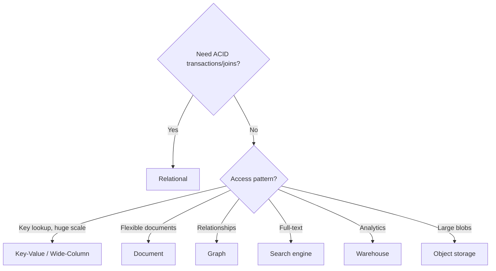

# Choosing the Right Database (HLD)

## 🧭 Overview
In an HLD interview, "which database?" is a recurring decision point, and a vague answer ("I'll use MongoDB") signals weakness. This file gives a decision framework focused on the *reasoning* interviewers want to hear: matching access patterns, consistency, and scale to the right store, and defending the choice with trade-offs. (For deeper per-type detail, see [Database Selection Guide](../03-databases/06-database-selection-guide.md).)

---

## 🧠 Technical Explanation

### The Decision Questions (ask these out loud)
1. **What's the access pattern?** Point lookups by key? Range scans? Full-text? Relationship traversal? Analytics?
2. **Read vs write ratio?** Read-heavy → replicas + cache. Write-heavy → LSM-based store.
3. **Consistency needs?** Strong (money, inventory) vs eventual (feeds, counters)?
4. **Scale?** GBs vs PBs; thousands vs millions of QPS.
5. **Data shape?** Relational, document, key-value, time-series, graph, blob?
6. **Transactions/joins needed?** → relational.

### Mapping Answers → Choice
| Signal | Likely choice |
|--------|---------------|
| Transactions + joins + strong consistency | Relational (Postgres/MySQL/Spanner) |
| Key-based lookups at huge scale | Key-Value / Wide-Column (DynamoDB/Cassandra) |
| Flexible/evolving documents | Document (MongoDB) |
| Massive write throughput / time-series | Wide-Column / TSDB (Cassandra/Influx) |
| Relationship queries | Graph (Neo4j) |
| Full-text search | Search (Elasticsearch) |
| Heavy analytics | Warehouse (BigQuery/Snowflake) |
| Large blobs/media | Object storage (S3) |

### Polyglot Is the Norm
Real systems use several stores. A typical e-commerce HLD: **Postgres** (orders, ACID), **Redis** (sessions/cache), **Elasticsearch** (search), **S3 + CDN** (media), **Kafka** (events), **warehouse** (analytics). Say this — it shows maturity.

### Defending the Choice
Always pair the pick with a trade-off: "I'll use DynamoDB because access is by user key at high scale and I can tolerate eventual consistency; the cost is limited ad-hoc query flexibility, which we don't need here."

---

## 🍎 Simple Explanation (ELI5 / Analogy)
Choosing a database is like choosing the right container for a trip. A backpack (key-value cache) is fast to grab essentials. A labeled filing cabinet (relational DB) keeps documents cross-referenced and consistent. A shipping container (object storage) hauls huge bulky items cheaply. You wouldn't put your passport (critical, must-not-lose) in a leaky bag, and you wouldn't ship a single pencil in a freight container. Match the container to what you're carrying and how often you need it.

---

## 📊 Diagram / Flowchart

---

## ⚖️ Trade-offs

| Choice | Pros | Cons |
|------|------|------|
| Relational | Transactions, joins, consistency | Harder horizontal scale |
| Key-Value/Wide-Column | Massive scale, fast key access | Limited query flexibility |
| Document | Flexible schema | Weak multi-entity joins |
| Polyglot | Best tool per job | Operational complexity, sync |

---

## 🌍 Real-World Examples
- **Uber** uses Schemaless (on MySQL), Cassandra, and Redis — chosen per access pattern.
- **Airbnb** uses MySQL for bookings and Elasticsearch for search.
- **Discord** moved messages from MongoDB → Cassandra → ScyllaDB as write scale grew.

---

## 🎯 Interview Questions

### 🔵 Conceptual (Theory)
1. What questions determine database choice? → **Answer:** Access pattern, read/write ratio, consistency needs, scale, data shape, and whether transactions/joins are required.
2. Why is "I'll use NoSQL" a weak answer? → **Answer:** NoSQL spans many types; you must specify which and justify it against the access pattern and consistency needs.
3. What is polyglot persistence and why mention it? → **Answer:** Using multiple specialized stores per workload; it shows you match each data need to the right tool.

### 🟠 Design (Practical)
1. Pick a DB for a high-write IoT telemetry pipeline. → **Answer:** A time-series or wide-column store (InfluxDB/Cassandra) for high write throughput and time-indexed queries.
2. Pick stores for an e-commerce platform. → **Answer:** Relational for orders, Redis for sessions/cache, Elasticsearch for search, S3+CDN for media, warehouse for analytics.

### 🔴 Company-Specific
1. [Amazon] When DynamoDB vs Aurora? *(Hint: key-access huge scale + serverless vs relational queries/transactions.)*
2. [Uber] How would you justify Cassandra for trip events? *(Hint: write-heavy, time-series, multi-region availability.)*
3. [Google] Spanner vs Bigtable — when each? *(Hint: relational + global strong consistency vs wide-column eventual.)*

---

## 📚 Further Reading
- [Database Selection Guide](../03-databases/06-database-selection-guide.md)
- *Designing Data-Intensive Applications*

---

## 🔗 Related Topics
- [Relational vs NoSQL](../03-databases/01-relational-vs-nosql.md)
- [Database Comparison Cheatsheet](../12-cheatsheets/database-comparison.md)
- [Choosing the Right Cache](04-choosing-the-right-cache.md)
